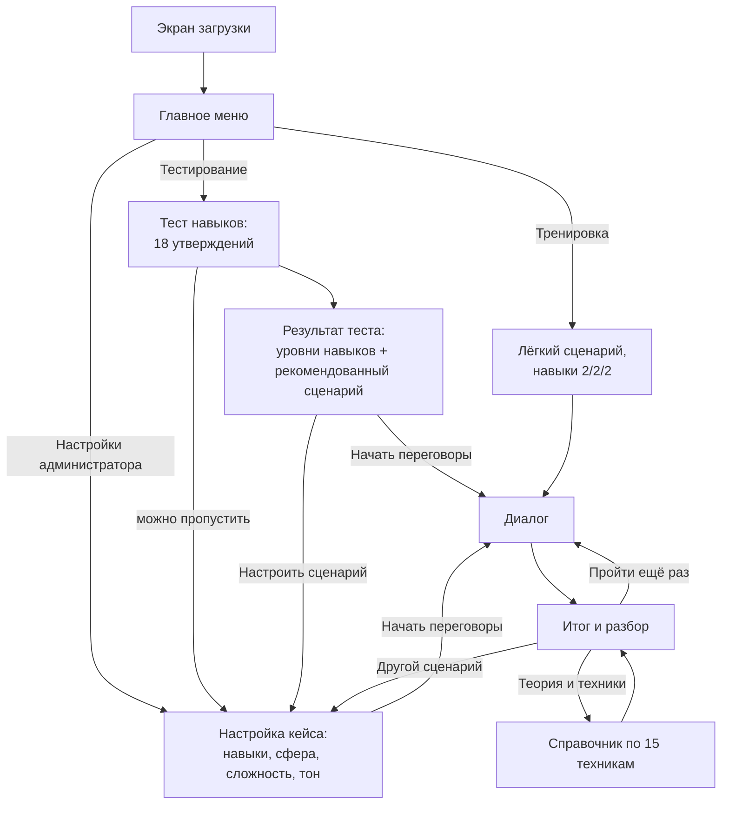
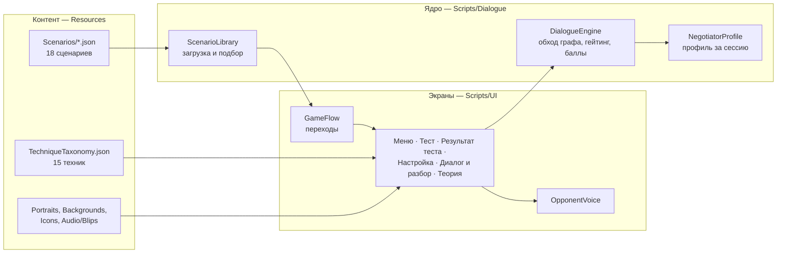

# «Арена переговоров» — сопроводительная документация

Документ для человека, который видит проект впервые: что это за продукт и для кого, где проходят границы MVP, как устроены код и логика симуляции, как запустить и показать прототип, какие методы, библиотеки и ассеты использованы. Состояние — на 25.09.2026.

Коротко про запуск — в [README](../README.md). Играть в браузере: https://masterit.itch.io/arena-peregovorov-lc

**Содержание**

1. [Продукт: аудитория, проблема, ценность](#1-продукт-аудитория-проблема-ценность)
2. [Границы MVP](#2-границы-mvp)
3. [Путь пользователя](#3-путь-пользователя)
4. [Архитектура](#4-архитектура)
5. [Логика симуляции](#5-логика-симуляции)
6. [Сборка, запуск и демонстрация](#6-сборка-запуск-и-демонстрация)
7. [Использованные методы, библиотеки, ассеты и сервисы](#7-использованные-методы-библиотеки-ассеты-и-сервисы)
8. [Подробные документы](#8-подробные-документы)

---

## 1. Продукт: аудитория, проблема, ценность

### Проблема

Переговорам обычно учат «с бумаги» — лекции, чек-листы, разбор чужих кейсов — или на очных тренингах и ролевых играх. Очный формат работает, но дорого масштабируется: занятие трудно провести в удобный момент, у участника мало попыток, и редко кто разбирает именно его формулировки. Теория (интересы сторон, BATNA, техники вопросов) без практики плохо переносится в реальный разговор.

### Аудитория

Люди, для которых переговоры — рабочий инструмент: HR-специалисты и руководители, менеджеры по продажам, закупщики. Покупатель продукта — корпоративное обучение и HR-отделы, которым нужен масштабируемый тренажёр soft skills, и тренеры, готовящие кейсы под конкретную группу.

### Что это

Диалоговый тренажёр в духе ролевых игр с ветвящимися диалогами. Игрок ведёт переговоры с руководителем, клиентом или поставщиком: читает реплику собеседника, выбирает один из вариантов ответа, и разговор идёт дальше по разным веткам к одному из трёх финалов — успех, компромисс или провал. Часть реплик доступна только при достаточном уровне навыков игрока. После разговора — разбор: какие техники сработали, какие нет, цитаты собственных реплик игрока и более сильные формулировки.

### Ценность по сравнению с обычным обучением

| | Лекция, чек-лист, разбор кейса | Очный тренинг, ролевая игра | «Арена переговоров» |
|---|---|---|---|
| Практика в диалоге | нет | да | да |
| Сколько попыток | — | 1–2 за занятие | сколько угодно, в любое время |
| Разбор своих формулировок | нет | зависит от тренера | всегда, по каждому ходу |
| Одинаковая оценка для всех | — | зависит от тренера | детерминированная: один и тот же выбор даёт один и тот же результат |
| Стоимость повторения | низкая | высокая | нулевая |
| Настройка под группу | нет | ручная подготовка | тренер выбирает сферу, сложность, тон, навыки |

Тренажёр не заменяет тренера: он даёт безопасное место отработать технику между занятиями и показывает тренеру, где у участника слабые места.

---

## 2. Границы MVP

### Что сделано

- **Полный путь пользователя** в двух контурах: игрок (тест навыков или быстрый старт → диалог → разбор) и администратор (задаёт контекст и навыки → диалог → разбор).
- **Библиотека из 18 сценариев**: 3 сферы (HR, B2B-продажи, Закупки) × 2 сюжета × 3 уровня сложности. В сумме 3 679 узлов разговора и 8 202 варианта ответа.
- **Исход зависит от стратегии и формулировок.** Каждый вариант ответа размечен одной из 15 переговорных техник и баллом от −2 до +2; ветки устроены так, что давление или капитуляция на старте не ведут к лучшему финалу.
- **Настройка под контекст**: сфера, тема (сюжет), сложность, тон собеседника и навыки игрока реально меняют подобранный сценарий и доступные реплики.
- **Обратная связь**: исход, профиль переговорщика, баллы по техникам, динамика по ходу разговора, общая стратегия, сильные стороны и «над чем поработать» с альтернативными формулировками, справочник по 15 техникам с источниками.
- **Реакция собеседника по ходу разговора**: портрет в пяти состояниях, подпись настроения, короткие голосовые реплики-«бормотание».
- **Геймификация**: архетип переговорщика, достижения, профиль по нескольким прохождениям с диаграммой навыков.
- **Публичная браузерная версия** (itch.io) и **Windows-сборка**; обе работают без сервера и без сети после загрузки.
- **Автоматическая проверка контента**: скрипт проверяет структуру и корректность всех 18 сценариев.

### Что сознательно не делали

- **Нет LLM во время игры.** Весь текст собеседника, ветки и правила оценки написаны заранее, движок их только исполняет. Так демо не зависит от платного API и сети, а оценка воспроизводима. Цена решения — новый сценарий пишется и проверяется вручную (с помощью скриптов), а не генерируется на лету. Настройка «под контекст» закрыта подбором сценария из библиотеки, что ТЗ допускает («генерируется или подбирается»).
- **Нет сервера и сохранений между запусками.** Профиль и достижения живут только в текущей сессии. Поэтому демо нечему «сломать» после перезапуска.
- **Нет свободного ввода текста и голоса.** Игрок выбирает из заданных вариантов — это даёт точную оценку каждой реплики.
- **Отдельная мобильная вёрстка не делалась.** Приоритет — компьютер (браузер или Windows).

### Известные ограничения прототипа

- Переключатель «Тренировка / Обучение» на экране настроек пока только запоминает выбор: оба режима ведут по одному пути. Это задел под будущий учебный режим.
- В браузерной версии нет кнопок выхода и возврата в главное меню (браузер не даёт странице закрыть себя); начать заново — обновить страницу.
- Рекомендация после теста навыков выбирает сложность по уровню игрока, но сюжет — первый по порядку в библиотеке для этой сложности (на практике HR); другую сферу можно выбрать кнопкой «Настроить сценарий».
- Баллы по техникам объясняют результат, но не переключают ветки во время разговора: исход определяется тем, по какой ветке прошёл игрок.
- Заявленная в гипотезах проверка слепым плейтестом с внешними участниками пока не проведена; поведение проверено кодом, скриптами и прохождениями командой.

### Что можно развить

- LLM как надстройка над готовым деревом: перефразирование реплик собеседника, разбор свободного ответа игрока с привязкой к той же таксономии техник.
- Редактор сценариев для тренера и новые сферы (формат сценария — обычный JSON).
- Сохранение прогресса и отчёт для тренера по группе: слабые техники, динамика между попытками.
- Учебный режим с подсказками по ходу разговора (тот самый переключатель «Обучение»).
- Мобильная вёрстка.

---

## 3. Путь пользователя



- **Главное меню** — три входа: «Тренировка» (сразу в разговор), «Тестирование» (сначала тест навыков), «Настройки администратора» (для тренера).
- **Тест навыков** — 18 утверждений (по 6 на навык) с трёхбалльной шкалой согласия; сумма 6–9 даёт уровень 1, 10–13 — уровень 2, 14–18 — уровень 3.
- **Настройка кейса** — единый экран для тренера и для игрока после теста. Внизу — живое превью: тема и собеседник подобранного сценария пересчитываются при каждом изменении.
- **Диалог** — реплика собеседника печатается по буквам с голосом, ниже пронумерованные варианты ответа (мышь или клавиши 1–9).
- **Итог и разбор** — см. [5.6](#56-разбор-после-разговора).

---

## 4. Архитектура

### Стек

| Слой | Решение | Почему |
|---|---|---|
| Движок | Unity 6000.3.23f1 (6.3 LTS), C# | Один проект собирается и в браузер (WebGL), и в Windows |
| Интерфейс | Unity UI + TextMeshPro, весь интерфейс строится кодом | Нет ручной сборки сцены и префабов — нечему «отвалиться» перед демо; один модуль `Theme` задаёт палитру и компоненты для всех экранов |
| Контент | JSON-файлы сценариев и таксономии техник в `Resources` | Читаются и правятся как текст, проверяются скриптом, не требуют открытия Unity |
| Данные сессии | В памяти процесса | Сервер и база не нужны |
| Сервер | Нет | Игра полностью клиентская; хостинг — статические файлы на itch.io |

### Компоненты



Ядро (`Scripts/Dialogue`) не зависит от интерфейса: `DialogueEngine` получает сценарий и навыки, отдаёт текущий узел, доступность вариантов, баллы по техникам и историю ходов. Экраны только показывают это состояние и передают выбор игрока.

### Карта кода

| Файл | Что делает |
|---|---|
| `Bootstrap/GameBootstrap.cs` | Точка входа сцены |
| `Bootstrap/GameFlow.cs` | Переходы между экранами для трёх входов из меню |
| `Bootstrap/GameMode.cs` | Флаг «Тренировка / Обучение» (пока без различий в поведении) |
| `Dialogue/DialogueModels.cs` | Модель сценария — C#-классы, в которые читается JSON |
| `Dialogue/DialogueEngine.cs` | Обход графа, проверка навыков, баллы по техникам, история ходов, настроение собеседника |
| `Dialogue/ScenarioLibrary.cs` | Загрузка всех сценариев и подбор ближайшего по настройкам |
| `Dialogue/PlayerSkills.cs` | Три навыка игрока |
| `Dialogue/SkillTestData.cs` | 18 утверждений теста |
| `Dialogue/NegotiatorProfile.cs` | Накопление результатов за сессию (профиль, достижения) |
| `Dialogue/TechniqueTaxonomyLibrary.cs` | Загрузка таксономии техник |
| `UI/Theme.cs` | Палитра и конструкторы элементов интерфейса, фоны, логотип, иконки навыков |
| `UI/ModeSelectController.cs` | Главное меню |
| `UI/SkillTestController.cs` | Тест навыков |
| `UI/TestResultController.cs` | Результат теста и рекомендация |
| `UI/AdminConfigController.cs` | Настройка кейса с живым превью подобранного сценария |
| `UI/DialogueUIController.cs` | Диалог (портрет, настроение, печать реплики, варианты ответа) и экран разбора |
| `UI/TheoryController.cs` | Справочник по техникам |
| `UI/OpponentVoice.cs` | Голос собеседника по настроению |
| `UI/RadarChart.cs` | Диаграмма навыков в профиле |
| `Editor/BuildScript.cs` | Сборка WebGL и Windows из командной строки |
| `Editor/BrandingSetup.cs` | Название продукта, заставка Windows, шаблон страницы WebGL |
| `Editor/AssetImportAutomation.cs` | Автонастройка импорта портретов, фонов и иконок |
| `Editor/TmpFontBuilder.cs` | Однократная сборка шрифтового атласа с кириллицей |

Пути — относительно `unity/Assets/Scripts/` и `unity/Assets/Editor/`.

### Технические решения, которые стоит знать

- **Кириллица в браузере.** Встроенный в Unity шрифт не содержит кириллицы в WebGL-сборке — русский текст пропадал. Весь текст переведён на TextMeshPro со статическим шрифтовым атласом (латиница, кириллица, нужная пунктуация), атлас лежит в репозитории.
- **Сжатие WebGL отключено**: статические хостинги не всегда отдают сжатые файлы с правильными заголовками, и загрузка зависала.
- **Устойчивость к повреждённому контенту**: сломанный JSON пропускается с записью в лог, остальные сценарии грузятся; если не загрузился ни один — на экране явный текст ошибки вместо пустого экрана.
- **Ассеты по соглашению об именах**: код ищет `Portraits/<сфера>_<настроение>`, `Backgrounds/<сфера>`, `Icons/skill_<навык>`; если файла нет, показывается нейтральная заглушка, игра не падает.

---

## 5. Логика симуляции

### 5.1 Навыки игрока

Три независимых навыка — **Напор**, **Эмпатия**, **Логика** — каждый на уровне 1–3. Их выбор основан на трёх валидированных психометрических шкалах; утверждения теста — собственные формулировки в переговорном контексте:

| Навык | Основа |
|---|---|
| Напор | Rathus Assertiveness Schedule, короткая форма |
| Эмпатия | Toronto Empathy Questionnaire |
| Логика | Need for Cognition Scale, короткая форма NCS-6 |

Уровни задаются тестом (игрок) или вручную (тренер). Общего пула очков нет: тренер может выставить любую комбинацию. Стратегический выбор заложен в сами сценарии — лучшие финалы на высокой сложности требуют сочетания навыков, а не одного максимального.

### 5.2 Сценарий как граф

Сценарий — JSON-файл: метаданные и список узлов. Узел — реплика собеседника и варианты ответа; каждый вариант ведёт в следующий узел. Финальные узлы вместо вариантов содержат исход и итоговый текст.

```json
{
  "meta": {
    "id": "procurement_price_hike_easy",
    "sphere": "Закупки",
    "topic": "Внезапное повышение цены поставщиком в середине действующего контракта",
    "difficulty": 1,
    "tone": "напористый / скептический",
    "opponentRole": "менеджер по работе с клиентами со стороны поставщика"
  },
  "startNode": "p1",
  "nodes": [
    {
      "id": "p1",
      "opponentLine": "Сразу к делу: с первого числа следующего месяца отпускная цена по нашему контракту вырастет на четырнадцать процентов. Это не прихоть, это рынок…",
      "options": [
        {
          "text": "Давайте начнём с того, что уже подписано. Пункт 4.3 нашего договора: цена фиксированная на весь срок…",
          "requiredSkills": [{ "skill": "logika", "level": 2 }],
          "technique": "objective_criteria",
          "points": 2,
          "next": "p2",
          "betterAlternative": ""
        },
        {
          "text": "Четырнадцать процентов — цифра серьёзная. Из чего она складывается: что именно у вас выросло и на сколько?",
          "requiredSkills": [],
          "technique": "open_question",
          "points": 1,
          "next": "p2",
          "betterAlternative": ""
        },
        {
          "text": "Ну раз рынок — значит, будем платить по новой цене.",
          "requiredSkills": [],
          "technique": "give_up",
          "points": -1,
          "next": "p1g",
          "betterAlternative": "Не принимайте повышение с первой же фразы — сначала выясните, из чего оно складывается, и сверьтесь с процедурой пересмотра в действующем договоре."
        }
      ],
      "outcome": "",
      "summary": ""
    },
    {
      "id": "end_win",
      "opponentLine": "Вот с этим я к директору пойду спокойно. Готовлю допсоглашение…",
      "options": [],
      "outcome": "win",
      "summary": "Вы удержали цену под давлением и при этом не потеряли поставщика…"
    }
  ]
}
```

Фрагмент реального файла `procurement_price_hike_easy.json`: тексты сокращены (…), из четырёх вариантов первого хода показаны три.

| Поле | Смысл |
|---|---|
| `meta.sphere`, `topic`, `difficulty`, `tone`, `opponentRole` | Теги для подбора сценария и превью на экране настройки |
| `requiredSkills` | Необязательный порог: вариант доступен, только если выполнены все требования |
| `technique` | Одна из 15 техник таксономии |
| `points` | Балл от −2 до +2 в пределах диапазона техники |
| `betterAlternative` | Более сильная формулировка; обязательна, если `points ≤ 0` |
| `outcome`, `summary` | Только у финальных узлов: `win`, `compromise` или `fail` и итоговый текст |

Формат задан классами в `Dialogue/DialogueModels.cs`.

### 5.3 Доступность реплик по навыкам

Вариант с `requiredSkills` доступен, если игрок удовлетворяет всем требованиям. Недоступные варианты не скрываются: они серые, рядом иконка навыка и нужный уровень. Игрок видит, что более сильный ход существует, и понимает, какой навык его открывает. В сценариях такие варианты есть в 17–34% узлов, по всей длине разговора, а не только у финала.

### 5.4 Оценка: техники и баллы

Вместо «умного судьи» — закрытая таксономия из 15 техник на основе Гарвардского метода, SPIN, исследований эффекта якорения и нормы взаимности. Каждый вариант ответа заранее размечен автором сценария; движок только суммирует баллы по техникам.

| Техники с положительным баллом | Техники с отрицательным баллом |
|---|---|
| Раскрытие интереса, опора на объективные критерии, открытый вопрос, активное слушание, деэскалация, пакетирование уступок, опора на реальную альтернативу (BATNA), якорение с гибкостью, восстановление после осечки | Давление позицией, голословное утверждение, эскалация, переход на личности, пустая угроза, преждевременная капитуляция |

Шкала имеет фиксированный смысл: **+2** — продвинутое применение (обычно требует навыка 2+), **+1** — корректное базовое, **−1** — ошибка, после которой можно восстановиться, **−2** — серьёзная ошибка, обычно ведущая к провалу.

**Исход определяется веткой, а не суммой баллов.** Сценарии построены так, что серьёзная ошибка (−2) на первом ходу не ведёт к успеху, только к компромиссу или провалу; на высокой сложности успех требует все три навыка на уровне 2 и выше. Это проверено перебором всех 27 комбинаций уровней навыков по графу каждого сценария, а не только авторской разметкой.

### 5.5 Реакция собеседника

После каждого хода меняется настроение собеседника — по баллу последнего выбранного варианта:

| Балл последнего хода | Настроение |
|---|---|
| ещё нет хода | Нейтрален |
| +2 | Доволен |
| +1 или 0 | Спокоен |
| −1 | Насторожен |
| −2 | Раздражён |

Настроение видно сразу в трёх местах: портрет собеседника (у каждой сферы свой персонаж в пяти состояниях), подпись с цветной меткой и цветная полоса под портретом. Реплика печатается по буквам, на каждое слово звучит короткий голосовой звук, подобранный под настроение.

### 5.6 Разбор после разговора

Экран итога — одна прокручиваемая страница:


1. **Исход** и итоговый текст финала.
2. **Профиль переговорщика (архетип)** — Аналитик, Дипломат, Стратег, Агрессор или Уступчивый, по тому, техники какой группы игрок выбирал чаще; если явного лидера нет — «смешанный стиль».
3. **Новые достижения** — если получены в этом прохождении.
4. **Баллы по техникам** — сумма по каждой встретившейся технике.
5. **Динамика по ходу разговора** — полоса из цветных отрезков, по одному на каждый ход с техникой: видно, где разговор пошёл хорошо и где провалился.
6. **Общая стратегия** — абзац по доле принципиальных и позиционных техник с названием самой сильной и самой слабой.
7. **Профиль за сессию** — после второго и последующих прохождений: диаграмма средних навыков и архетип по всем прохождениям.
8. **Сильные стороны** — до трёх лучших реплик игрока.
9. **Над чем поработать** — до трёх худших реплик игрока, у каждой — более сильная формулировка из сценария.

Кнопки: «Пройти ещё раз», «Теория и техники» (справочник по всем 15 техникам с определениями и источниками; встретившиеся в прохождении подняты наверх), «Другой сценарий».

### 5.7 Геймификация

| Механика | Правило |
|---|---|
| Архетип | По частоте групп техник за прохождение и за сессию |
| Достижение «Первая сделка» | Первый успешный финал |
| «Слушатель» | 3 и больше открытых вопросов за разговор |
| «Твёрдый» | 5 и больше ходов с техникой и ни одной капитуляции |
| «Исследователь» | Использован вариант, требующий навыка |
| «Повтор» | Третье прохождение за сессию |
| Рост сложности | Лёгкий → средний → сложный вариант каждого сюжета: разговор длиннее, требования к навыкам и к успеху строже |

### 5.8 Настройка под контекст


На экране настройки тренер задаёт:

| Настройка | Варианты | На что влияет |
|---|---|---|
| Навыки игрока | Напор, Эмпатия, Логика: 1–3 | Какие реплики доступны в разговоре |
| Сфера | HR, Закупки, B2B-продажи | Подбор сценария, собеседник, портрет, фон |
| Сложность | 1–3 | Вариант сюжета: длина разговора, пороги навыков, требования к успеху |
| Тон собеседника | Список строится из тонов, реально существующих в выбранной сфере | Сюжет внутри сферы |

Тема и роль собеседника задаются выбором сюжета и видны в превью. Подбор (`ScenarioLibrary.Pick`) — не поиск точного совпадения, а выбор ближайшего сценария по весам: совпадение сферы +10, совпадение тона +5, минус разница в сложности. Поэтому любая комбинация настроек даёт сценарий. Чипы сфер и тонов строятся из фактического содержимого библиотеки: новый JSON-файл сам появится в настройках.

Библиотека сюжетов:

| Сфера | Сюжет | Игрок | Собеседник | Тон |
|---|---|---|---|---|
| HR | Пересмотр зарплаты | сотрудник | непосредственный руководитель | нейтральный |
| HR | Контроль договорённостей после отложенного повышения | сотрудник | тот же руководитель, несколько месяцев спустя | уклончивый |
| B2B-продажи | Защита цены и ценности перед клиентом | менеджер по продажам | закупщик клиента | напористый / скептический |
| B2B-продажи | Клиент тянет время с подписанием | менеджер по продажам | закупщик клиента | уклончивый |
| Закупки | Переговоры с поставщиком о цене и условиях | закупщик | менеджер поставщика | защитный |
| Закупки | Внезапное повышение цены посреди контракта | закупщик | менеджер поставщика | напористый / скептический |

Каждый сюжет — в трёх вариантах сложности, всего 18 файлов.

### 5.9 Объём и проверка контента

| Сложность | Узлов в сценарии | Самый длинный путь до финала, ходов |
|---|---|---|
| Лёгкая | 57–105 | 50–97 |
| Средняя | 158–266 | 150–259 |
| Сложная | 307–317 | 300–309 |

В каждом сценарии три финала (успех, компромисс, провал) и от 13 до 15 разных техник. Разговор устроен как длинный «хребет» из фаз с короткими ответвлениями для слабых ответов, которые либо возвращаются на хребет, либо ведут к худшему финалу.

Все 18 файлов проходят `scripts/validate_scenario.py`: переходы ведут в существующие узлы, все узлы достижимы, у финалов есть исход и итог, техники и баллы соответствуют таксономии, у каждой слабой реплики есть альтернатива. Скрипт выдаёт два предупреждения (эвристика «ход −1 на старте всё ещё может привести к успеху») для лёгкого и среднего вариантов сюжета «Клиент тянет время»; по шкале баллов −1 — ошибка, после которой можно восстановиться, так что это допустимо.

---

## 6. Сборка, запуск и демонстрация

### Запуск без сборки

| Способ | Как |
|---|---|
| Браузер | https://masterit.itch.io/arena-peregovorov-lc — Chrome или Edge на компьютере, первая загрузка около 70 МБ |
| Windows | Архив `ArenaPeregovorov-Windows.zip` со страницы игры на itch.io: распаковать целиком, запустить `ArenaPeregovorov.exe` |

Ключи, аккаунты и переменные окружения не нужны.

### Сборка из исходников

Кратко (подробно — в [README](../README.md#сборка-из-исходников)):

1. Установить Unity Hub, редактор **6000.3.23f1** с модулями WebGL и/или Windows Build Support, Git и Git LFS.
2. `git lfs install`, клонировать репозиторий, `git lfs pull`.
3. В Unity Hub добавить папку `unity`, открыть сцену `Assets/Scenes/Main.unity`, нажать Play.
4. Сборка из командной строки: `-executeMethod Arena.EditorTools.BuildScript.BuildWebGL` (результат — `unity/WebGL-Build/`) или `...BuildWindows` (результат — `unity/Windows-Build/`).
5. WebGL-сборку открывать через локальный сервер (`python -m http.server` в папке сборки), а не двойным щелчком по `index.html`.

Вспомогательные Python-скрипты в `scripts/` для игры не нужны. Проверке сценариев хватает стандартного Python; скриптам подготовки ассетов нужны `numpy` и `Pillow` (версии — в `scripts/requirements.txt`).

### Сценарий демонстрации (5–7 минут)

1. **Экран загрузки и меню** — логотип, три входа.
2. **Настройки администратора** — показать, что контекст задаётся здесь. Переключить сферу (HR → Закупки → B2B-продажи): в превью меняются тема и собеседник. Поменять тон — меняется сюжет. Выставить навыки, например Напор 2, Эмпатия 3, Логика 2.
3. **Разговор** — пройти 5–8 ходов. Обратить внимание: серые реплики с иконкой навыка, смена портрета и настроения после сильного и слабого ответа, голос собеседника. Ответы можно выбирать клавишами 1–9.
4. **Разбор** — исход, архетип, баллы по техникам, динамика, «над чем поработать» с альтернативной формулировкой, справочник по техникам.
5. **Зависимость от стратегии** — «Пройти ещё раз» и начать с давления или уступки: настроение падает, путь к успеху закрывается.
6. **Другой контекст** — «Другой сценарий», сменить сферу или сложность, показать, что это другой разговор и другие требования.

### Если что-то не так

| Симптом | Причина и что делать |
|---|---|
| Вместо картинок серые плашки, нет звука | Репозиторий склонирован без Git LFS: `git lfs install` и `git lfs pull` |
| `index.html` из сборки открывается пустым | Браузер не грузит файлы по `file://` — запустить локальный сервер |
| Windows показывает «Неизвестный издатель» | Файл не подписан: «Подробнее» → «Выполнить в любом случае» |
| В браузере нет кнопки «в меню» | Так задумано для WebGL — обновить страницу (F5) |
| Долгая первая загрузка в браузере | Около 70 МБ без сжатия; повторные открытия берутся из кэша браузера |

---

## 7. Использованные методы, библиотеки, ассеты и сервисы

### Методы

- **Переговорные техники и оценка**: Гарвардский метод принципиальных переговоров (Fisher, Ury, Patton, *Getting to Yes*), SPIN Selling (Rackham), эффект якорения первым предложением (Galinsky, Mussweiler, 2001), норма взаимности в уступках. Определения и источники каждой из 15 техник — в `docs/eval-rubric.md` и в самой игре, в справочнике «Теория и техники».
- **Навыки игрока**: по мотивам Rathus Assertiveness Schedule, Toronto Empathy Questionnaire и Need for Cognition Scale (NCS-6) — см. `docs/skill-test.md`.
- **Разработка контента**: сценарии написаны с помощью AI-ассистента (Claude) на этапе разработки, затем проверены скриптом `validate_scenario.py` и перебором всех комбинаций навыков. Во время игры AI не используется.
- **Графика**: портреты, фоны, иконки и логотип сгенерированы командой с помощью AI-генераторов изображений по единому стилевому описанию (`docs/visual-style-guide.md`); подготовка файлов — скрипты `scripts/prepare_*.py`.

### Библиотеки и инструменты

| Что | Где используется | Условия |
|---|---|---|
| Unity 6000.3.23f1 | Движок, сборка WebGL и Windows | Unity Personal (бесплатно) |
| Unity UI и TextMeshPro (пакет `com.unity.ugui`) | Весь интерфейс и текст | Входит в Unity |
| Python 3, numpy, Pillow | Только вспомогательные скрипты подготовки ассетов | Открытые лицензии |

### Ассеты

| Ассет | Источник | Условия |
|---|---|---|
| Портреты, фоны, иконки, логотип, экран загрузки | Сгенерированы командой (AI-генераторы изображений) | Созданы для проекта |
| Голос собеседника | [Sample Focus — Gibberish Voices Pack](https://samplefocus.com/collections/gibberish-voices-pack); нарезка — `scripts/slice_voice.py`, исходники — `assets-src/voices/` | [Standard License Sample Focus](https://samplefocus.com/license): бесплатно, допускается коммерческое использование, ссылка на автора не обязательна |
| Шрифт интерфейса | Атлас TextMeshPro, собранный из системного шрифта Segoe UI (`Editor/TmpFontBuilder.cs`) | Сам файл шрифта в репозиторий не входит; в сборку попадает только растровый атлас |

### Внешние сервисы

| Сервис | Для чего | Доступ |
|---|---|---|
| itch.io | Хостинг браузерной версии | Открытая ссылка, без регистрации для игрока |
| GitHub + Git LFS | Исходный код и бинарные ассеты | Публичный репозиторий |

Во время игры внешние API не вызываются; ключей и переменных окружения нет.

---

## 8. Подробные документы

| Тема | Документ |
|---|---|
| Таксономия техник, шкала баллов, методология разбора, калибровка сложности | [`eval-rubric.md`](eval-rubric.md), [`technique-taxonomy.json`](technique-taxonomy.json) |
| Тест навыков: утверждения, подсчёт, психометрическая основа | [`skill-test.md`](skill-test.md) |
| Почему выбраны эти три сферы | [`negotiation-domains.md`](negotiation-domains.md) |
| Визуальный стиль, палитра, промпты для генерации арта | [`visual-style-guide.md`](visual-style-guide.md) |
| Гипотезы развития и статус их проверки | [`feature-hypotheses.md`](feature-hypotheses.md) |
| Дизайн-документ (история проектных решений) | [`game-design-document.md`](game-design-document.md) |
| План и хронология работ | [`roadmap.md`](roadmap.md) |
| Презентация решения | [`presentation/arena-peregovorov.pdf`](presentation/arena-peregovorov.pdf), [`.pptx`](presentation/arena-peregovorov.pptx) |
| Техническое задание хакатона | [`9. ОЭЗ ППТ Алабуга.pdf`](../9.%20ОЭЗ%20ППТ%20Алабуга.pdf) |
