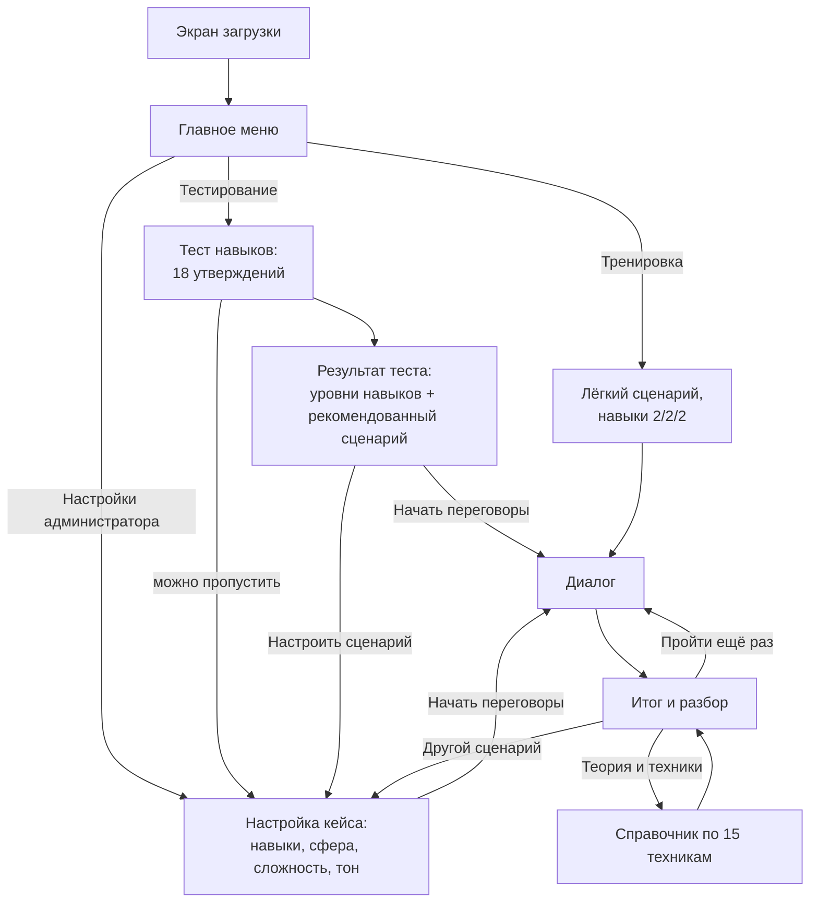
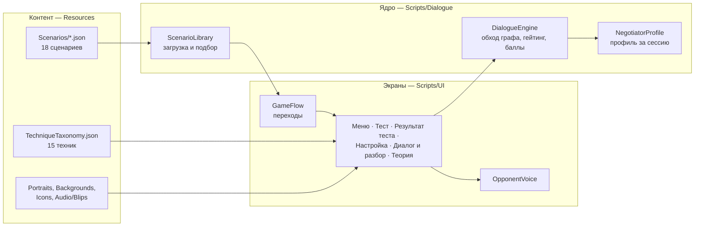

# «Арена переговоров» — сопроводительная документация

Документ для человека, который видит проект впервые: что это за продукт и для кого, где проходят границы MVP, как устроены код и логика симуляции, как запустить и показать прототип, какие методы, библиотеки и ассеты использованы. Состояние — на 25.09.2026.

Коротко про запуск — в [README](../README.md). Играть в браузере: https://masterit.itch.io/arena-peregovorov-lc

**Содержание**

1. [Продукт: аудитория, проблема, ценность](#1-продукт-аудитория-проблема-ценность)
2. [Границы MVP](#2-границы-mvp)
3. [Путь пользователя](#3-путь-пользователя)
4. [Архитектура](#4-архитектура)
5. [Логика симуляции](#5-логика-симуляции)
6. [Сборка, запуск и демонстрация](#6-сборка-запуск-и-демонстрация)
7. [Использованные методы, библиотеки, ассеты и сервисы](#7-использованные-методы-библиотеки-ассеты-и-сервисы)
8. [Приложения](#8-приложения)
   - [Приложение А. Методология оценки](#приложение-а-методология-оценки)
   - [Приложение Б. Таксономия 15 техник](#приложение-б-таксономия-15-техник)
   - [Приложение В. Тест навыков](#приложение-в-тест-навыков)
   - [Приложение Г. Выбор трёх сфер](#приложение-г-выбор-трёх-сфер)
   - [Приложение Д. Визуальный стиль и промпты для арта](#приложение-д-визуальный-стиль-и-промпты-для-арта)
   - [Приложение Е. Бэклог гипотез](#приложение-е-бэклог-гипотез)
   - [Приложение Ж. Дизайн-документ](#приложение-ж-дизайн-документ)
   - [Приложение З. План и хронология работ](#приложение-з-план-и-хронология-работ)

---

## 1. Продукт: аудитория, проблема, ценность

### Проблема

Переговорам обычно учат «с бумаги» — лекции, чек-листы, разбор чужих кейсов — или на очных тренингах и ролевых играх. Очный формат работает, но дорого масштабируется: занятие трудно провести в удобный момент, у участника мало попыток, и редко кто разбирает именно его формулировки. Теория (интересы сторон, BATNA, техники вопросов) без практики плохо переносится в реальный разговор.

### Аудитория

Люди, для которых переговоры — рабочий инструмент: HR-специалисты и руководители, менеджеры по продажам, закупщики. Покупатель продукта — корпоративное обучение и HR-отделы, которым нужен масштабируемый тренажёр soft skills, и тренеры, готовящие кейсы под конкретную группу.

### Что это

Диалоговый тренажёр в духе ролевых игр с ветвящимися диалогами. Игрок ведёт переговоры с руководителем, клиентом или поставщиком: читает реплику собеседника, выбирает один из вариантов ответа, и разговор идёт дальше по разным веткам к одному из трёх финалов — успех, компромисс или провал. Часть реплик доступна только при достаточном уровне навыков игрока. После разговора — разбор: какие техники сработали, какие нет, цитаты собственных реплик игрока и более сильные формулировки.

### Ценность по сравнению с обычным обучением

| | Лекция, чек-лист, разбор кейса | Очный тренинг, ролевая игра | «Арена переговоров» |
|---|---|---|---|
| Практика в диалоге | нет | да | да |
| Сколько попыток | — | 1–2 за занятие | сколько угодно, в любое время |
| Разбор своих формулировок | нет | зависит от тренера | всегда, по каждому ходу |
| Одинаковая оценка для всех | — | зависит от тренера | детерминированная: один и тот же выбор даёт один и тот же результат |
| Стоимость повторения | низкая | высокая | нулевая |
| Настройка под группу | нет | ручная подготовка | тренер выбирает сферу, сложность, тон, навыки |

Тренажёр не заменяет тренера: он даёт безопасное место отработать технику между занятиями и показывает тренеру, где у участника слабые места.

---

## 2. Границы MVP

### Что сделано

- **Полный путь пользователя** в двух контурах: игрок (тест навыков или быстрый старт → диалог → разбор) и администратор (задаёт контекст и навыки → диалог → разбор).
- **Библиотека из 18 сценариев**: 3 сферы (HR, B2B-продажи, Закупки) × 2 сюжета × 3 уровня сложности. В сумме 3 679 узлов разговора и 8 202 варианта ответа.
- **Исход зависит от стратегии и формулировок.** Каждый вариант ответа размечен одной из 15 переговорных техник и баллом от −2 до +2; ветки устроены так, что давление или капитуляция на старте не ведут к лучшему финалу.
- **Настройка под контекст**: сфера, тема (сюжет), сложность, тон собеседника и навыки игрока реально меняют подобранный сценарий и доступные реплики.
- **Обратная связь**: исход, профиль переговорщика, баллы по техникам, динамика по ходу разговора, общая стратегия, сильные стороны и «над чем поработать» с альтернативными формулировками, справочник по 15 техникам с источниками.
- **Реакция собеседника по ходу разговора**: портрет в пяти состояниях, подпись настроения, короткие голосовые реплики-«бормотание».
- **Геймификация**: архетип переговорщика, достижения, профиль по нескольким прохождениям с диаграммой навыков.
- **Публичная браузерная версия** (itch.io) и **Windows-сборка**; обе работают без сервера и без сети после загрузки.
- **Автоматическая проверка контента**: скрипт проверяет структуру и корректность всех 18 сценариев.

### Что сознательно не делали

- **Нет LLM во время игры.** Весь текст собеседника, ветки и правила оценки написаны заранее, движок их только исполняет. Так демо не зависит от платного API и сети, а оценка воспроизводима. Цена решения — новый сценарий пишется и проверяется вручную (с помощью скриптов), а не генерируется на лету. Настройка «под контекст» закрыта подбором сценария из библиотеки, что ТЗ допускает («генерируется или подбирается»).
- **Нет сервера и сохранений между запусками.** Профиль и достижения живут только в текущей сессии. Поэтому демо нечему «сломать» после перезапуска.
- **Нет свободного ввода текста и голоса.** Игрок выбирает из заданных вариантов — это даёт точную оценку каждой реплики.
- **Отдельная мобильная вёрстка не делалась.** Приоритет — компьютер (браузер или Windows).

### Известные ограничения прототипа

- Переключатель «Тренировка / Обучение» на экране настроек пока только запоминает выбор: оба режима ведут по одному пути. Это задел под будущий учебный режим.
- В браузерной версии нет кнопки выхода (браузер не даёт странице закрыть себя) — игру закрывают вместе с вкладкой; кнопка «в главное меню» есть и там.
- Рекомендация после теста навыков выбирает сложность по уровню игрока, но сюжет — первый по порядку в библиотеке для этой сложности (на практике HR); другую сферу можно выбрать кнопкой «Настроить сценарий».
- Баллы по техникам объясняют результат, но не переключают ветки во время разговора: исход определяется тем, по какой ветке прошёл игрок.
- Заявленная в гипотезах проверка слепым плейтестом с внешними участниками пока не проведена; поведение проверено кодом, скриптами и прохождениями командой.

### Что можно развить

- LLM как надстройка над готовым деревом: перефразирование реплик собеседника, разбор свободного ответа игрока с привязкой к той же таксономии техник.
- Редактор сценариев для тренера и новые сферы (формат сценария — обычный JSON).
- Сохранение прогресса и отчёт для тренера по группе: слабые техники, динамика между попытками.
- Учебный режим с подсказками по ходу разговора (тот самый переключатель «Обучение»).
- Мобильная вёрстка.

---

## 3. Путь пользователя



- **Главное меню** — три входа: «Тренировка» (сразу в разговор), «Тестирование» (сначала тест навыков), «Настройки администратора» (для тренера).
- **Тест навыков** — 18 утверждений (по 6 на навык) с трёхбалльной шкалой согласия; сумма 6–9 даёт уровень 1, 10–13 — уровень 2, 14–18 — уровень 3.
- **Настройка кейса** — единый экран для тренера и для игрока после теста. Внизу — живое превью: тема и собеседник подобранного сценария пересчитываются при каждом изменении.
- **Диалог** — реплика собеседника печатается по буквам с голосом, ниже пронумерованные варианты ответа (мышь или клавиши 1–9).
- **Итог и разбор** — см. [5.6](#56-разбор-после-разговора).

---

## 4. Архитектура

### Стек

| Слой | Решение | Почему |
|---|---|---|
| Движок | Unity 6000.3.23f1 (6.3 LTS), C# | Один проект собирается и в браузер (WebGL), и в Windows |
| Интерфейс | Unity UI + TextMeshPro, весь интерфейс строится кодом | Нет ручной сборки сцены и префабов — нечему «отвалиться» перед демо; один модуль `Theme` задаёт палитру и компоненты для всех экранов |
| Контент | JSON-файлы сценариев и таксономии техник в `Resources` | Читаются и правятся как текст, проверяются скриптом, не требуют открытия Unity |
| Данные сессии | В памяти процесса | Сервер и база не нужны |
| Сервер | Нет | Игра полностью клиентская; хостинг — статические файлы на itch.io |

### Компоненты



Ядро (`Scripts/Dialogue`) не зависит от интерфейса: `DialogueEngine` получает сценарий и навыки, отдаёт текущий узел, доступность вариантов, баллы по техникам и историю ходов. Экраны только показывают это состояние и передают выбор игрока.

### Карта кода

| Файл | Что делает |
|---|---|
| `Bootstrap/GameBootstrap.cs` | Точка входа сцены |
| `Bootstrap/GameFlow.cs` | Переходы между экранами для трёх входов из меню |
| `Bootstrap/GameMode.cs` | Флаг «Тренировка / Обучение» (пока без различий в поведении) |
| `Dialogue/DialogueModels.cs` | Модель сценария — C#-классы, в которые читается JSON |
| `Dialogue/DialogueEngine.cs` | Обход графа, проверка навыков, баллы по техникам, история ходов, настроение собеседника |
| `Dialogue/ScenarioLibrary.cs` | Загрузка всех сценариев и подбор ближайшего по настройкам |
| `Dialogue/PlayerSkills.cs` | Три навыка игрока |
| `Dialogue/SkillTestData.cs` | 18 утверждений теста |
| `Dialogue/NegotiatorProfile.cs` | Накопление результатов за сессию (профиль, достижения) |
| `Dialogue/TechniqueTaxonomyLibrary.cs` | Загрузка таксономии техник |
| `UI/Theme.cs` | Палитра и конструкторы элементов интерфейса, фоны, логотип, иконки навыков |
| `UI/ModeSelectController.cs` | Главное меню |
| `UI/SkillTestController.cs` | Тест навыков |
| `UI/TestResultController.cs` | Результат теста и рекомендация |
| `UI/AdminConfigController.cs` | Настройка кейса с живым превью подобранного сценария |
| `UI/DialogueUIController.cs` | Диалог (портрет, настроение, печать реплики, варианты ответа) и экран разбора |
| `UI/TheoryController.cs` | Справочник по техникам |
| `UI/OpponentVoice.cs` | Голос собеседника по настроению |
| `UI/RadarChart.cs` | Диаграмма навыков в профиле |
| `Editor/BuildScript.cs` | Сборка WebGL и Windows из командной строки |
| `Editor/BrandingSetup.cs` | Название продукта, заставка Windows, шаблон страницы WebGL |
| `Editor/AssetImportAutomation.cs` | Автонастройка импорта портретов, фонов и иконок |
| `Editor/TmpFontBuilder.cs` | Однократная сборка шрифтового атласа с кириллицей |

Пути — относительно `unity/Assets/Scripts/` и `unity/Assets/Editor/`.

### Технические решения, которые стоит знать

- **Кириллица в браузере.** Встроенный в Unity шрифт не содержит кириллицы в WebGL-сборке — русский текст пропадал. Весь текст переведён на TextMeshPro со статическим шрифтовым атласом (латиница, кириллица, нужная пунктуация), атлас лежит в репозитории.
- **Сжатие WebGL отключено**: статические хостинги не всегда отдают сжатые файлы с правильными заголовками, и загрузка зависала.
- **Устойчивость к повреждённому контенту**: сломанный JSON пропускается с записью в лог, остальные сценарии грузятся; если не загрузился ни один — на экране явный текст ошибки вместо пустого экрана.
- **Ассеты по соглашению об именах**: код ищет `Portraits/<сфера>_<настроение>`, `Backgrounds/<сфера>`, `Icons/skill_<навык>`; если файла нет, показывается нейтральная заглушка, игра не падает.

---

## 5. Логика симуляции

### 5.1 Навыки игрока

Три независимых навыка — **Напор**, **Эмпатия**, **Логика** — каждый на уровне 1–3. Их выбор основан на трёх валидированных психометрических шкалах; утверждения теста — собственные формулировки в переговорном контексте:

| Навык | Основа |
|---|---|
| Напор | Rathus Assertiveness Schedule, короткая форма |
| Эмпатия | Toronto Empathy Questionnaire |
| Логика | Need for Cognition Scale, короткая форма NCS-6 |

Уровни задаются тестом (игрок) или вручную (тренер). Общего пула очков нет: тренер может выставить любую комбинацию. Стратегический выбор заложен в сами сценарии — лучшие финалы на высокой сложности требуют сочетания навыков, а не одного максимального.

### 5.2 Сценарий как граф

Сценарий — JSON-файл: метаданные и список узлов. Узел — реплика собеседника и варианты ответа; каждый вариант ведёт в следующий узел. Финальные узлы вместо вариантов содержат исход и итоговый текст.

```json
{
  "meta": {
    "id": "procurement_price_hike_easy",
    "sphere": "Закупки",
    "topic": "Внезапное повышение цены поставщиком в середине действующего контракта",
    "difficulty": 1,
    "tone": "напористый / скептический",
    "opponentRole": "менеджер по работе с клиентами со стороны поставщика"
  },
  "startNode": "p1",
  "nodes": [
    {
      "id": "p1",
      "opponentLine": "Сразу к делу: с первого числа следующего месяца отпускная цена по нашему контракту вырастет на четырнадцать процентов. Это не прихоть, это рынок…",
      "options": [
        {
          "text": "Давайте начнём с того, что уже подписано. Пункт 4.3 нашего договора: цена фиксированная на весь срок…",
          "requiredSkills": [{ "skill": "logika", "level": 2 }],
          "technique": "objective_criteria",
          "points": 2,
          "next": "p2",
          "betterAlternative": ""
        },
        {
          "text": "Четырнадцать процентов — цифра серьёзная. Из чего она складывается: что именно у вас выросло и на сколько?",
          "requiredSkills": [],
          "technique": "open_question",
          "points": 1,
          "next": "p2",
          "betterAlternative": ""
        },
        {
          "text": "Ну раз рынок — значит, будем платить по новой цене.",
          "requiredSkills": [],
          "technique": "give_up",
          "points": -1,
          "next": "p1g",
          "betterAlternative": "Не принимайте повышение с первой же фразы — сначала выясните, из чего оно складывается, и сверьтесь с процедурой пересмотра в действующем договоре."
        }
      ],
      "outcome": "",
      "summary": ""
    },
    {
      "id": "end_win",
      "opponentLine": "Вот с этим я к директору пойду спокойно. Готовлю допсоглашение…",
      "options": [],
      "outcome": "win",
      "summary": "Вы удержали цену под давлением и при этом не потеряли поставщика…"
    }
  ]
}
```

Фрагмент реального файла `procurement_price_hike_easy.json`: тексты сокращены (…), из четырёх вариантов первого хода показаны три.

| Поле | Смысл |
|---|---|
| `meta.sphere`, `topic`, `difficulty`, `tone`, `opponentRole` | Теги для подбора сценария и превью на экране настройки |
| `requiredSkills` | Необязательный порог: вариант доступен, только если выполнены все требования |
| `technique` | Одна из 15 техник таксономии |
| `points` | Балл от −2 до +2 в пределах диапазона техники |
| `betterAlternative` | Более сильная формулировка; обязательна, если `points ≤ 0` |
| `outcome`, `summary` | Только у финальных узлов: `win`, `compromise` или `fail` и итоговый текст |

Формат задан классами в `Dialogue/DialogueModels.cs`.

### 5.3 Доступность реплик по навыкам

Вариант с `requiredSkills` доступен, если игрок удовлетворяет всем требованиям. Недоступные варианты не скрываются: они серые, рядом иконка навыка и нужный уровень. Игрок видит, что более сильный ход существует, и понимает, какой навык его открывает. В сценариях такие варианты есть в 17–34% узлов, по всей длине разговора, а не только у финала.

### 5.4 Оценка: техники и баллы

Вместо «умного судьи» — закрытая таксономия из 15 техник на основе Гарвардского метода, SPIN, исследований эффекта якорения и нормы взаимности. Каждый вариант ответа заранее размечен автором сценария; движок только суммирует баллы по техникам.

| Техники с положительным баллом | Техники с отрицательным баллом |
|---|---|
| Раскрытие интереса, опора на объективные критерии, открытый вопрос, активное слушание, деэскалация, пакетирование уступок, опора на реальную альтернативу (BATNA), якорение с гибкостью, восстановление после осечки | Давление позицией, голословное утверждение, эскалация, переход на личности, пустая угроза, преждевременная капитуляция |

Шкала имеет фиксированный смысл: **+2** — продвинутое применение (обычно требует навыка 2+), **+1** — корректное базовое, **−1** — ошибка, после которой можно восстановиться, **−2** — серьёзная ошибка, обычно ведущая к провалу.

**Исход определяется веткой, а не суммой баллов.** Сценарии построены так, что серьёзная ошибка (−2) на первом ходу не ведёт к успеху, только к компромиссу или провалу; на высокой сложности успех требует все три навыка на уровне 2 и выше. Это проверено перебором всех 27 комбинаций уровней навыков по графу каждого сценария, а не только авторской разметкой.

### 5.5 Реакция собеседника

После каждого хода меняется настроение собеседника — по баллу последнего выбранного варианта:

| Балл последнего хода | Настроение |
|---|---|
| ещё нет хода | Нейтрален |
| +2 | Доволен |
| +1 или 0 | Спокоен |
| −1 | Насторожен |
| −2 | Раздражён |

Настроение видно сразу в трёх местах: портрет собеседника (у каждой сферы свой персонаж в пяти состояниях), подпись с цветной меткой и цветная полоса под портретом. Реплика печатается по буквам, на каждое слово звучит короткий голосовой звук, подобранный под настроение.

### 5.6 Разбор после разговора

Экран итога — одна прокручиваемая страница:


1. **Исход** и итоговый текст финала.
2. **Профиль переговорщика (архетип)** — Аналитик, Дипломат, Стратег, Агрессор или Уступчивый, по тому, техники какой группы игрок выбирал чаще; если явного лидера нет — «смешанный стиль».
3. **Новые достижения** — если получены в этом прохождении.
4. **Баллы по техникам** — сумма по каждой встретившейся технике.
5. **Динамика по ходу разговора** — полоса из цветных отрезков, по одному на каждый ход с техникой: видно, где разговор пошёл хорошо и где провалился.
6. **Общая стратегия** — абзац по доле принципиальных и позиционных техник с названием самой сильной и самой слабой.
7. **Профиль за сессию** — после второго и последующих прохождений: диаграмма средних навыков и архетип по всем прохождениям.
8. **Сильные стороны** — до трёх лучших реплик игрока.
9. **Над чем поработать** — до трёх худших реплик игрока, у каждой — более сильная формулировка из сценария.

Кнопки: «Пройти ещё раз», «Теория и техники» (справочник по всем 15 техникам с определениями и источниками; встретившиеся в прохождении подняты наверх), «Другой сценарий».

### 5.7 Геймификация

| Механика | Правило |
|---|---|
| Архетип | По частоте групп техник за прохождение и за сессию |
| Достижение «Первая сделка» | Первый успешный финал |
| «Слушатель» | 3 и больше открытых вопросов за разговор |
| «Твёрдый» | 5 и больше ходов с техникой и ни одной капитуляции |
| «Исследователь» | Использован вариант, требующий навыка |
| «Повтор» | Третье прохождение за сессию |
| Рост сложности | Лёгкий → средний → сложный вариант каждого сюжета: разговор длиннее, требования к навыкам и к успеху строже |

### 5.8 Настройка под контекст


На экране настройки тренер задаёт:

| Настройка | Варианты | На что влияет |
|---|---|---|
| Навыки игрока | Напор, Эмпатия, Логика: 1–3 | Какие реплики доступны в разговоре |
| Сфера | HR, Закупки, B2B-продажи | Подбор сценария, собеседник, портрет, фон |
| Сложность | 1–3 | Вариант сюжета: длина разговора, пороги навыков, требования к успеху |
| Тон собеседника | Список строится из тонов, реально существующих в выбранной сфере | Сюжет внутри сферы |

Тема и роль собеседника задаются выбором сюжета и видны в превью. Подбор (`ScenarioLibrary.Pick`) — не поиск точного совпадения, а выбор ближайшего сценария по весам: совпадение сферы +10, совпадение тона +5, минус разница в сложности. Поэтому любая комбинация настроек даёт сценарий. Чипы сфер и тонов строятся из фактического содержимого библиотеки: новый JSON-файл сам появится в настройках.

Библиотека сюжетов:

| Сфера | Сюжет | Игрок | Собеседник | Тон |
|---|---|---|---|---|
| HR | Пересмотр зарплаты | сотрудник | непосредственный руководитель | нейтральный |
| HR | Контроль договорённостей после отложенного повышения | сотрудник | тот же руководитель, несколько месяцев спустя | уклончивый |
| B2B-продажи | Защита цены и ценности перед клиентом | менеджер по продажам | закупщик клиента | напористый / скептический |
| B2B-продажи | Клиент тянет время с подписанием | менеджер по продажам | закупщик клиента | уклончивый |
| Закупки | Переговоры с поставщиком о цене и условиях | закупщик | менеджер поставщика | защитный |
| Закупки | Внезапное повышение цены посреди контракта | закупщик | менеджер поставщика | напористый / скептический |

Каждый сюжет — в трёх вариантах сложности, всего 18 файлов.

### 5.9 Объём и проверка контента

| Сложность | Узлов в сценарии | Самый длинный путь до финала, ходов |
|---|---|---|
| Лёгкая | 57–105 | 50–97 |
| Средняя | 158–266 | 150–259 |
| Сложная | 307–317 | 300–309 |

В каждом сценарии три финала (успех, компромисс, провал) и от 13 до 15 разных техник. Разговор устроен как длинный «хребет» из фаз с короткими ответвлениями для слабых ответов, которые либо возвращаются на хребет, либо ведут к худшему финалу.

Все 18 файлов проходят `scripts/validate_scenario.py`: переходы ведут в существующие узлы, все узлы достижимы, у финалов есть исход и итог, техники и баллы соответствуют таксономии, у каждой слабой реплики есть альтернатива. Скрипт выдаёт два предупреждения (эвристика «ход −1 на старте всё ещё может привести к успеху») для лёгкого и среднего вариантов сюжета «Клиент тянет время»; по шкале баллов −1 — ошибка, после которой можно восстановиться, так что это допустимо.

---

## 6. Сборка, запуск и демонстрация

### Запуск без сборки

| Способ | Как |
|---|---|
| Браузер | https://masterit.itch.io/arena-peregovorov-lc — Chrome или Edge на компьютере, первая загрузка около 70 МБ |
| Windows | Архив `ArenaPeregovorov-Windows.zip` со страницы игры на itch.io: распаковать целиком, запустить `ArenaPeregovorov.exe` |

Ключи, аккаунты и переменные окружения не нужны.

### Сборка из исходников

Кратко (подробно — в [README](../README.md#сборка-из-исходников)):

1. Установить Unity Hub, редактор **6000.3.23f1** с модулями WebGL и/или Windows Build Support, Git и Git LFS.
2. `git lfs install`, клонировать репозиторий, `git lfs pull`.
3. В Unity Hub добавить папку `unity`, открыть сцену `Assets/Scenes/Main.unity`, нажать Play.
4. Сборка из командной строки: `-executeMethod Arena.EditorTools.BuildScript.BuildWebGL` (результат — `unity/WebGL-Build/`) или `...BuildWindows` (результат — `unity/Windows-Build/`).
5. WebGL-сборку открывать через локальный сервер (`python -m http.server` в папке сборки), а не двойным щелчком по `index.html`.

Вспомогательные Python-скрипты в `scripts/` для игры не нужны. Проверке сценариев хватает стандартного Python; скриптам подготовки ассетов нужны `numpy` и `Pillow` (версии — в `scripts/requirements.txt`).

### Сценарий демонстрации (5–7 минут)

1. **Экран загрузки и меню** — логотип, три входа.
2. **Настройки администратора** — показать, что контекст задаётся здесь. Переключить сферу (HR → Закупки → B2B-продажи): в превью меняются тема и собеседник. Поменять тон — меняется сюжет. Выставить навыки, например Напор 2, Эмпатия 3, Логика 2.
3. **Разговор** — пройти 5–8 ходов. Обратить внимание: серые реплики с иконкой навыка, смена портрета и настроения после сильного и слабого ответа, голос собеседника. Ответы можно выбирать клавишами 1–9.
4. **Разбор** — исход, архетип, баллы по техникам, динамика, «над чем поработать» с альтернативной формулировкой, справочник по техникам.
5. **Зависимость от стратегии** — «Пройти ещё раз» и начать с давления или уступки: настроение падает, путь к успеху закрывается.
6. **Другой контекст** — «Другой сценарий», сменить сферу или сложность, показать, что это другой разговор и другие требования.

### Если что-то не так

| Симптом | Причина и что делать |
|---|---|
| Вместо картинок серые плашки, нет звука | Репозиторий склонирован без Git LFS: `git lfs install` и `git lfs pull` |
| `index.html` из сборки открывается пустым | Браузер не грузит файлы по `file://` — запустить локальный сервер |
| Windows показывает «Неизвестный издатель» | Файл не подписан: «Подробнее» → «Выполнить в любом случае» |
| В браузере нет кнопки выхода (крестика) | Так задумано: страница не может закрыть сама себя — закройте вкладку. Кнопка «в главное меню» (домик) работает |
| Долгая первая загрузка в браузере | Около 70 МБ без сжатия; повторные открытия берутся из кэша браузера |

---

## 7. Использованные методы, библиотеки, ассеты и сервисы

### Методы

- **Переговорные техники и оценка**: Гарвардский метод принципиальных переговоров (Fisher, Ury, Patton, *Getting to Yes*), SPIN Selling (Rackham), эффект якорения первым предложением (Galinsky, Mussweiler, 2001), норма взаимности в уступках. Определения и источники каждой из 15 техник — в `docs/eval-rubric.md` и в самой игре, в справочнике «Теория и техники».
- **Навыки игрока**: по мотивам Rathus Assertiveness Schedule, Toronto Empathy Questionnaire и Need for Cognition Scale (NCS-6) — см. `docs/skill-test.md`.
- **Разработка контента**: сценарии написаны с помощью AI-ассистента (Claude) на этапе разработки, затем проверены скриптом `validate_scenario.py` и перебором всех комбинаций навыков. Во время игры AI не используется.
- **Графика**: портреты, фоны, иконки и логотип сгенерированы командой с помощью AI-генераторов изображений по единому стилевому описанию (`docs/visual-style-guide.md`); подготовка файлов — скрипты `scripts/prepare_*.py`.

### Библиотеки и инструменты

| Что | Где используется | Условия |
|---|---|---|
| Unity 6000.3.23f1 | Движок, сборка WebGL и Windows | Unity Personal (бесплатно) |
| Unity UI и TextMeshPro (пакет `com.unity.ugui`) | Весь интерфейс и текст | Входит в Unity |
| Python 3, numpy, Pillow | Только вспомогательные скрипты подготовки ассетов | Открытые лицензии |

### Ассеты

| Ассет | Источник | Условия |
|---|---|---|
| Портреты, фоны, иконки, логотип, экран загрузки | Сгенерированы командой (AI-генераторы изображений) | Созданы для проекта |
| Голос собеседника | [Sample Focus — Gibberish Voices Pack](https://samplefocus.com/collections/gibberish-voices-pack); нарезка — `scripts/slice_voice.py`, исходники — `assets-src/voices/` | [Standard License Sample Focus](https://samplefocus.com/license): бесплатно, допускается коммерческое использование, ссылка на автора не обязательна |
| Шрифт интерфейса | Атлас TextMeshPro, собранный из системного шрифта Segoe UI (`Editor/TmpFontBuilder.cs`) | Сам файл шрифта в репозиторий не входит; в сборку попадает только растровый атлас |

### Внешние сервисы

| Сервис | Для чего | Доступ |
|---|---|---|
| itch.io | Хостинг браузерной версии | Открытая ссылка, без регистрации для игрока |
| GitHub + Git LFS | Исходный код и бинарные ассеты | Публичный репозиторий |

Во время игры внешние API не вызываются; ключей и переменных окружения нет.

---

## 8. Приложения

Рабочие документы команды включены сюда целиком, как есть. Это история проекта и подробности по отдельным темам: часть статусов в них (например, в дизайн-документе от 18.09) с тех пор изменилась. Там, где приложения расходятся с разделами 1–7, актуальны разделы 1–7.

- [Приложение А. Методология оценки](#приложение-а-методология-оценки) — `docs/eval-rubric.md`
- [Приложение Б. Таксономия 15 техник](#приложение-б-таксономия-15-техник) — `docs/technique-taxonomy.json`
- [Приложение В. Тест навыков](#приложение-в-тест-навыков) — `docs/skill-test.md`
- [Приложение Г. Выбор трёх сфер](#приложение-г-выбор-трёх-сфер) — `docs/negotiation-domains.md`
- [Приложение Д. Визуальный стиль и промпты для арта](#приложение-д-визуальный-стиль-и-промпты-для-арта) — `docs/visual-style-guide.md`
- [Приложение Е. Бэклог гипотез](#приложение-е-бэклог-гипотез) — `docs/feature-hypotheses.md`
- [Приложение Ж. Дизайн-документ](#приложение-ж-дизайн-документ) — `docs/game-design-document.md`
- [Приложение З. План и хронология работ](#приложение-з-план-и-хронология-работ) — `docs/roadmap.md`

Отдельные материалы, которые не входят в этот файл:

- Презентация решения: [`presentation/arena-peregovorov.pdf`](presentation/arena-peregovorov.pdf), [`.pptx`](presentation/arena-peregovorov.pptx)
- Техническое задание хакатона (документ организаторов): [`9. ОЭЗ ППТ Алабуга.pdf`](../9.%20ОЭЗ%20ППТ%20Алабуга.pdf)

---

## Приложение А. Методология оценки

*Исходный файл: `docs/eval-rubric.md` — «Рубрика оценки переговорных техник — «Арена переговоров»».*

Область ответственности этого документа: как реплика игрока превращается в тег техники,
балл, попадание в разбор и (частично) в ветвление сценария. Не описывает сам диалоговый
движок (`unity/Assets/Scripts/Dialogue/`) и не содержит сценарного контента (см.
`docs/negotiation-domains.md` и файлы в `unity/Assets/Resources/Scenarios/`) — только
методологию и схему, которой должен следовать `scenario-designer` при простановке полей
`technique`/`points`/`betterAlternative` в каждой опции диалога.

### 0. Как оценка устроена в этом движке (важно, не «универсальный Evaluator»)

Продукт — статичное ветвящееся дерево диалогов **без LLM** (решение зафиксировано). Значит,
здесь нет отдельного runtime-классификатора, который «на лету» решает, какую технику применил
игрок. Вместо этого:

- Автор сценария (`scenario-designer`) заранее размечает **каждую** опцию репликой техники —
  `technique` (один тег из закрытого списка ниже), `points` (число из диапазона техники) и,
  если `points <= 0`, обязательным `betterAlternative`.
- Движок (`DialogueEngine.cs`) на выборе опции: (1) добавляет шаг в `Transcript`, (2) суммирует
  `points` по тегу в `TechniqueScores`, (3) переходит в `option.next`.
- «Оценка» игрока — это, по сути, детерминированная бухгалтерия по уже готовой авторской
  разметке, а не вывод модели. Это даёт 100% воспроизводимость (два прохождения с одним и тем
  же путём в дереве всегда дают один и тот же счёт) ценой того, что вся качественная работа —
  на стороне автора сценария, а эта рубрика — единственный контракт, которому он обязан
  следовать, чтобы теги были сопоставимы между тремя доменами.

Всё, что ниже, — это (а) закрытый список допустимых значений `technique`, (б) конвенция по
`points`, (в) как из `TechniqueScores`/`Transcript` собрать понятный разбор для игрока, (г) как
это калибруется под `meta.difficulty`.

---

### 1. Закрытая таксономия техник

15 тегов. Список закрыт — `scenario-designer` не должен вводить новые значения `technique` без
пересмотра этого документа (иначе теги перестают быть сопоставимы между доменами и накопленная
статистика по `TechniqueScores` теряет смысл). Список покрывает все «акцентные техники»,
перечисленные в `docs/negotiation-domains.md` для трёх доменов, плюс три техники, которых там
не было явно, но которые обоснованы источниками и нужны как «предохранители» от типичных
ошибок игрока (`active_listening`, `personal_attack`, `batna_leverage` — обоснование каждой в
скобках у соответствующей строки).

| id (canonical) | Русское название | Определение (1 фраза) | Диапазон `points` | HR | B2B-продажи | Закупки | Источник |
|---|---|---|---|---|---|---|---|
| `state_interest` | Раскрытие интереса | Игрок называет свой реальный интерес/потребность («зачем»), а не только позицию/требование | +1…+2 | центральная | второстепенная | второстепенная | Fisher & Ury, *Getting to Yes* — «focus on interests, not positions» |
| `position_push` | Давление позицией | Игрок повторяет/усиливает исходное требование, не объясняя интерес и не приводя критерий | −2…−1 | центральная | второстепенная | второстепенная | Fisher & Ury — критика позиционного торга |
| `objective_criteria` | Опора на объективные критерии | Аргумент подкреплён внешним проверяемым стандартом (KPI, рыночный бенчмарк, данные, прецедент) | +1…+2 | центральная | центральная | центральная | Fisher & Ury — «insist on using objective criteria» |
| `vague_claim` | Голословное утверждение | То же требование, но без данных/критерия («мне кажется, что я заслуживаю») | −1 (до −2 при отказе привести данные по прямому запросу) | центральная (обратная от objective_criteria) | второстепенная | второстепенная | там же — антипаттерн objective_criteria |
| `open_question` | Открытый вопрос | Вопрос, вскрывающий интерес/проблему/ограничение оппонента вместо утверждения своей позиции | +1…+2 | второстепенная | центральная (SPIN-подобные проблемные/импликационные вопросы) | центральная (вскрытие истинных ограничений поставщика) | Fisher & Ury (вопросы для выявления интереса) + Rackham, *SPIN Selling* (Situation/Problem/Implication/Need-payoff) |
| `active_listening` | Активное слушание / перефразирование | Игрок перефразирует и признаёт сказанное оппонентом, прежде чем продолжать | +1 (до +2, если перефраз явно снимает затор/вскрывает новую информацию) | второстепенная | второстепенная | второстепенная | Академическая и практическая литература по активному слушанию в переговорах (используется опытными переговорщиками, включая FBI); *новый тег, не входил в акцентные техники доменов — добавлен как отдельная от `de_escalate` техника, т.к. это работа с содержанием реплики оппонента, а не только с тоном* |
| `de_escalate` | Деэскалация тона | Игрок отделяет человека от проблемы, признаёт напряжение и возвращает разговор к сути после конфликтного момента | +1 (до +2 при восстановлении после серьёзной эскалации с немедленным содержательным ходом) | центральная | второстепенная | второстепенная («сохранение отношений») | Fisher & Ury — «separate the people from the problem»; LinkedIn 2025 Workplace Learning Report — conflict mitigation как топ-навык (см. `negotiation-domains.md`) |
| `escalate` | Эскалация тона | Игрок отвечает на давление ещё большим давлением/агрессией | −2 (типично, часто ведёт к `end_fail`) | центральная (обратная от de_escalate) | второстепенная | второстепенная | там же |
| `personal_attack` | Переход на личности | Игрок атакует характер/компетентность оппонента вместо содержания вопроса | −2…−1 | второстепенная везде | второстепенная везде | второстепенная везде | Fisher & Ury, первый принцип метода; *новый тег — отличается от `escalate` тем, что бьёт по человеку, а не по громкости/тону спора; это отдельная, отдельно фиксируемая ошибка первого порядка по Гарвардскому методу* |
| `package_deal` | Пакетирование / размен уступками | Решение связывает ≥2 параметров сделки (цена+срок, повышение+план, объём+предоплата), а не голая уступка по одному пункту | +1 (связка 2 параметров) …+2 (связка ≥2 параметров + явное условие взаимности «если вы X — я Y») | центральная | центральная | центральная | Fisher & Ury — «invent options for mutual gain»; исследования issue bracketing/bundling; норма взаимности в уступках (*Negotiation Journal*, MIT Press) |
| `empty_threat` | Пустая угроза / ультиматум | Заявление о готовности уйти/эскалировать без реального обоснованного BATNA либо в форме ультиматума | −2…−1 | центральная | центральная | центральная | Fisher & Ury — угроза без реальной альтернативы, классическая ошибка позиционного торга |
| `batna_leverage` | Опора на реальную альтернативу (BATNA) | Игрок спокойно и обоснованно сообщает о жизнеспособной альтернативе как о фактической границе готовности продолжать, не в форме угрозы | +1…+2 | второстепенная | центральная | центральная | Fisher & Ury — «power comes from the ability to walk away»; *новый тег — положительная пара к уже существующему `empty_threat`: то же по сути действие (упоминание альтернативы), но по форме и опоре на факты это принципиально другая, положительная техника* |
| `give_up` | Преждевременная капитуляция | Игрок отказывается от своего интереса/требования без попытки размена или уточнения условий | −1 (до −2, если капитуляция происходит сразу после того, как оппонент явно оставил пространство для торга) | второстепенная везде | второстепенная везде | второстепенная везде | Обратная сторона `batna_leverage`/`package_deal` — уступка без переговорной работы |
| `anchor_with_flex` | Якорение с гибкостью | Игрок называет конкретное число/условие (первым или в ответ), сразу сопровождая его сигналом готовности к размену/уточнению | +1 (якорь без явного обоснования, но с гибкостью) …+2 (якорь + обоснование + гибкость — обычно на стыке Напора и Логики) | второстепенная | центральная | центральная | Galinsky & Mussweiler (2001), *J. of Personality and Social Psychology* — первое предложение как «якорь»; PON Harvard — «making the first move» |
| `recover` | Восстановление после осечки | После слабой реплики или тупика игрок конструктивно возвращает разговор в рабочее русло | +1 (фиксированно — это утешительный, не полноценный балл) | второстепенная везде | второстепенная везде | второстепенная везде | Практический антипод `give_up`; страхует от того, что один провал сразу закрывает игроку весь дальнейший прогресс |

Машиночитаемая копия этой таблицы — `docs/technique-taxonomy.json` (тот же набор полей + два
дополнительных: `signal_ru` — что именно в тексте реплики считать признаком применения техники
при авторской разметке, и `theory_note_ru` — короткая теоретическая привязка для экрана
фидбека, см. §3).

Проверка покрытия акцентных техник доменов (`negotiation-domains.md`):

- **HR**: интересы vs позиции → `state_interest`/`position_push`; объективные критерии →
  `objective_criteria`/`vague_claim`; пакетирование → `package_deal`; деэскалация неявной
  угрозы → `empty_threat`/`de_escalate`/`escalate`; открытые вопросы → `open_question`. Всё
  покрыто, соответствует уже существующему `hr_salary_review.json`.
- **B2B-продажи**: анкеринг → `anchor_with_flex`; многовариантный размен → `package_deal`;
  SPIN-вопросы → `open_question`; обработка возражений фактами → `objective_criteria`; BATNA
  продавца → `batna_leverage`/`empty_threat`/`give_up`. Покрыто.
- **Закупки**: объективные критерии/бенчмарк → `objective_criteria`; вопросы о реальных
  ограничениях поставщика → `open_question`; размен уступками → `package_deal`; якорение с
  обоснованием → `anchor_with_flex`; BATNA закупщика → `batna_leverage`/`empty_threat`. Покрыто.

---

### 2. Конвенция баллов

Шкала целых чисел `{-2, -1, 0, +1, +2}` с фиксированной семантикой (не «чем больше, тем
лучше» произвольно — у каждого значения есть смысл, одинаковый во всех трёх доменах):

| Значение | Смысл | Типовые последствия для ветвления |
|---|---|---|
| **+2** | Продвинутое/составное применение техники. Как правило, гейтится `requiredSkills` уровня ≥2 (недоступно игроку со слабым навыком) — сравни с уже фактическим `anchor_with_flex`/`package_deal` в `hr_salary_review.json`, у которых `points: 2` и требование навыка ≥2. | Обычно ведёт к лучшей из доступных на этом узле веток (`end_win` или её аналог в других доменах). |
| **+1** | Корректное базовое применение техники — доступно без гейта или с гейтом уровня 1. «Достаточно хорошо», но не блестяще. | Обычно ведёт к продолжению разговора без ухудшения или к компромиссной ветке. |
| **0** | Не используется для тегированных опций. Зарезервировано для реплик без содержательной техники (`technique: ""`) — чисто связующих/технических. Любая опция с непустым `technique` обязана иметь ненулевой балл: тег без знака теряет диагностическую ценность для фидбека. | Не влияет на `TechniqueScores` (движок и так не суммирует пустой тег). |
| **−1** | Незначительная ошибка/упущенная возможность. Ослабляет позицию, но не портит отношения фатально — с этого узла обычно ещё есть путь на `recover`/`de_escalate`. | Обычно ведёт либо к «штрафному» узлу с шансом восстановиться, либо к более слабой финальной ветке (`compromise` вместо `win`), но не сразу к `fail`. |
| **−2** | Серьёзная ошибка. Реально вредит отношениям/сделке. | Как правило, напрямую ведёт к `end_fail` или резко сужает набор доступных дальше опций. |

**Диапазон, а не фиксированное число.** У каждой техники в таблице §1 указан диапазон
(например, `position_push`: −2…−1), а не единственное значение — конкретное число внутри
диапазона автор сценария выбирает по степени тяжести конкретной реплики: например, мягкое,
ещё не враждебное повторение позиции — `-1`, а откровенно самообесценивающая или ультимативная
формулировка с тем же тегом — уже `-2`. Это не ошибка/несогласованность разметки, а корректный
пример того, как работает диапазон: значение внутри диапазона отражает тяжесть конкретной
формулировки, тег остаётся тем же. (Конкретные id узлов-примеров здесь намеренно не
фиксируются — после углубления сценариев до 28-30 узлов на файл id продолжат меняться при
доработке контента; сверяться нужно с актуальным JSON, а не с номером узла из этого документа.)

**Правило согласованности между сценариями.** Если две реплики в разных доменах реализуют один
и тег с одинаковой степенью «правильности» (например, обе — «базовое упоминание рыночного
бенчмарка без источника»), они должны получать одинаковый балл (оба `+1`, а не один `+1`,
другой `+2`) — иначе `TechniqueScores` перестают быть сопоставимы между HR/продажами/закупками,
а по ТЗ (п.8.2) три домена должны демонстрировать *одну и ту же* механику, а не три разных.

---

### 3. Методология итогового фидбека

#### 3.1 Что уже делает движок (базовый, обязательный уровень)

`DialogueUIController.RenderEndScreen()` уже реализует минимальный рабочий вариант: для каждого
шага `Transcript`, где `points <= 0` и `betterAlternative` не пусто, показывает пару «вместо X →
Y». Это корректное, но черновое правило — годится для MVP демо, но два его свойства стоит
осознанно зафиксировать или (см. 3.2) чуть усилить:

- Оно **не ограничено по числу** — если в сценарии много слабых реплик подряд, экран фидбека
  покажет их все. Для короткого тестового сценария (5–7 реплик) это не проблема, но методология
  должна заранее задать потолок для более длинных сценариев (см. 3.2).
- Оно **не показывает сильные стороны** — только слабые. Для образовательного продукта раздел
  «что уже получается» так же важен, как «над чем поработать» (иначе фидбек читается как список
  ошибок, а не как разбор).

#### 3.2 Рекомендуемое уточнение (не требует немедленной переделки движка, но задаёт целевую логику)

Формальная схема отчёта, которую должен собирать экран итогов (сейчас это встроено прямой
генерацией строки в `DialogueUIController`; при усложнении сценариев стоит выделить в отдельный
билдер, но это уже вопрос к тому, кто владеет UI/движком, а не к этому документу):

```json
{
  "outcome": "win | compromise | fail",
  "outcomeSummary": "<node.summary терминального узла>",
  "techniqueScores": { "<techniqueId>": -2 },
  "strengths": [
    { "techniqueId": "package_deal", "quote": "<opt.text>", "theoryNote": "<из technique-taxonomy.json>" }
  ],
  "improvements": [
    { "techniqueId": "position_push", "quote": "<opt.text>", "betterAlternative": "<opt.betterAlternative>", "theoryNote": "<из technique-taxonomy.json>" }
  ]
}
```

Правила отбора (детерминированные, без субъективного взвешивания):

1. **strengths** — шаги `Transcript`, где `points > 0`. Сортировка: сначала по убыванию
   `points` (сперва `+2`), при равенстве — сначала техники с центральностью «центральная» для
   домена текущего сценария (`meta.sphere`/domain mapping из §1). Дедупликация по `techniqueId`
   — один и тот же тег показывается максимум один раз (самый яркий пример), чтобы не повторять
   один урок трижды. Показывать **до 3**.
2. **improvements** — шаги `Transcript`, где `points <= 0` **и** `betterAlternative` не пусто.
   Сортировка: сначала по возрастанию `points` (сперва `-2`, самое серьёзное), та же
   дедупликация по `techniqueId`, тот же лимит **до 3**. Это прямое выполнение требования задачи
   «2–3 конкретные цитаты с alternative-формулировкой».
3. Если `improvements` пуст — показать явное поощрение («явных слабых реплик не было» — уже
   есть в коде), а не оставлять пустой блок.
4. Если `strengths` пуст (игрок ни разу не набрал `+1`/`+2`) — не скрывать блок молча, а
   явно показать «сильных сторон пока не зафиксировано» и переставить акцент на первый пункт
   `improvements` как на самую полезную рекомендацию для следующей попытки.
5. `theoryNote` берётся из статического словаря `technique-taxonomy.json` по `techniqueId`, а не
   пишется отдельно в каждой реплике сценария — это снимает с `scenario-designer` нагрузку
   придумывать теоретическую привязку на каждую реплику вручную и гарантирует, что одна и та же
   техника всегда объясняется одинаково, независимо от домена.

#### 3.3 Итоговый вердикт vs `outcome`

`node.summary` терминального узла (авторский текст) остаётся источником истины для формулировки
итога — рубрика не переопределяет его. `techniqueScores` и `strengths`/`improvements` — это
*объяснение*, почему получился именно такой исход, а не альтернативный источник истины по
исходу (см. §4 — исход определяется деревом, а не отдельно посчитанным порогом, за одним
уточнённым исключением).

---

### 4. Влияет ли накопленный счёт на выбор ветки сценария

**Основной ответ: нет, ветвление остаётся полностью авторским** — тем самым узлом, в который
ведёт `option.next`, — и это методологически достаточно для большинства случаев. Обоснование:

- В статичном дереве без LLM каждая опция уже одновременно (а) несёт тег техники и балл и (б)
  определяет следующий узел. Поэтому история выборов игрока *уже* кодируется структурой дерева:
  чтобы дойти до лучшей развязки, игрок должен последовательно выбрать несколько технически
  верных реплик подряд — если он ошибся на первом шаге, дерево естественно уводит его в ветку
  `*b`/`*c` с более узким набором последующих исходов. Отдельный рантайм-порог по сумме баллов
  в большинстве сценариев не добавляет ничего, чего не даёт сам граф.
- Явно вводить общий порог «`TechniqueScores` ≥ N → `end_win`» независимо от пройденного пути
  рискованно для статичного дерева без LLM: он легко рассинхронизируется с содержанием узлов
  (например, порог формально пройден, а по смыслу последней реплики оппонент не должен
  соглашаться) и добавляет тестовую поверхность (нужно вручную проверять каждую комбинацию
  путь×порог), что дорого при ограниченном времени хакатона.

**Уточнение — один конкретный случай, где нужна защита:** при разборе исходной (короткой,
~9 узлов) версии `hr_salary_review.json` найдена реальная дыра такого типа — id узлов ниже
относятся к той, уже не существующей версии файла, пример оставлен как учебный кейс, а не как
актуальная схема. Путь `n1 → position_push(-1) → n2b → de_escalate(+1) → n3`
приводит игрока **в тот же узел `n3`**, что и правильный путь `n1 → state_interest(+1) → n2 →
objective_criteria(+2) → n3` — но полностью пропускает шаг `n2`, где как раз проверяется
`objective_criteria`. Из `n3` в обоих случаях доступна опция `anchor_with_flex → end_win`.
Итог: игрок может дойти до лучшей концовки, ни разу не подкрепив свою позицию объективным
критерием — просто извинившись после того, как изначально надавил позицией. Это прямое
нарушение принципа «исход должен зависеть от содержания аргументов, а не только от факта
извинения после ошибки» (п.8.4 ТЗ).

Есть два способа закрыть эту дыру, и они не взаимоисключающие:

1. **Дешёвый, авторский (рекомендуется как основной для MVP):** `scenario-designer` не сводит
   ветку восстановления после `position_push` в тот же самый узел `n3` с тем же набором опций —
   либо ведёт в отдельный `n3d` без доступа к `anchor_with_flex`/`end_win` напрямую (только к
   `end_compromise`), либо в `n3`, но с опцией `anchor_with_flex`, дополнительно требующей более
   высокого уровня навыка, недостижимого без более сильного начала разговора. Это не требует
   изменений в движке — только в графе конкретного сценария.
2. **Общий, на уровне движка (рекомендуется как v2-улучшение, не блокирует хакатон):** добавить
   в `DialogueOption` необязательное поле `minCumulativeScore` (int?), которое `IsOptionAvailable`
   проверяет по аналогии с `requiredSkills` — то есть **гейтить конкретные лучшие опции** (в
   первую очередь те, что ведут в `end_win`) минимальным накопленным `TechniqueScores`-баллом на
   момент выбора, а не подменять исход постфактум. Конкретное правило: `minCumulativeScore` для
   опций, ведущих в `end_win`, = число central-техник для домена сценария (см. центральность в
   §1), умноженное на `+1`, и растёт вместе с `meta.difficulty`. При недостаточном
   счёте опция должна не исчезать молча, а быть видимой, но заблокированной — как уже сделано
   для `requiredSkills` (`DialogueEngine.GetMissingRequirements`, до гипотезы Ю5 называлась
   `GetLockLabel`), чтобы игрок понимал, что ему не хватило суммарной техники, а не конкретного
   навыка. **Это требует изменения кода** (`DialogueModels.cs` — новое поле; `DialogueEngine.cs` —
   проверка в `IsOptionAvailable`/`GetMissingRequirements`) — вне зоны ответственности этого
   документа, фиксирую здесь как явную рекомендацию тому, кто владеет движком, и отдельно —
   сценарному дизайнеру, чтобы для новых сценариев сразу закладывать опцию 1 (не сводить обходной
   путь и «правильный» путь в один и тот же узел с одинаковым набором лучших опций).

**Обновление после углубления сценариев (17.09):** все три сценария переписаны с ~9 до 28-30
узлов специально по опции 1 выше — обходные/слабые ветки (`*_weak` и т.п.) заведены в отдельные
узлы без прямого выхода к `end_win`. Проверено не только вручную автором, но и независимо:
скрипт `scripts/validate_scenario.py` (реализует гипотезу К3) плюс отдельный перебор всех 8
комбинаций уровней трёх навыков через мини-симуляцию графа — ни в одном из трёх файлов ни одна
комбинация с хотя бы одним навыком ниже требуемого порога не достигает `end_win`. Опция 2
(`minCumulativeScore`) осталась нереализованной и не понадобилась — дырок, которые она должна
была бы закрывать, в текущих графах не нашлось.

---

### 5. Калибровка под сложность (`meta.difficulty`)

**Обновление (17.09, гипотеза Г2):** шкала окончательно зафиксирована как **1–3** (не 1–5) —
1:1 с тремя точками сложности в `AdminConfigController`. Каждый из трёх доменов теперь состоит
из **трёх файлов** — `<домен>_easy.json` (difficulty 1), `<домен>_medium.json` (difficulty 2),
`<домен>_hard.json` (difficulty 3, это уже существующие углублённые сценарии, переименованные
как есть, без изменения контента). Таблица ниже — инструкция для `scenario-designer` при
написании easy/medium-версий, откалиброванная по уже готовым и независимо проверенным `_hard`
файлам, а не только теоретически:

| Параметр | Difficulty 1 (easy) | Difficulty 2 (medium) | Difficulty 3 (hard) |
|---|---|---|---|
| Гейт для `+2`-опций (`requiredSkills`) | уровень ≥2 («умеренно») на одном навыке | уровень ≥2 на 2 навыках | уровень ≥2 сразу на всех ключевых для домена навыках одновременно (в готовых `_hard` — фактически на всех трёх или на двух из трёх, эмпирически проверено) |
| Выбор внутри диапазона `points` для ошибок | ближе к верхней границе (мягче: `position_push`≈−1) | середина диапазона | ближе к нижней границе (жёстче: `vague_claim`/`escalate` часто сразу `-2`) |
| «Запас на восстановление» (доля узлов, дающих второй шанс после слабой реплики) | заметная часть узлов — почти после любой некритичной ошибки есть `recover`/`de_escalate` обратно в основную линию | меньше — второй шанс есть не после каждой ошибки | минимально, как в готовых `_hard` (27-40% узлов гейтовано, но у позиционных/эскалационных ошибок пути назад в основную линию нет вообще — см. §4) |
| Требование к `end_win` | одна `+2` реплика на центральной технике может быть достаточна | связка из 2 central-техник с `points > 0` | связка **всех** ключевых для домена навыков ≥2 одновременно — подтверждено независимым перебором всех 8 комбинаций уровней на каждом из трёх готовых `_hard` файлов, не теоретическая рекомендация |
| Тон оппонента на старте | нейтральный | нейтральный→скептический | скептический/защитный/напористый с первой реплики (тон одинаковый у всех 3 сложностей одного домена — см. §2 правило согласованности; меняется содержание реплик, не ярлык тона) |
| Глубина (число ходов до `end_win`) | **до 50 ходов** (обновлено 19-20.09 по решению пользователя — было 6-8) | **до 150 ходов** (было 8-10) | **до 300 ходов** (было 10-11) |

**Обновление (19-20.09):** глубина по сложности радикально увеличена по прямому запросу пользователя
(было 6-8/8-10/10-11 ходов, стало до 50/150/300). Все 12 файлов (4 сюжета × 3 сложности) переписаны
как длинный «хребет» последовательных фаз одного непрерывного разговора с короткими
ответвлениями-развилками для слабых ответов, реконвергирующими вперёд (или ведущими в общий
узел-потолок без возврата на hard) — чтобы избежать экспоненциального роста числа узлов при такой
глубине. Фактически достигнуто (независимо проверено `scripts/validate_scenario.py` + перебором
всех 27 комбинаций уровней навыков, не только вручную):

| Сюжет | Easy (цель 50) | Medium (цель 150) | Hard (цель 300) |
|---|---|---|---|
| `hr_salary_review` | 50 (100%) | 141 (94%) | **300 (100%)** |
| `hr_salary_followup` | 50 (100%) | 150 (100%) | **300 (100%)** |
| `sales_price_defense` | 50 (100%) | 150 (100%) | **300 (100%)** |
| `procurement_supplier_negotiation` | 50 (100%) | 150 (100%) | **300 (100%)** |
| `sales_client_stalling` | 50 (100%) | 150 (100%) | **300 (100%)** |
| `procurement_price_hike` | 50 (100%) | 150 (100%) | **300 (100%)** |

**Обновление (21.09) — по одному второму сюжету на «Закупки» и «Продажи».** До этого тон
собеседника («Тон собеседника» на экране настройки кейса) реально различался только внутри HR
(2 сюжета) — у «Закупки» и «Продажи» был всего один тон каждый, и переключение чипа тона для них
ничего не меняло (`ScenarioLibrary.Pick` всё равно откатывался на единственный существующий
сюжет сферы). По той же схеме, что и `hr_salary_followup` — тот же тип персонажа/обстановки,
другая ситуация и тон — добавлены:
- `sales_client_stalling_{easy,medium,hard}.json` (тон "уклончивый" — клиент тянет время вместо
  открытого торга по цене, как в `sales_price_defense`);
- `procurement_price_hike_{easy,medium,hard}.json` (тон "напористый / скептический" — поставщик
  сам инициирует повышение цены посреди контракта, вместо того чтобы защищаться от требования
  снизить цену, как в `procurement_supplier_negotiation`).

Оба написаны и независимо перепроверены той же методологией, что и остальные 4: чисто
`validate_scenario.py` (0 ошибок на обоих; у sales — 2 безобидных предупреждения про
восстановимую раннюю ошибку первого хода, не про реальную лазейку) плюс перебор всех 27
комбинаций навыков через отдельный скрипт (полная достижимость `win`, а не жадная симуляция).
Плотность гейтов заложена сразу по ходу написания (не отдельным проходом, как раньше пришлось
чинить для первых 4 сюжетов): 24-28% у sales, 26-35% у procurement (выше на hard — 34.8%, но
внутри уже задокументированного диапазона 27-40%). Требуемые комбинации навыков подтверждены
независимо и совпали с предсказанием автора:

| Сюжет | Easy → `end_win` | Medium → `end_win` | Hard → `end_win` |
|---|---|---|---|
| `sales_client_stalling` | `логика≥2 ИЛИ эмпатия≥2` | `логика≥2 И эмпатия≥2` | `напор≥2 И эмпатия≥2 И логика≥2` |
| `procurement_price_hike` | `логика≥2` | `логика≥2 И эмпатия≥2` | `напор≥2 И эмпатия≥2 И логика≥2` |

Написание `procurement_price_hike_hard.json` прервалось на середине из-за обрыва связи с API
(на узле h25 из плана на 300 ходов) — агент был возобновлён с того же места тем же сообщением,
без потери уже написанного материала по easy/medium.

**Обновление (20.09):** hard изначально везде остановился на 56-60% от цели (авторский предел
ручного написания за один заход) — пользователь попросил добить до 300, что сделано отдельным
заходом той же техникой «хирургической вставки» (новый под-эпизод врезается между двумя соседними
узлами существующего хребта, старый хребет и все гейты не трогаются). Все четыре hard-файла теперь
ровно на цели. После вставки независимо перепроверено то же самое: `validate_scenario.py` чист, и
перебор всех 27 комбинаций навыков даёт **тот же набор из 8 выигрышных комбинаций**, что и до
вставки — новый материал не открыл обходных путей и не изменил требуемую связку `napor≥2 И
empatiya≥2 И logika≥2`. Easy/medium не трогали, они уже были на цели или близко к ней.

Эта таблица — инструкция для `scenario-designer`, а не для рантайма: `difficulty` не меняет
поведение `DialogueEngine.cs` автоматически (движок просто хранит `int` и использует его только
для подбора сценария) — весь эффект сложности должен быть **заранее закодирован в графе и
разметке баллов** конкретного JSON-сценария при его написании под нужный уровень.

---

### 6. Источники

- Fisher, R., Ury, W., Patton, B. — *Getting to Yes: Negotiating Agreement Without Giving In*;
  краткое изложение принципов (интересы vs позиции, объективные критерии, BATNA, отделение
  людей от проблемы) — [Wikipedia: Getting to Yes](https://en.wikipedia.org/wiki/Getting_to_Yes),
  [PON Harvard Law School: Principled Negotiation](https://www.pon.harvard.edu/daily/negotiation-skills-daily/principled-negotiation-focus-interests-create-value/).
- Rackham, N. — *SPIN Selling* (Situation/Problem/Implication/Need-payoff questions), основано
  на анализе 35 000 сделок — [Highspot: SPIN selling explained](https://www.highspot.com/blog/spin-selling/),
  [HubSpot: The SPIN selling method](https://blog.hubspot.com/sales/spin-selling-the-ultimate-guide).
- Galinsky, A., Mussweiler, T. (2001) — *First Offers as Anchors: The Role of Perspective-Taking
  and Negotiator Focus*, эффект якорения первым предложением —
  [ResearchGate](https://www.researchgate.net/publication/11709922_First_Offers_as_Anchors_The_Role_of_Perspective-Taking_and_Negotiator_Focus),
  [PON Harvard: Making the first move](https://www.pon.harvard.edu/daily/negotiation-skills-daily/making-the-first-move/).
- Пакетирование/размен уступками и норма взаимности — [ScienceDirect: cognitive issue
  bracketing in negotiations](https://www.sciencedirect.com/science/article/abs/pii/S0022103121001712),
  [MIT Press, Negotiation Journal: Why Do We Respond to a Concession with Another
  Concession?](https://direct.mit.edu/ngtn/article/33/1/71/121622/Why-Do-We-Respond-to-a-Concession-with-Another),
  [PON Harvard: Make Concessions Strategically](https://www.pon.harvard.edu/daily/business-negotiations/business-skills-make-concessions-strategically-in-negotiation/).
- Активное слушание/перефразирование в переговорах, включая практику FBI-переговорщиков и
  оговорку о смешанных эмпирических данных по прямому эффекту на результат —
  [Academy of Negotiation: Active Listening in Negotiation](https://academyofnegotiation.com/blog-active-listening-in-negotiation),
  [Sastrify: The Essential Role of Active Listening in Negotiation](https://www.sastrify.com/blog/negotiations-active-listening).
- Домены сценариев и их акцентные техники — `docs/negotiation-domains.md` (внутренний документ
  проекта, там же дополнительные источники по HR/продажам/закупкам).
- Контракт навыков игрока и уровней — `docs/skill-test.md`.
- Контракт данных диалога и уже реализованная логика подсчёта —
  `unity/Assets/Scripts/Dialogue/DialogueModels.cs`,
  `unity/Assets/Scripts/Dialogue/DialogueEngine.cs`,
  `unity/Assets/Scripts/UI/DialogueUIController.cs`.
- Требования ТЗ, обосновывающие критичность этой рубрики (п.8.4 «исход зависит от стратегии,
  формулировок и аргументов игрока», «обратная связь понятна и полезна для обучения») — `9. ОЭЗ
  ППТ Алабуга.pdf`.

---

## Приложение Б. Таксономия 15 техник

*Исходный файл: `docs/technique-taxonomy.json`.*

Закрытый список техник, которыми размечен каждый вариант ответа в сценариях. Машиночитаемый источник — `docs/technique-taxonomy.json`, копия для игры — `unity/Assets/Resources/TechniqueTaxonomy.json`; методология — приложение А.

### Раскрытие интереса · `state_interest`

- **Баллы:** +1…+2
- **Определение:** Игрок называет свой реальный интерес/потребность («зачем»), а не только позицию/требование.
- **Сигнал в реплике:** В реплике явно есть слово-причина/обоснование интереса (например «хочу, чтобы...», «мне важно...»), а не только требование.
- **Теория:** Гарвардский метод (Fisher & Ury): фокус на интересах, а не на позициях, даёт больше пространства для решений. — *Fisher & Ury, Getting to Yes*
- **Значимость для сфер:** HR — центральная, продажи — второстепенная, закупки — второстепенная

### Давление позицией · `position_push`

- **Баллы:** -2…-1
- **Определение:** Игрок повторяет/усиливает исходное требование, не объясняя интерес и не приводя критерий.
- **Сигнал в реплике:** Реплика — повтор требования без новой информации, обоснования или предложения размена.
- **Теория:** Позиционный торг неэффективен и вредит отношениям (Fisher & Ury) — вместо повтора требования нужно вскрывать интерес. — *Fisher & Ury, Getting to Yes*
- **Значимость для сфер:** HR — центральная, продажи — второстепенная, закупки — второстепенная

### Опора на объективные критерии · `objective_criteria`

- **Баллы:** +1…+2
- **Определение:** Аргумент подкреплён внешним проверяемым стандартом (KPI, рыночный бенчмарк, данные, прецедент).
- **Сигнал в реплике:** В реплике есть конкретная цифра, ссылка на данные, KPI, рыночный бенчмарк или проверяемый факт.
- **Теория:** Гарвардский метод: настаивать на объективных критериях вместо силового давления или мнений. — *Fisher & Ury, Getting to Yes*
- **Значимость для сфер:** HR — центральная, продажи — центральная, закупки — центральная

### Голословное утверждение · `vague_claim`

- **Баллы:** -2…-1
- **Определение:** То же требование, но без данных/критерия («мне кажется, что я заслуживаю»).
- **Сигнал в реплике:** Оценочное суждение о себе/ситуации без цифр, фактов или источника.
- **Теория:** Антипаттерн объективных критериев — субъективная оценка легко отклоняется оппонентом. — *Fisher & Ury, Getting to Yes*
- **Значимость для сфер:** HR — центральная, продажи — второстепенная, закупки — второстепенная

### Открытый вопрос · `open_question`

- **Баллы:** +1…+2
- **Определение:** Вопрос, вскрывающий интерес/проблему/ограничение оппонента вместо утверждения своей позиции.
- **Сигнал в реплике:** Реплика — открытый вопрос («как», «что», «почему», «при каких условиях»), направленный на позицию/ограничения/проблему оппонента, а не риторический.
- **Теория:** Сочетание вопросов на выявление интереса (Fisher & Ury) и SPIN-вопросов о проблеме/следствиях (Rackham) — оба фреймворка показывают, что вопросы эффективнее утверждений на этапе диагностики. — *Fisher & Ury, Getting to Yes; Rackham, SPIN Selling*
- **Значимость для сфер:** HR — второстепенная, продажи — центральная, закупки — центральная

### Активное слушание / перефразирование · `active_listening`

- **Баллы:** +1…+2
- **Определение:** Игрок перефразирует и признаёт сказанное оппонентом, прежде чем продолжать.
- **Сигнал в реплике:** Реплика начинается с перефраза слов оппонента («правильно понимаю, что...», «то есть вас беспокоит...») перед тем как игрок продолжает свою мысль.
- **Теория:** Практика опытных переговорщиков (включая протоколы переговорщиков ФБР); прямой эффект на объективный результат подтверждён не во всех эмпирических работах, поэтому балл умеренный. — *Academy of Negotiation; Sastrify — active listening in negotiation*
- **Значимость для сфер:** HR — второстепенная, продажи — второстепенная, закупки — второстепенная

### Деэскалация тона · `de_escalate`

- **Баллы:** +1…+2
- **Определение:** Игрок отделяет человека от проблемы, признаёт напряжение и возвращает разговор к сути после конфликтного момента.
- **Сигнал в реплике:** Реплика признаёт напряжение/извиняется за тон и сразу возвращает разговор к содержательному вопросу.
- **Теория:** Гарвардский метод: отделяйте людей от проблемы. Deескалация/conflict mitigation также названа топ soft skill 2025 года (LinkedIn Workplace Learning Report). — *Fisher & Ury, Getting to Yes; LinkedIn 2025 Workplace Learning Report*
- **Значимость для сфер:** HR — центральная, продажи — второстепенная, закупки — второстепенная

### Эскалация тона · `escalate`

- **Баллы:** -2
- **Определение:** Игрок отвечает на давление ещё большим давлением/агрессией.
- **Сигнал в реплике:** Реплика повышает агрессию/ультимативность по сравнению с предыдущим ходом игрока, не предлагая содержательного выхода.
- **Теория:** Обратная сторона деэскалации — усиливает конфликт вместо решения проблемы. — *Fisher & Ury, Getting to Yes*
- **Значимость для сфер:** HR — центральная, продажи — второстепенная, закупки — второстепенная

### Переход на личности · `personal_attack`

- **Баллы:** -2…-1
- **Определение:** Игрок атакует характер/компетентность оппонента вместо содержания вопроса.
- **Сигнал в реплике:** Реплика содержит оценку личности/компетентности оппонента, а не аргумент по существу.
- **Теория:** Первый принцип Гарвардского метода — отделяйте людей от проблемы; переход на личности — его прямое нарушение. — *Fisher & Ury, Getting to Yes*
- **Значимость для сфер:** HR — второстепенная, продажи — второстепенная, закупки — второстепенная

### Пакетирование / размен уступками · `package_deal`

- **Баллы:** +1…+2
- **Определение:** Решение связывает ≥2 параметров сделки (цена+срок, повышение+план, объём+предоплата), а не голая уступка по одному пункту.
- **Сигнал в реплике:** В реплике одновременно упомянуты минимум два разных параметра сделки, связанные друг с другом («если X, то Y»).
- **Теория:** Гарвардский метод: изобретайте варианты для взаимной выгоды. Пакетирование/размен эффективнее одностороннего торга по одному параметру за счёт нормы взаимности. — *Fisher & Ury, Getting to Yes; issue bracketing research; Negotiation Journal (reciprocity)*
- **Значимость для сфер:** HR — центральная, продажи — центральная, закупки — центральная

### Пустая угроза / ультиматум · `empty_threat`

- **Баллы:** -2…-1
- **Определение:** Заявление о готовности уйти/эскалировать без реального обоснованного BATNA либо в форме ультиматума.
- **Сигнал в реплике:** Угроза уйти/разорвать переговоры без указания конкретной, проверяемой альтернативы, либо поданная в форме ультиматума.
- **Теория:** Классическая ошибка позиционного торга: угроза без реальной альтернативы теряет силу и разрушает доверие. — *Fisher & Ury, Getting to Yes (BATNA)*
- **Значимость для сфер:** HR — центральная, продажи — центральная, закупки — центральная

### Опора на реальную альтернативу (BATNA) · `batna_leverage`

- **Баллы:** +1…+2
- **Определение:** Игрок спокойно и обоснованно сообщает о жизнеспособной альтернативе как о фактической границе готовности продолжать переговоры.
- **Сигнал в реплике:** Упоминание конкретной, правдоподобной альтернативы (другой работодатель/клиент/поставщик) в спокойном, а не ультимативном тоне.
- **Теория:** Сила в переговорах определяется способностью уйти к жизнеспособной альтернативе (BATNA), а не громкостью угрозы. — *Fisher & Ury, Getting to Yes (BATNA)*
- **Значимость для сфер:** HR — второстепенная, продажи — центральная, закупки — центральная

### Преждевременная капитуляция · `give_up`

- **Баллы:** -2…-1
- **Определение:** Игрок отказывается от своего интереса/требования без попытки размена или уточнения условий.
- **Сигнал в реплике:** Реплика сворачивает разговор/отказывается от цели без встречного предложения или уточняющего вопроса.
- **Теория:** Обратная сторона BATNA/пакетирования — уступка без переговорной работы, обычно не нужна, если есть пространство для размена. — *Fisher & Ury, Getting to Yes*
- **Значимость для сфер:** HR — второстепенная, продажи — второстепенная, закупки — второстепенная

### Якорение с гибкостью · `anchor_with_flex`

- **Баллы:** +1…+2
- **Определение:** Игрок называет конкретное число/условие (первым или в ответ), сразу сопровождая его сигналом готовности к размену/уточнению.
- **Сигнал в реплике:** Реплика содержит конкретную цифру/условие и явный сигнал гибкости («и готов обсудить...», «плюс пересмотр через...»).
- **Теория:** Первое предложение сильно определяет итоговую цену через эффект якорения (assimilation), но без сигнала гибкости рискует восприниматься как ультиматум. — *Galinsky & Mussweiler (2001); PON Harvard, Making the first move*
- **Значимость для сфер:** HR — второстепенная, продажи — центральная, закупки — центральная

### Восстановление после осечки · `recover`

- **Баллы:** +1
- **Определение:** После слабой реплики или тупика игрок конструктивно возвращает разговор в рабочее русло.
- **Сигнал в реплике:** После предыдущей неудачной реплики игрок предлагает конкретный конструктивный следующий шаг, а не сворачивает разговор.
- **Теория:** Практический антипод преждевременной капитуляции — не даёт одной ошибке закрыть весь дальнейший прогресс в переговорах. — *Практическое дополнение, симметричное give_up*
- **Значимость для сфер:** HR — второстепенная, продажи — второстепенная, закупки — второстепенная

---

## Приложение В. Тест навыков

*Исходный файл: `docs/skill-test.md` — «Входной тест навыков — «Арена переговоров»».*

Определяет стартовый уровень трёх навыков игрока (Напор, Эмпатия, Логика), которые гейтят реплики в диалоге. Два способа задать уровни:

- **Режим «Игрок»** — прохождение теста ниже (~2 минуты, 18 вопросов).
- **Режим «Администратор»** — прямой выбор уровня по каждому навыку вручную, без теста (например, для тренера, который готовит конкретный кейс под конкретного обучаемого).

Оба режима производят один и тот же результат — три значения уровня навыка, каждое из трёх возможных: **слабо развит / умеренно развит / сильно развит**. Движок диалога не различает, откуда взялось значение — из теста или от администратора.

### Психометрическая основа (для документации/питча)

Вопросы — не дословная копия, а собственные формулировки в переговорном контексте, по мотивам трёх валидированных научных шкал:

- **Напор** — по мотивам Rathus Assertiveness Schedule (короткая форма SRAS-SF, 19 пунктов, α=.81).
- **Эмпатия** — по мотивам Toronto Empathy Questionnaire (16 пунктов, α=.85).
- **Логика/Аргументация** — по мотивам Need for Cognition Scale, короткая форма NCS-6 (Coelho, Hanel & Wolf, 2018).

Использовать это как обоснование выбора трёх навыков в презентации/документации (п.8.1 ТЗ — «обоснованность выбранного способа реализации»).

---

### Формат теста

18 утверждений (по 6 на навык). Игрок оценивает, насколько утверждение похоже на него, по шкале:

| Балл | Значение |
|---|---|
| 1 | Не характерно для меня |
| 2 | Отчасти характерно |
| 3 | Характерно для меня |

Сумма по навыку — от 6 (мин.) до 18 (макс.). Порядок вопросов на экране должен быть **перемешан** (см. приложение) — если вопросы одного навыка идут подряд, игрок начинает угадывать, что тестируется, и подстраивает ответы.

#### Напор / Уверенность

1. Если оппонент называет условие или цену первым, я обычно сразу называю встречное требование, не дожидаясь его следующего хода.
2. Мне легко сказать «нет» и настоять на своём, даже если собеседник давит на меня.
3. Я не боюсь сразу озвучить, чего хочу добиться, с самого начала разговора.
4. Если пауза в разговоре затягивается, я скорее возьму инициативу и предложу своё условие, чем буду ждать.
5. Мне комфортно повторить свою позицию ещё раз, даже если собеседник её уже отклонил.
6. Я готов уйти из переговоров, если условия не устраивают, а не соглашаться "лишь бы закрыть вопрос".

#### Эмпатия

7. Я легко замечаю, когда собеседник расстроен или напряжён, даже если он это не говорит прямо.
8. Мне важно понять, что на самом деле беспокоит другую сторону, прежде чем предлагать решение.
9. Я часто мысленно ставлю себя на место оппонента, чтобы понять его мотивы.
10. Если вижу, что собеседник разочарован, мне хочется признать это вслух, прежде чем продолжать спор.
11. Я замечаю изменение тона голоса или манеры речи собеседника и реагирую на это.
12. Мне легче договориться, когда я сначала показываю, что услышал позицию другого человека.

#### Логика / Аргументация

13. Мне нравится раскладывать сложную ситуацию на факты и цифры, прежде чем принимать решение.
14. Я предпочитаю подкреплять свою позицию конкретными данными или объективными критериями, а не только личным мнением.
15. Мне интересно разбираться в деталях условия сделки, а не просто соглашаться на общие формулировки.
16. Я люблю заранее продумать несколько аргументов на случай возражений собеседника.
17. Мне проще убедить кого-то через логичную цепочку рассуждений, чем через эмоции.
18. Я трачу время на то, чтобы сравнить варианты по критериям, прежде чем сделать выбор.

---

### Подсчёт результата

Сумма баллов по каждому навыку (диапазон 6–18) переводится в уровень:

| Сумма | Уровень |
|---|---|
| 6–9 | Слабо развит |
| 10–13 | Умеренно развит |
| 14–18 | Сильно развит |

### Режим «Администратор»

Вместо теста — прямой выбор одного из трёх уровней (Слабо / Умеренно / Сильно) по каждому из трёх навыков независимо. Без пула очков и без ограничений на комбинацию — админ может выставить хоть «сильно» по всем трём, если это нужно для конкретного тренировочного случая (например, показать сценарий на максимальной сложности реплик).

**Зафиксированное решение:** независимые уровни без пула очков — финально, для обоих режимов. Причины: (1) реальные шкалы-первоисточники (Rathus/TEQ/NCS) не ipsativные — они не заставляют жертвовать одним качеством ради другого, и принудительный пул исказил бы то, что тест реально измеряет; (2) в режиме «Администратор» пул вообще не имеет смысла — админ настраивает тренировочный кейс, а не «прокачивает персонажа», и ему может быть нужно намеренно выставить любую комбинацию, включая максимум по всем трём.

Стратегическое напряжение от «билда персонажа» (которое давал бы пул очков) переносится в сами сценарии: часть лучших концовок должна требовать *сочетания* навыков (например, Эмпатия ≥2 И Логика ≥2 одновременно), а не одного максимального показателя. Это ответственность `scenario-designer` при проектировании точек ветвления — см. соответствующее указание в `.claude/agents/scenario-designer.md`.

### Контракт данных (для движка диалога)

```
PlayerSkills {
  напор: 1 | 2 | 3   // 1 = слабо, 2 = умеренно, 3 = сильно
  эмпатия: 1 | 2 | 3
  логика: 1 | 2 | 3
}
```
Значение `required_level` в узлах диалога (см. `docs/scenario-schema.md`, если уже создан, либо схему из плана разработки) сравнивается напрямую с этими значениями 1–3 — реплика открыта, если `PlayerSkills[skill] >= required_level`.

---

### Приложение: порядок показа игроку (перемешанный)

Рекомендуемый порядок вопросов на экране (номера — из списка выше):

7, 13, 1, 9, 16, 4, 11, 2, 14, 8, 5, 17, 10, 3, 18, 6, 12, 15

---

## Приложение Г. Выбор трёх сфер

*Исходный файл: `docs/negotiation-domains.md` — «Топ-3 тематики для сценариев «Арена переговоров»».*

Цель документа — зафиксировать, на каких трёх доменах строятся полноценные сценарии
с ветвлением к финалу (п.7.2 ТЗ требует минимум 1–2, мы целимся в 2–3, чтобы явно
показать конфигурируемость под разные сферы/тона — п.8.2, 8.4 ТЗ).

Критерии отбора:
1. Реалистичность для ролей, которые прямо называет ТЗ (п.1): менеджер по продажам,
   руководитель, HR-специалист, предприниматель, закупщик.
2. Подтверждённый спрос в открытых источниках (corporate L&D / sales enablement /
   procurement training), а не придуманный кейс.
3. Каждый домен должен тренировать свой акцент из переговорных техник, чтобы три
   сценария не дублировали друг друга по сути, а вместе покрывали таксономию техник,
   которую использует `eval-rubric-designer` (интересы vs позиции, объективные
   критерии, вопросы, управление уступками, анкеринг, BATNA, эскалация/деэскалация).

---

### 1. HR / Пересмотр оплаты и результатов труда (employee ↔ руководитель)

- **Сфера/тема**: HR, разговор о повышении зарплаты / оценке результатов на
  performance review.
- **Роли**: игрок — сотрудник; оппонент — непосредственный руководитель.
- **Типичная сложность/тон**: базовый–средний уровень, тон нейтральный →
  раздражённый при эскалации.
- **Акцентные техники**: работа с интересами vs позициями (заявленное требование
  "хочу больше денег" vs интерес "признание вклада/уверенность в будущем"),
  объективные критерии (KPI, измеримые результаты), пакетирование уступок
  (частичное повышение сейчас + план пересмотра), деэскалация неявной угрозы
  ("уйду, если не повысите"), открытые вопросы для выявления позиции руководителя
  по бюджету.
- **Почему отличается от двух других**: единственный домен с вертикальной
  асимметрией власти внутри одной организации, где основная ставка — не разовая
  сделка, а сохранение рабочих отношений после разговора. Это специально
  проверяет деэскалацию тона и умение переформулировать позицию в интерес —
  тема, которую два других (внешние, коммерческие) домена не тренируют так явно.
- **Обоснование востребованности**: performance/зарплатные разговоры прямо
  называются как типовой рабочий переговорный сценарий в разборах workplace-
  negotiation (обсуждение зарплаты/бонусов на performance review, апелляция к
  достижениям и рыночным данным) — [Indeed: Types of Negotiation Strategies](https://www.indeed.com/career-advice/career-development/types-of-negotiation).
  Кроме того, LinkedIn 2025 Workplace Learning Report называет **conflict
  mitigation** топ-1 soft skill 2025 года на фоне меняющейся динамики на рабочем
  месте — деэскалация в разговоре "сотрудник–руководитель" прямо в этой нише —
  [LinkedIn 2025 Workplace Learning Report, разбор Forbes](https://www.forbes.com/sites/carolinecastrillon/2025/03/19/linkedin-reveals-the-most-in-demand-skills-on-the-rise-for-2025/).
- **Статус**: готовый финальный сценарий движка в трёх версиях сложности
  (`hr_salary_review_{easy,medium,hard}.json`) — от 6 ходов/1 навыка на easy до
  10 ходов/трёх навыков одновременно на hard, независимо перепроверено перебором
  всех комбинаций уровней навыков (Г2, `docs/feature-hypotheses.md`).
- **Второй сюжет внутри домена (Г3, 17.09)**: «Контроль договорённостей после
  отложенного повышения» (`hr_salary_followup_{easy,medium,hard}.json`) — прямое
  продолжение первого сюжета через 3-4 месяца: тот же руководитель, сотрудник
  выполнил обещанное условие, но руководитель тянет время/сужает договорённость
  задним числом. Тренирует другой навык — не инициировать просьбу, а отстоять
  ранее достигнутую договорённость (объективные критерии + твёрдость без
  агрессии + деэскалация). Отличается от первого сюжета тоном (`"уклончивый"`
  vs `"нейтральный"`) — так админ-конфиг может выбрать именно эту тему внутри
  HR, портрет/фон при этом переиспользуются (сфера та же).

---

### 2. B2B-продажи: защита цены и ценности перед клиентом (продавец ↔ закупщик клиента)

- **Сфера/тема**: продажи, переговоры о цене/скидке и условиях контракта с
  клиентом, который давит на снижение цены или просит уступки "здесь и сейчас".
- **Роли**: игрок — менеджер по продажам (или owner малого бизнеса, продающий
  услугу); оппонент — представитель закупки/лица, принимающего решение на
  стороне клиента.
- **Типичная сложность/тон**: средний–высокий уровень, тон напористый/
  скептический ("у конкурента дешевле").
- **Акцентные техники**: анкеринг (кто и как заякорил разговор — стартовая цена
  клиента или продавца), многовариантный размен (цена ↔ объём/срок контракта/
  условия оплаты — "package deal", а не голая скидка), SPIN-подобные вопросы
  (выявление реальной проблемы/срочности клиента, а не просто "дорого"),
  обработка возражений через факты/кейсы, BATNA продавца (готовность уйти от
  невыгодной сделки вместо демпинга).
- **Почему отличается от двух других**: игрок здесь — продающая сторона, которая
  должна защищать ценность и НЕ поддаваться первому предложенному анкеру
  оппонента; фокус на устойчивости к давлению на цену и на многовариантном
  структурировании сделки, а не на выявлении лежащего в основе интереса власти
  (как в HR) или на извлечении уступок у контрагента (как в закупках, см. ниже).
- **Обоснование востребованности**: современные B2B-переговоры о продажах сместились
  от однопараметрового торга по цене к пакетированию цены, сроков, SLA и условий
  оплаты, а продавцы, которые вкладываются в такие практики (ролевые игры,
  живой коучинг, тестирование стилей переговоров, умение промолчать или уйти),
  показывают лучший результат по марже — [Highspot: The art of sales negotiation](https://www.highspot.com/blog/sales-negotiation/),
  [Allego / sales enablement: coaching for objection handling](https://www.allego.com/blog/handling-sales-objections/).
  Направление прямо закрывает роль "менеджер по продажам" и "предприниматель" из
  ТЗ.
- **Статус**: новый домен, пишется с нуля.

---

### 3. Закупки: переговоры с поставщиком о цене и условиях (закупщик ↔ поставщик)

- **Сфера/тема**: закупки/снабжение, пересмотр цены контракта или условий
  поставки (сроки, объём, оплата) с текущим или потенциальным поставщиком.
- **Роли**: игрок — закупщик/владелец бизнеса, договаривающийся с поставщиком;
  оппонент — менеджер по работе с клиентами со стороны поставщика.
- **Типичная сложность/тон**: средний–высокий, тон варьируется от
  сотрудничающего ("мы партнёры") до защитного ("у нас и так по нижней границе
  маржи") — хорошая площадка для демонстрации настройки тона под разные
  учебные цели.
- **Акцентные техники**: объективные критерии (рыночный бенчмарк цен,
  сравнение с альтернативными поставщиками), вопросы для вскрытия истинных
  ограничений поставщика (себестоимость, загрузка мощностей — позиция "не можем
  снизить цену" vs интерес "нужна предсказуемая загрузка"), управление
  уступками через размен (объём/предоплата/долгосрочный контракт ↔ цена),
  анкеринг с обоснованием, BATNA закупщика (альтернативный поставщик как
  реальный рычаг, а не блеф) и риск разрушения долгосрочных отношений при
  чрезмерном давлении.
- **Почему отличается от двух других**: зеркально к сценарию продаж (та же
  коммерческая природа сделки, но игрок — сторона, извлекающая уступки, а не
  защищающая цену), что специально демонстрирует конфигурируемость движка
  (роль/цели собеседника меняются местами при той же теме "сделка/цена"). Это
  единственный домен, где акцент — не на устойчивости к давлению, а на
  тактичном извлечении информации об ограничениях контрагента и балансе
  "выжать максимум" vs "сохранить партнёра".
- **Обоснование востребованности**: закупочные переговоры описываются как
  системная функция с фокусом на стратегических вопросах, контроле повестки и
  вскрытии реальных потребностей за декларируемыми требованиями поставщика,
  а также на "элегантных" разменах, которые дёшевы для одной стороны и ценны
  для другой — [Red Bear Negotiation: Procurement Negotiation Skills Training](https://www.redbearnegotiation.com/blog/procurement-negotiation-skills-training),
  [Negotiations.com: Procurement Negotiation Training](https://www.negotiations.com/training/negotiating-procurement/).
  Направление прямо закрывает роль "закупщик" и частично "предприниматель" из
  ТЗ.
- **Статус**: новый домен, пишется с нуля.

---

### Итоговая тройка и покрытие ролей ТЗ

| Домен | Игрок | Оппонент | Роли ТЗ, которые закрывает |
|---|---|---|---|
| HR / пересмотр оплаты | сотрудник | руководитель | HR-специалист, руководитель |
| B2B-продажи / защита цены | менеджер по продажам | закупщик клиента | менеджер по продажам, предприниматель |
| Закупки / переговоры с поставщиком | закупщик | менеджер поставщика | закупщик, предприниматель |

Вместе три домена покрывают 4 из 5 ролей, явно названных в ТЗ (менеджер по
продажам, руководитель, HR-специалист, предприниматель, закупщик) — не хватает
только узкоспециализированной "предпринимательской" темы вне закупок/продаж,
что не критично, так как предприниматель естественно фигурирует в обоих
коммерческих сценариях.

Три домена также не дублируют друг друга по проверяемым техникам:
- HR-сценарий — единственный про **деэскалацию и вертикальную власть** внутри
  организации.
- Продажи — про **устойчивость к анкерингу оппонента и защиту ценности**.
- Закупки — про **активное извлечение информации и уступок у контрагента**
  при сохранении отношений.

### Отклонённые кандидаты

- **Внутриорганизационный конфликт за бюджет/ресурсы между отделами** —
  реалистичный и востребованный кейс (см. [Risely: Negotiation and Conflict
  Resolution examples](https://risely.me/negotiation-and-conflict-resolution-with-examples/)),
  но отклонён: исход такого разговора ("сколько бюджета дали") сложнее свести к
  чётким, программно проверяемым критериям для Evaluator'а по сравнению с ценой/
  зарплатой/условиями контракта, а по техникам сильно пересекается с HR-сценарием
  (интересы vs позиции, деэскалация).
- **Переговоры о зарплате на входе в найм (job offer negotiation)** — отклонён
  как слишком узкий вариант того же HR-домена (тот же набор техник: объективные
  критерии/рыночный бенчмарк, анкеринг, пакетирование), не даёт нового акцента
  по сравнению со сценарием пересмотра оплаты — может стать вариацией внутри
  HR-домена позже, но не отдельной темой в топ-3.
- **Работа с недовольным клиентом / сервис-рекавери (обработка жалобы)** —
  отклонён для топ-3, так как по сути является частным случаем продаж/удержания
  клиента с меньшим акцентом на "сделку" и более сложным программным критерием
  успеха
  ("удовлетворённость" тяжелее формализовать, чем цену/условия контракта);
  может быть добавлен позже как четвёртый сценарий.

---

## Приложение Д. Визуальный стиль и промпты для арта

*Исходный файл: `docs/visual-style-guide.md` — ««Арена переговоров» — гайд по визуальному стилю и промпты для генерации ассетов».*

Документ для команды: единое визуальное направление продукта и готовые промпты
для ChatGPT/Grok, чтобы за один проход собрать консистентный набор картинок
(портреты оппонентов, фоны сцен, иконки навыков/исходов). Экономит балл по
п.5 ТЗ («продуманный, аккуратный и приятный интерфейс») и п.8.4 («оформление
усиливает опыт, а не отвлекает от сути»).

Это документ про то, **как ассеты должны выглядеть художественно** — не про
раскладку экрана. Раскладка (`unity/Assets/Scripts/UI/DialogueUIController.cs`)
пока строит UI кодом без слотов под изображения — добавление `Image`-компонентов
под портрет/фон/иконки отдельная задача имплементации, вне охвата этого файла.

---

### 1. Единое визуальное направление

**Стиль одной фразой**: современная корпоративная флэт-иллюстрация с мягкими
градиентами — не фотореализм, не мультяшность.

Почему именно так:
- **Не фотореализм лиц.** Три отдельных портрета, сгенерированных как фото
  реальных людей, почти гарантированно разъедутся по качеству кожи, освещению
  и «зловещей долине» между генерациями — это заметно и портит впечатление
  единого продукта больше, чем любая стилизация.
- **Не мультяшность/casual.** Аудитория — HR/продажи/закупки, корпоративное
  обучение (см. `docs/product-concept.md`), а не массовый игрок. Мультяшный
  или чиби-стиль читается как несерьёзный инструмент для взрослой деловой
  аудитории и противоречит позиционированию.
- **Флэт с мягкими градиентами** — золотая середина: достаточно «дизайнерский»
  и современный (плоские формы, мягкая тень/градиент вместо жёсткого фотосвета),
  но при этом стабильно воспроизводится image-моделями от портрета к портрету,
  от иконки к иконке — потому что не требует точного фотографического сходства.

**Настроение**: деловое, но не скучное — сдержанная строгая композиция
(костюмы, переговорные комнаты), но не монохромная унылая палитра: тёплые
акценты (янтарь, коралл) поверх холодной база (тёмно-синий, стальной тил)
дают ощущение напряжения и энергии переговоров, а не корпоративного буклета.

**Палитра (HEX)** — используется во всех промптах ниже через единый суффикс:

| Роль в палитре | Название | HEX |
|---|---|---|
| Тёмная база / авторитет | Deep Navy | `#16233F` |
| Вторичный тёмный / панели | Slate Blue | `#2E4368` |
| Холодный акцент / логика, спокойствие | Steel Teal | `#4C8FA6` |
| Тёплый акцент / энергия, компромисс | Warm Amber | `#E8A33D` |
| Тёплый акцент / напор, провал | Muted Coral | `#D9694F` |
| Позитивный акцент / выигрыш | Sage Green | `#5FA378` |
| Светлый нейтральный / бумага, фон панелей | Parchment | `#F3EFE7` |
| Линии/текст на светлом | Charcoal Ink | `#23262B` |

Смысловое закрепление цвета за игровыми сущностями (для консистентности между
иконками и остальным UI, которое команда будет красить дальше):
- **Напор** → Muted Coral / Warm Amber (энергия, давление).
- **Эмпатия** → Steel Teal / Parchment (мягкость, спокойствие).
- **Логика** → Deep Navy / Slate Blue (строгость, структура).
- **Win** → Sage Green + Warm Amber.
- **Compromise** → Warm Amber + Steel Teal.
- **Fail** → Muted Coral + Deep Navy.

---

### 2. Единый style suffix (вставлять дословно в конец КАЖДОГО промпта)

Чтобы весь набор выглядел как один продукт, а не случайные картинки, в конец
каждого промпта ниже добавляется **один и тот же** блок текста без изменений:

```
Modern corporate flat-illustration style with soft painterly gradients, clean
semi-geometric shapes and crisp vector-like edges, no photorealistic skin or
photo texture, no cartoon/chibi/anime proportions, restrained professional
business mood with a touch of warmth, single soft studio light source from
upper-left with a gentle rim light and subtle ambient occlusion, muted matte
color palette limited to deep navy #16233F, slate blue #2E4368, steel teal
#4C8FA6, warm amber #E8A33D, muted coral #D9694F, sage green #5FA378 and
parchment off-white #F3EFE7, minimal fine detail, no text, no watermark, no
logo, no signature.
```

Этот блок уже вставлен целиком в конец каждого промпта в §3 ниже — редактировать его
нужно только здесь и здесь же вручную продублировать во все 13 промптов, если вы
меняете палитру/стиль. Копировать промпт для генерации нужно **целиком одним куском**,
из одного code-блока — ничего вручную дописывать/склеивать не требуется.

---

### 3. Промпты по категориям ассетов

#### 3.1 Портреты оппонентов (3 шт.)

**Технические требования (общие для всех трёх)**: квадратный кадр 1:1, экспорт
1024×1024 px (лучше 2048×2048 для запаса под WebGL-масштабирование), **прозрачный
фон** (PNG с альфа-каналом), поясной портрет (chest-up) в развороте 3/4 к
камере, персонаж занимает ~75–85% высоты кадра с равномерными полями по краям
(чтобы при масштабировании под угол диалогового экрана не появлялось лишнего
пустого фона с одной стороны).

**Портрет 1 — Руководитель (HR-сценарий)**
Тон по `docs/negotiation-domains.md`: нейтральный → раздражённый при эскалации,
держит бюджет и решение о повышении.

```
Portrait bust of a composed department manager in his late 40s conducting a
performance review, calm but faintly guarded expression, one eyebrow slightly
raised, hands loosely clasped in front of his chest, wearing a tailored dark
blazer over an open-collar shirt, three-quarter angle facing camera, a
neutral-to-tense authority figure who controls the budget, corporate office
context only implied through soft blurred shapes behind him, tight chest-up
crop with even padding on all sides, transparent background, Modern corporate flat-illustration style with soft painterly gradients, clean
semi-geometric shapes and crisp vector-like edges, no photorealistic skin or
photo texture, no cartoon/chibi/anime proportions, restrained professional
business mood with a touch of warmth, single soft studio light source from
upper-left with a gentle rim light and subtle ambient occlusion, muted matte
color palette limited to deep navy #16233F, slate blue #2E4368, steel teal
#4C8FA6, warm amber #E8A33D, muted coral #D9694F, sage green #5FA378 and
parchment off-white #F3EFE7, minimal fine detail, no text, no watermark, no
logo, no signature.
```

Русское пояснение: портрет для сценария пересмотра зарплаты — база нейтральная,
но с лёгкой настороженностью, чтобы поза читалась и как «спокойный руководитель»,
и как готовый быстро перейти к раздражению при эскалации разговора.

**Портрет 2 — Закупщик клиента (B2B-продажи)**
Тон: напористый/скептический, «у конкурента дешевле», давит на цену.

```
Portrait bust of a sharp, skeptical corporate procurement lead in her mid-30s,
arms crossed, one eyebrow raised in a challenging "convince me" expression, a
slight smirk suggesting she already has a cheaper competing offer in hand,
sleek modern business attire, three-quarter angle facing camera, confident and
mildly combative posture, tight chest-up crop with even padding on all sides,
transparent background, Modern corporate flat-illustration style with soft painterly gradients, clean
semi-geometric shapes and crisp vector-like edges, no photorealistic skin or
photo texture, no cartoon/chibi/anime proportions, restrained professional
business mood with a touch of warmth, single soft studio light source from
upper-left with a gentle rim light and subtle ambient occlusion, muted matte
color palette limited to deep navy #16233F, slate blue #2E4368, steel teal
#4C8FA6, warm amber #E8A33D, muted coral #D9694F, sage green #5FA378 and
parchment off-white #F3EFE7, minimal fine detail, no text, no watermark, no
logo, no signature.
```

Русское пояснение: оппонент в сценарии защиты цены — закупщик клиента,
скептичный и давящий с самого начала разговора, визуально «противник», а не
партнёр.

**Портрет 3 — Менеджер поставщика (Закупки)**
Тон: плавает от «мы партнёры» до защитного «у нас и так по нижней границе
маржи».

```
Portrait bust of a warm but guarded supplier account manager in his early 40s,
a closed-lip half-smile that reads as friendly yet cautious, holding a folder
subtly against his chest like a protective barrier, business-casual attire
with sleeves rolled up, three-quarter angle facing camera, partnership-oriented
but defensive body language, tight chest-up crop with even padding on all
sides, transparent background, Modern corporate flat-illustration style with soft painterly gradients, clean
semi-geometric shapes and crisp vector-like edges, no photorealistic skin or
photo texture, no cartoon/chibi/anime proportions, restrained professional
business mood with a touch of warmth, single soft studio light source from
upper-left with a gentle rim light and subtle ambient occlusion, muted matte
color palette limited to deep navy #16233F, slate blue #2E4368, steel teal
#4C8FA6, warm amber #E8A33D, muted coral #D9694F, sage green #5FA378 and
parchment off-white #F3EFE7, minimal fine detail, no text, no watermark, no
logo, no signature.
```

Русское пояснение: оппонент в закупочном сценарии — единственный портрет из
трёх, который должен выглядеть двойственно (не враг и не начальник, а партнёр,
который защищает свои цифры), отсюда папка у груди как визуальный барьер.

---

#### 3.2 Фоновые сцены (3 шт.)

**Технические требования (общие для всех трёх)**: широкоформатный кадр 16:9,
экспорт минимум 1920×1080 px, **непрозрачный** фон (это самый нижний слой
Canvas — альфа не нужна), пустая комната без людей (портрет оппонента ляжет
поверх отдельным слоем), неглубокая глубина резкости/мягкое боуке на дальнем
плане, чтобы фон не спорил с текстом и элементами интерфейса поверх него.

**Фон 1 — Кабинет руководителя (HR)**

```
Empty modern manager's office interior set up for a performance-review
meeting, mid-century-influenced corporate furniture, a clean desk with a
closed laptop and a single neat stack of papers, a large window with a softly
blurred city skyline, warm late-afternoon light mixing with cool interior
tones, shallow depth of field with soft bokeh, quiet and slightly tense
atmosphere, empty room with no people, wide 16:9 establishing shot,
Modern corporate flat-illustration style with soft painterly gradients, clean
semi-geometric shapes and crisp vector-like edges, no photorealistic skin or
photo texture, no cartoon/chibi/anime proportions, restrained professional
business mood with a touch of warmth, single soft studio light source from
upper-left with a gentle rim light and subtle ambient occlusion, muted matte
color palette limited to deep navy #16233F, slate blue #2E4368, steel teal
#4C8FA6, warm amber #E8A33D, muted coral #D9694F, sage green #5FA378 and
parchment off-white #F3EFE7, minimal fine detail, no text, no watermark, no
logo, no signature.
```

**Фон 2 — Переговорная клиента (B2B-продажи)**

```
Empty modern client boardroom set up for a high-stakes sales negotiation, a
glass-walled meeting room, a long conference table with a blurred presentation
screen showing indistinct chart shapes in the background, a city high-rise
view through floor-to-ceiling windows, cool corporate lighting with a
competitive, high-pressure atmosphere, shallow depth of field with soft
bokeh, empty room with no people, wide 16:9 establishing shot, Modern corporate flat-illustration style with soft painterly gradients, clean
semi-geometric shapes and crisp vector-like edges, no photorealistic skin or
photo texture, no cartoon/chibi/anime proportions, restrained professional
business mood with a touch of warmth, single soft studio light source from
upper-left with a gentle rim light and subtle ambient occlusion, muted matte
color palette limited to deep navy #16233F, slate blue #2E4368, steel teal
#4C8FA6, warm amber #E8A33D, muted coral #D9694F, sage green #5FA378 and
parchment off-white #F3EFE7, minimal fine detail, no text, no watermark, no
logo, no signature.
```

**Фон 3 — Офис поставщика (Закупки)**

```
Empty supplier company meeting space that blends a small office corner with a
glimpse of a logistics warehouse through an interior glass partition, softly
blurred stacked pallets and shipment boxes visible in the background, a
simple meeting table in the foreground, warm practical lighting suggesting a
working business rather than a showroom, shallow depth of field with soft
bokeh, empty room with no people, wide 16:9 establishing shot, Modern corporate flat-illustration style with soft painterly gradients, clean
semi-geometric shapes and crisp vector-like edges, no photorealistic skin or
photo texture, no cartoon/chibi/anime proportions, restrained professional
business mood with a touch of warmth, single soft studio light source from
upper-left with a gentle rim light and subtle ambient occlusion, muted matte
color palette limited to deep navy #16233F, slate blue #2E4368, steel teal
#4C8FA6, warm amber #E8A33D, muted coral #D9694F, sage green #5FA378 and
parchment off-white #F3EFE7, minimal fine detail, no text, no watermark, no
logo, no signature.
```

Русское пояснение (все три): фон должен молча считываться как площадка
конкретного сценария (кабинет / переговорка клиента / склад-офис поставщика)
без единого слова текста на изображении — контекст сцены игрок узнаёт из
реплик, картинка только настроение.

---

#### 3.3 Иконки навыков и исходов (6 шт.)

**Технические требования (общие для всех шести)**: квадратный кадр 1:1,
экспорт 512×512 px, **прозрачный фон** (под `Image`-компоненты, которые можно
тонировать/масштабировать), один сплошной силуэт с мягкой градиентной
заливкой (не тонкий line-art), объект по центру с равными отступами от края
кадра — это важно, чтобы все шесть иконок при уменьшении до ~48–64px в игре
визуально «весили» одинаково.

**Напор**

```
Flat icon of a single bold forward-pointing chevron arrow with dynamic speed
lines trailing behind it, symbolizing assertive forward momentum, rendered as
one solid shape with a soft gradient fill from muted coral #D9694F to warm
amber #E8A33D, centered composition with even padding on all sides,
transparent background, Modern corporate flat-illustration style with soft painterly gradients, clean
semi-geometric shapes and crisp vector-like edges, no photorealistic skin or
photo texture, no cartoon/chibi/anime proportions, restrained professional
business mood with a touch of warmth, single soft studio light source from
upper-left with a gentle rim light and subtle ambient occlusion, muted matte
color palette limited to deep navy #16233F, slate blue #2E4368, steel teal
#4C8FA6, warm amber #E8A33D, muted coral #D9694F, sage green #5FA378 and
parchment off-white #F3EFE7, minimal fine detail, no text, no watermark, no
logo, no signature.
```

**Эмпатия**

```
Flat icon of two overlapping speech-bubble shapes with a small soft heart
nested in the area where they overlap, symbolizing empathetic listening,
rendered as one solid shape with a soft gradient fill from steel teal #4C8FA6
to parchment off-white #F3EFE7, centered composition with even padding on all
sides, transparent background, Modern corporate flat-illustration style with soft painterly gradients, clean
semi-geometric shapes and crisp vector-like edges, no photorealistic skin or
photo texture, no cartoon/chibi/anime proportions, restrained professional
business mood with a touch of warmth, single soft studio light source from
upper-left with a gentle rim light and subtle ambient occlusion, muted matte
color palette limited to deep navy #16233F, slate blue #2E4368, steel teal
#4C8FA6, warm amber #E8A33D, muted coral #D9694F, sage green #5FA378 and
parchment off-white #F3EFE7, minimal fine detail, no text, no watermark, no
logo, no signature.
```

**Логика**

```
Flat icon of a simplified balance scale merged with a small gear at its
pivot point, symbolizing analytical reasoning, rendered as one solid shape
with a soft gradient fill from deep navy #16233F to slate blue #2E4368,
centered composition with even padding on all sides, transparent background,
Modern corporate flat-illustration style with soft painterly gradients, clean
semi-geometric shapes and crisp vector-like edges, no photorealistic skin or
photo texture, no cartoon/chibi/anime proportions, restrained professional
business mood with a touch of warmth, single soft studio light source from
upper-left with a gentle rim light and subtle ambient occlusion, muted matte
color palette limited to deep navy #16233F, slate blue #2E4368, steel teal
#4C8FA6, warm amber #E8A33D, muted coral #D9694F, sage green #5FA378 and
parchment off-white #F3EFE7, minimal fine detail, no text, no watermark, no
logo, no signature.
```

**Исход: Win**

```
Flat icon of a minimal laurel wreath wrapping around a single checkmark,
symbolizing a winning negotiation outcome, rendered as one solid shape with a
soft gradient fill from sage green #5FA378 to warm amber #E8A33D, centered
composition with even padding on all sides, transparent background,
Modern corporate flat-illustration style with soft painterly gradients, clean
semi-geometric shapes and crisp vector-like edges, no photorealistic skin or
photo texture, no cartoon/chibi/anime proportions, restrained professional
business mood with a touch of warmth, single soft studio light source from
upper-left with a gentle rim light and subtle ambient occlusion, muted matte
color palette limited to deep navy #16233F, slate blue #2E4368, steel teal
#4C8FA6, warm amber #E8A33D, muted coral #D9694F, sage green #5FA378 and
parchment off-white #F3EFE7, minimal fine detail, no text, no watermark, no
logo, no signature.
```

**Исход: Compromise**

```
Flat icon of a handshake formed from two halves rendered in two different
accent tones meeting in the middle, symbolizing a compromise outcome,
rendered as one solid shape with a soft gradient fill from warm amber #E8A33D
to steel teal #4C8FA6, centered composition with even padding on all sides,
transparent background, Modern corporate flat-illustration style with soft painterly gradients, clean
semi-geometric shapes and crisp vector-like edges, no photorealistic skin or
photo texture, no cartoon/chibi/anime proportions, restrained professional
business mood with a touch of warmth, single soft studio light source from
upper-left with a gentle rim light and subtle ambient occlusion, muted matte
color palette limited to deep navy #16233F, slate blue #2E4368, steel teal
#4C8FA6, warm amber #E8A33D, muted coral #D9694F, sage green #5FA378 and
parchment off-white #F3EFE7, minimal fine detail, no text, no watermark, no
logo, no signature.
```

**Исход: Fail**

```
Flat icon of a downward-pointing broken chevron arrow split by a small
jagged crack, symbolizing a failed negotiation outcome, rendered as one
solid shape with a soft gradient fill from muted coral #D9694F to deep navy
#16233F, centered composition with even padding on all sides, transparent
background, Modern corporate flat-illustration style with soft painterly gradients, clean
semi-geometric shapes and crisp vector-like edges, no photorealistic skin or
photo texture, no cartoon/chibi/anime proportions, restrained professional
business mood with a touch of warmth, single soft studio light source from
upper-left with a gentle rim light and subtle ambient occlusion, muted matte
color palette limited to deep navy #16233F, slate blue #2E4368, steel teal
#4C8FA6, warm amber #E8A33D, muted coral #D9694F, sage green #5FA378 and
parchment off-white #F3EFE7, minimal fine detail, no text, no watermark, no
logo, no signature.
```

---

#### 3.4 Опционально — титульный/лого-арт стартового экрана

**Технические требования**: широкоформатный кадр 16:9, экспорт минимум
1920×1080 px, непрозрачный фон (фоновая картинка стартового экрана), верхняя
часть кадра художественно «пустая» (мягкий градиентный воздух), чтобы там
естественно читалось название продукта, которое накладывается поверх отдельно
— это не решение по раскладке, а свойство самой композиции картинки.

```
Wide symbolic hero illustration of two silhouetted business figures seated
across a minimalist negotiation table, facing each other in a tense but
composed stand-off, a dramatic single overhead spotlight creating a shared
pool of light between them while the rest of the room fades into soft
gradient darkness, generous empty gradient space in the upper third of the
frame, no faces in detail, no text, wide 16:9 cinematic composition,
Modern corporate flat-illustration style with soft painterly gradients, clean
semi-geometric shapes and crisp vector-like edges, no photorealistic skin or
photo texture, no cartoon/chibi/anime proportions, restrained professional
business mood with a touch of warmth, single soft studio light source from
upper-left with a gentle rim light and subtle ambient occlusion, muted matte
color palette limited to deep navy #16233F, slate blue #2E4368, steel teal
#4C8FA6, warm amber #E8A33D, muted coral #D9694F, sage green #5FA378 and
parchment off-white #F3EFE7, minimal fine detail, no text, no watermark, no
logo, no signature.
```

Русское пояснение: не обязательный ассет, но недорогой по эффекту — один общий
хиро-арт для главного экрана/загрузки, закрепляющий стиль ещё до первого
диалога.

---

### 4. Итого промптов

| Категория | Количество |
|---|---|
| Портреты оппонентов | 3 |
| Фоновые сцены | 3 |
| Иконки навыков | 3 |
| Иконки исходов | 3 |
| Титульный арт (опционально) | 1 |
| **Всего** | **13** |

---

### 5. ChatGPT vs Grok — какой инструмент использовать

Я поискал свежие (2026) сравнения ChatGPT/GPT-Image и Grok Imagine именно по
консистентности стилизованных портретов и получил **противоречивые результаты
из источников без раскрытой методологии** — не бенчмарки, а SEO-обзорные
блоги:

- Часть источников утверждает, что ChatGPT даёт более «чистые» и предсказуемые
  результаты, подходящие для деловых/маркетинговых материалов —
  [Comparison: Image generation models in 2026 (Medium)](https://mickey19951031.medium.com/comparison-image-generation-models-in-2026-gemini-vs-grok-vs-chatgpt-vs-stable-5098ea38e7ae),
  [ChatGPT Images 2.0 vs Grok Imagine (Techloy)](https://www.techloy.com/chatgpt-images-2-0-vs-grok-imagine-which-ai-image-generator-should-you-use/).
- Другая часть источников утверждает прямо противоположное — что именно
  **Grok Imagine 2 лучше держит консистентность персонажа** между отдельно
  сгенерированными изображениями, а GPT-Image, наоборот, не гарантирует
  идентичность персонажа в серии генераций —
  [GPT Image 2 vs Grok Imagine, 6 category test (AtlasCloud)](https://www.atlascloud.ai/blog/guides/gpt-image-2-vs-grok-imagine-image),
  [Grok Imagine vs GPT-Image-2 benchmark (Vidguru)](https://www.vidguru.ai/blog/grok-imagine-image-quality-vs-gpt-image-2-comparison.html),
  [GPT Image 2 vs Grok Imagine, 6 real image tests (SuperMaker AI)](https://supermaker.ai/blog/gpt-image-2-vs-grok-imagine-image-20-6-real-image-tests/),
  [GPT-Image-2 vs Grok Imagine Image 2.0 (OrcaRouter)](https://www.orcarouter.ai/blog/gpt-image-2-vs-grok-imagine-image-2-0).

**Вывод: однозначных надёжных данных нет.** Источники взаимно противоречат
друг другу, ни один не публикует прозрачную методологию тестирования, и почти
все читаются как шаблонные SEO-статьи, а не независимый бенчмарк — доверять им
как основанием для выбора инструмента нельзя.

**Рекомендация — пилот перед основным прогоном:**
1. Сгенерируйте **один и тот же** промпт портрета (например, руководитель из
   п.3.1) и **один и тот же** промпт фона в ChatGPT и отдельно в Grok.
2. Сравните результат по двум критериям: (а) насколько точно соблюдён
   `Modern corporate flat-illustration style with soft painterly gradients, clean
semi-geometric shapes and crisp vector-like edges, no photorealistic skin or
photo texture, no cartoon/chibi/anime proportions, restrained professional
business mood with a touch of warmth, single soft studio light source from
upper-left with a gentle rim light and subtle ambient occlusion, muted matte
color palette limited to deep navy #16233F, slate blue #2E4368, steel teal
#4C8FA6, warm amber #E8A33D, muted coral #D9694F, sage green #5FA378 and
parchment off-white #F3EFE7, minimal fine detail, no text, no watermark, no
logo, no signature.` — палитра, отсутствие фотореализма, отсутствие
   мультяшности; (б) субъективно, насколько стабильным кажется стиль между
   портретом и фоном внутри одного инструмента.
3. **Выберите один инструмент и сгенерируйте им весь набор из 13 промптов.**

**Явное предупреждение: не смешивайте инструменты внутри одного набора
ассетов.** Даже с одинаковым текстовым промптом и одинаковым style suffix
разные модели по-разному интерпретируют «flat corporate illustration» —
разная трактовка градиентов, разные пропорции лиц, разная плотность деталей.
Три портрета и три фона, сгенерированные в разных инструментах, будут заметно
не похожи друг на друга даже при идентичном тексте — это разрушит именно то
единство визуального языка, ради которого вводится style suffix, и будет
считываться жюри как «набор случайных картинок», а не продуманный интерфейс
(обратный эффект от заявленного в п.5 ТЗ).

Дополнительно: генерируйте все ассеты одного инструмента по возможности в
одной сессии/диалоге (а не в разрозненных новых чатах) — некоторые инструменты
подхватывают контекст предыдущих генераций в рамках сессии, что дополнительно
повышает похожесть между картинками одного набора.

Sources:
- [Comparison: Image generation models in 2026 — Gemini vs Grok vs ChatGPT vs Stable (Medium)](https://mickey19951031.medium.com/comparison-image-generation-models-in-2026-gemini-vs-grok-vs-chatgpt-vs-stable-5098ea38e7ae)
- [ChatGPT Images 2.0 vs Grok Imagine: Which AI Image Generator Should You Use? (Techloy)](https://www.techloy.com/chatgpt-images-2-0-vs-grok-imagine-which-ai-image-generator-should-you-use/)
- [We Tested GPT Image 2 vs Grok Imagine with 6 Category Tests (AtlasCloud)](https://www.atlascloud.ai/blog/guides/gpt-image-2-vs-grok-imagine-image)
- [Grok Imagine Image Quality vs OpenAI GPT-Image 2: The 2026 AI Image Benchmark (Vidguru)](https://www.vidguru.ai/blog/grok-imagine-image-quality-vs-gpt-image-2-comparison.html)
- [GPT Image 2 vs Grok Imagine Image 2.0: 6 Image Tests (SuperMaker AI)](https://supermaker.ai/blog/gpt-image-2-vs-grok-imagine-image-20-6-real-image-tests/)
- [GPT-Image-2 vs Grok Imagine Image 2.0: The #2 Challenger (OrcaRouter)](https://www.orcarouter.ai/blog/gpt-image-2-vs-grok-imagine-image-2-0)

---

## Приложение Е. Бэклог гипотез

*Исходный файл: `docs/feature-hypotheses.md` — «Бэклог гипотез — качество, юзабилити, глубина».*

Отдельный документ от `docs/roadmap.md` (план по датам) — здесь копится и приоритизируется список
идей «что улучшить», проверяется дёшево и по ходу перетекает в роадмап конкретными задачами с
датой. Не всё отсюда попадёт в финал — это специально избыточный список кандидатов, а не
обязательства.

Три оси, по которым сортируем (все — прямые критерии ТЗ):
- **Глубина** — п.8.1 «оригинальность механик», п.8.4 «исход зависит от стратегии и аргументов».
- **Юзабилити** — п.5 (опционально, но балл), п.8.3 «путь пользователя понятен».
- **Качество** — п.8.2 «качество реализации и стабильность», часть п.8.4 «доп. механики усиливают опыт, а не отвлекают».

### Как проверяем гипотезы (честно, с поправкой на реальность хакатона)

Полноценного A/B-тестирования на пользователях у нас нет — команда 3 человека, дни, а не недели.
Поэтому «проверка» здесь — не наука, а дешёвые способы не полагаться только на собственное мнение
автора фичи:

1. **Слепой плейтест напарником** — второй человек в команде, который не писал конкретную фичу,
   проходит сценарий без подсказок; фиксируем, где он завис, спросил «а что делать?», не понял
   иконку/подпись. Это основной метод для юзабилити-гипотез.
2. **Симуляция жюри** — то же самое, но человеку заранее не объясняют вообще ничего про продукт,
   засекаем время от старта до первого осмысленного действия. Прогонять минимум раз перед каждой
   сдачей (уже часть чек-листа `demo-reliability-checker`).
3. **Скриптовая проверка графа** — для гипотез про глубину сценариев: скрипт (как уже
   использовался при проверке дыры в `hr_salary_review.json`, см. `docs/eval-rubric.md` §4) —
   пройти все «плохие» и «хорошие» пути программно, убедиться, что исходы действительно разные.
4. **До/после на скриншотах** — для визуальных гипотез просто сравниваем скриншот старого и
   нового варианта рядом — если разница не очевидна за 3 секунды, гипотеза не оправдала трудозатрат.
5. **Явный порог отказа** — у каждой гипотезы ниже указано, что считается «не сработало» — чтобы
   не тянуть фичу из чистого sunk cost, если плейтест показал, что она не помогает.

Каждая гипотеза ниже должна перед стартом работы явно пройти пункт 1 или 3 (в зависимости от
типа) — фиксируем результат в колонке «Статус», а не просто «сделано».

---

### Глубина

| # | Гипотеза | Как проверим | Порог отказа | Трудозатраты | Приоритет | Статус |
|---|---|---|---|---|---|---|
| Г1 | Если добавить во 2-й сценарий домена узел, где эмпатия-гейтед вопрос раскрывает скрытый интерес оппонента (а не просто открывает ветку), то следующая реплика будет ощутимо умнее реагировать на этот интерес — сценарий читается глубже, а не просто «больше веток» | Слепой плейтест: спросить, заметил ли игрок разницу в поведении оппонента после «раскрывающего» вопроса | Если плейтестер не замечает эффекта без подсказки — не оправдало усложнение | M | Средний | **Реализовано — но в существующих сценариях, не во «2-м сценарии домена» (это отдельная, ещё не сделанная задача Г2)**: попутно с углублением разговоров эмпатия-гейтед `open_question` в каждом из трёх файлов раскрывает конкретный скрытый интерес (у HR — реальная причина заморозки бюджета; у продаж — личный риск закупщика перед руководством, а не абстрактная цена; у закупок — нестабильность объёма заказов как боль поставщика), и весь дальнейший торг в конкретных репликах строится вокруг именно этой раскрытой причины, а не общих фраз. Проверено чтением JSON, не только со слов сценариста. Слепой плейтест ещё не проводился |
| Г2 | Если для каждого из 3 доменов сделать по 2-й сценарий с другой сложностью, то слайдер «Сложность» в админ-конфиге перестанет быть декоративным для одного и того же домена | Проверить `ScenarioLibrary.Pick` — при смене только сложности (сфера/тон те же) должен реально меняться `previewScenario.meta.id` | Если после добавления 2-го сценария на домен слайдер сложности всё ещё не меняет подбор — баг в весах `Pick`, чинить до того, как считать гипотезу подтверждённой | L | Средний (после промежуточной сдачи) | **Реализовано, шире исходной формулировки**: не 2-й, а полных 3 сценария на домен (шкала сложности упрощена до 1-3, 1:1 с уровнями). Прогрессия независимо проверена перебором всех комбинаций навыков: easy — 1 навык≥2 (6-7 ходов), medium — 2 навыка (8-9 ходов), hard — 2-3 навыка (10-11 ходов). В процессе найдена и исправлена реальная дыра в `sales_price_defense_medium.json` — второй, негейтованный путь к `end_win` на финальном узле сводил на нет весь гейт |
| Г3 | Переопределена пользователем 17.09: не 4-й домен, а второй сюжет внутри HR — продолжение темы «пересмотр зарплаты» через 3-4 месяца, когда сотрудник добивается выполнения обещанного, а не просит с нуля (другой навык: отстоять договорённость, а не инициировать просьбу) | Спросить у второго члена команды, ощущается ли второй сюжет как содержательно новая ситуация, а не повтор первого под другим соусом | Если ощущается как то же самое — не делать ради количества | L | Средний | **Реализовано**: `hr_salary_followup_{easy,medium,hard}.json` — тот же руководитель и сфера (портрет/фон переиспользуются), новый `tone: "уклончивый"` отличает тему от исходной внутри HR для подбора в админ-конфиге. Прогрессия по сложности (1/2/3 навыка, глубина 6/8/10 ходов) независимо перепроверена перебором всех комбинаций навыков — дыр нет. Мнение второго члена команды ещё не собрано |
| Г4 | Если ввести «память» между попытками (например, разблокировка более сложного варианта сценария после успешного прохождения простого), то продукт ощущается как прогрессия, а не набор независимых заходов | Плейтест: пройти сценарий дважды подряд, спросить — чувствуется ли развитие или это два одинаковых первых раза | Если требует персистентности между сессиями (сейчас её осознанно нет — п. «демо не ломается после перезапуска») — либо ограничить памятью в рамках одной сессии, либо не делать | M | Низкий, пересекается с геймификацией по роадмапу (22-23.09) | Не начато |
| Г5 | Если добавить экран-справочник по переговорным техникам, используя уже готовые `theory_note_ru`/`theory_source` из `docs/technique-taxonomy.json` (контент уже написан, просто не показан игроку нигде), со ссылками с экрана итога на техники, которые реально встретились в прохождении, то продукт ощутимо читается как образовательный инструмент, а не только игра — прямое попадание в «оригинальность механик» (п.8.1 ТЗ) и в позиционирование из `product-concept.md` | Слепой плейтест: спросить после прохождения, узнал ли игрок что-то новое про сами техники переговоров, а не только про свой результат | Если плейтестеры открывают экран и сразу закрывают не читая — переработать подачу (например, короткая всплывающая карточка вместо отдельного экрана-простыни), а не тянуть нечитаемый раздел | S–M (контент уже есть, нужен только UI-экран и переход с итогов) | Высокий — дёшево при уже готовом контенте | **Реализовано (17.09, коммит `c0ed546`)**: `TheoryController.cs` — список карточек по всем техникам из `TechniqueTaxonomyLibrary`, встретившиеся в прохождении подняты наверх и подсвечены янтарным, с пометкой «встретилось в этом прохождении». Открывается кнопкой «Теория и техники» с экрана итога (`DialogueUIController.OnOpenTheoryClicked`, передаёт `engine.TechniqueScores.Keys`), подключено в `GameFlow.cs`. Слепой плейтест (узнал ли игрок что-то новое) ещё не проведён |
| Г6 | Если явно проверить (скриптом, как К3) и, где нужно, добавить `requiredSkills`-варианты в узлы сценариев, где их пока нет, то ощущение «мой профиль навыков реально формирует мой уникальный прогон» (как в Fallout) усилится по всему дереву, а не будет ограничено 1-2 развилками на сценарий. Важно: сам механизм гейтинга реплик по навыкам **уже реализован** в движке (`DialogueEngine.IsOptionAvailable`, все три сценария его используют) — это не новая фича, а вопрос глубины/охвата покрытия им | Скриптовая проверка: доля узлов с хотя бы одной `requiredSkills`-опцией в каждом сценарии — если доля низкая, это конкретная измеримая находка, а не оценочное суждение | Если доля и так высокая (окажется, что механика уже используется в большинстве узлов) — не тратить время, гипотеза не находит проблемы | S (аудит) + M (доусиление, если нужно) | Средний | **Реализовано, дважды.** Первый раз (17.09) измерено скриптом на исходных сценариях: HR 40% (10/25), продажи 37% (10/27), закупки 27% (7/26). **Регрессия и повторное исправление (20.09)**: после резкого углубления всех 12 файлов (Г2/roadmap, до 50/150/300 ходов) абсолютное число гейтов не изменилось, но доля упала до 1-4% — новый объём (в 5-10 раз больше узлов) писался без новых гейтов, чтобы не рисковать уже проверенной логикой победы. По запросу пользователя доля восстановлена до ~17-20% на всех 12 файлах: добавлены параллельные `+2`-опции на новых узлах, каждая с `next`, буквально скопированным у уже существующей опции того же узла (правило безопасности — не создавать новых узлов/путей). Независимо перепроверено: `validate_scenario.py` чист, перебор всех 27 комбинаций навыков даёт тот же набор выигрышных комбинаций, что и до добавления гейтов, на каждом из 12 файлов |
| Г7 | *Добавлено 19.09, брейнсторм конкурентных отличий.* Если добавить режим «Один на один» (два игрока за одним и тем же деревом: один видит и выбирает реплики стороны сотрудника/продавца/закупщика, другой — реплики руководителя/закупщика клиента/поставщика, ходят по очереди), то тренажёр становится инструментом живой групповой сессии обучения, а не только соло-практикой — прямое попадание в позиционирование «для корпоративного обучения» (`docs/product-concept.md`) и в оригинальность механик (п.8.1 ТЗ); механика, которую сложно скопировать конкуренту с LLM-ботом «игрок против модели» | Слепой плейтест вдвоём: посадить двух человек за один/два экрана, проверить, очевидно ли с ходу, кто чем управляет и чья сейчас реплика | Если тестерам неочевидно, чей сейчас ход, и это не лечится простым UI-индикатором — сложность не в идее, а в реализации, тогда переоценить приоритет | L (отдельный режим, разделение видимости опций по роли, вероятно hot-seat на одном устройстве, не сеть) | Средний — сильный демо-эффект, но крупная задача | Не начато |
| Г8 | *Добавлено 19.09.* Если после нескольких пройденных сценариев показывать накопленный «профиль переговорщика» (радар по трём навыкам + доминирующая семья техник — принципиальные vs позиционные, та же классификация, что уже использует Ю6) вместо изолированной оценки только последнего раунда, то у игрока появляется причина пройти больше одного сценария, а результатом хочется поделиться — усиливает идею Г4 («память между попытками»), но без персистентности между сессиями: профиль считается по прогонам в рамках одной открытой сессии | Плейтест: пройти 2-3 сценария подряд, показать профиль, спросить — узнаёт ли игрок в нём себя и хочет ли показать результат кому-то ещё | Если реакция «и что мне с этим делать» — не разворачивать в отдельный экран, оставить маленьким блоком на итоговом экране или не делать | M | Средний, пересекается с геймификацией по роадмапу (22-23.09) | **Реализовано (21.09), маленьким блоком, как и предполагал порог отказа**: новый `NegotiatorProfile` (in-memory, без сохранения на диск) живёт в `DialogueUIController` — сам контроллер не пересоздаётся между «Пройти ещё раз»/«Другой сценарий», поэтому копит данные по всем прогонам сессии естественно. Начиная со 2-го завершённого сценария на экране итога появляется секция «ПРОФИЛЬ ПЕРЕГОВОРЩИКА»: треугольный радар (`RadarChart : Graphic`, нарисован процедурно, без внешних библиотек) по средним значениям напор/эмпатия/логика за все прогоны + фраза о доминирующей семье техник, посчитанная по сумме баллов за всю сессию (общая логика с Ю6 вынесена в `AnalyzeTechniqueFamilies`, чтобы не дублировать код). Компиляция проверена headless-сборкой — ошибок нет. **Живая проверка в Play-режиме на 2+ прогонах ещё не проведена**, слепой плейтест — тем более |

### Юзабилити

| # | Гипотеза | Как проверим | Порог отказа | Трудозатраты | Приоритет | Статус |
|---|---|---|---|---|---|---|
| Ю1 | Если добавить на первый экран диалога одну короткую подсказку («реплики серые = не хватает навыка»), то новый игрок не тратит первую попытку на непонимание, почему часть кнопок неактивна | Слепой плейтест без объяснений: если игрок сам, не спрашивая, понимает смысл серых кнопок — подсказка не нужна | Если плейтестер и без подсказки понимает за 5 секунд — не делать, это лишний экран | S | Высокий (дёшево, прямое улучшение п.8.3) | **Реализовано**: строка-подсказка в `DialogueUIController.Render()`, показывается только до первого хода (`engine.Transcript.Count == 0`), не отдельный экран. Слепой плейтест ещё не прогнан — порог отказа проверить при следующем прогоне `demo-reliability-checker`/командой |
| Ю2 | Если добавить в `docs/eval-rubric.md` §3.2 уже согласованный блок «сильные стороны» на экран итога, то фидбек читается как разбор, а не список ошибок | Сравнить реакцию плейтестера на текущий экран (только слабые места) и новый (сильные+слабые) — спросить, какой ощущается полезнее | Порога отказа нет — это уже согласованное решение методолога, не гипотеза, а долг разработки | S | Высокий, уже в роадмапе на 20-21.09 | **Реализовано**: экран итога перестроен на единый прокручиваемый список (баллы → сильные стороны → над чем поработать), сортировка/дедупликация/лимит 3 и центральность техник — точно по правилам §3.2, `theoryNote` подтягивается из `TechniqueTaxonomyLibrary`. Сравнение реакции плейтестера — ещё не проводилось |
| Ю3 | Если реплики диалога дублировать цифрами 1/2/3/4 и повесить на них клавиши-цифры, то прохождение демо на питче будет быстрее и увереннее (меньше кликов мышью в стрессовой обстановке презентации) | Засечь время прохождения одного полного диалога мышью vs с клавиатурой | Если разница по времени меньше пары секунд на весь диалог — не стоит усложнения ради демо-эффекта | S | Средний, ценно именно для питч-сессии (п.8.5) | **Реализовано**: реплики нумеруются «1. / 2. / …», `DialogueUIController.Update()` слушает Alpha1-9/Keypad1-9 и работает только пока показан диалог (не итог и не другие экраны); заблокированная по навыку реплика по цифре не выбирается, как и мышью. Замер времени мышь vs клавиатура ещё не проводился |
| Ю5 | Если заменить текстовую подпись требования навыка («Требуется: Логика ≥2») на такую же, но с иконкой навыка нужного цвета, то требование считывается быстрее, чем текст целиком | До/после на скриншоте — не тратить время на плейтест, эффект либо очевиден на глаз, либо нет | Ждёт реальных иконок из `docs/visual-style-guide.md` — без них некорректно оценивать | S (после получения иконок) | Средний | **Реализовано без ожидания ассетов**: `DialogueEngine.GetMissingRequirements` отдаёт структурные требования, `DialogueUIController` рисует бейдж «иконка + ≥N» на каждый недостающий навык. Пробует `Resources/Icons/skill_<навык>.png` (конвенция из `docs/team-plan.md`), пока файла нет — цветной квадрат того же акцента, что у пипсов навыков; при появлении реальных иконок от Трека 1 подхватятся автоматически, без правок кода. **Дополнено (24.09):** реальные иконки навыков подключены — на светлой квадратной плашке (тёмная иконка «Логика» иначе теряется на тёмном фоне), размер 68 px в строке опции вместо 16 (по просьбе увеличены вдвое; строка с такой репликой выше остальных, ~80); а чтобы игрок вообще мог связать иконку с навыком, рядом с пипсами навыков (полоса вверху экрана) теперь тоже стоит иконка (52 px) + название над пипсами |
| Ю6 | Если после раунда добавить не только теги+баллы, но развёрнутый абзац о стратегии игрока в целом (например: «Вы делали ставку на давление, но почти не использовали объективные критерии — типичный паттерн позиционного торга»), собранный из шаблонов по доминирующему сочетанию тегов техник за прогон, то фидбек ощущается как персональный разбор от коуча, а не бухгалтерия по очкам — это прямое усиление уже согласованного Ю2, а не отдельная фича | Слепой плейтест: сравнить реакцию на экран с абзацем и без — спросить прямо, какой ощущается полезнее для обучения | Если добавление абзаца не меняет субъективную оценку «полезности» в плейтесте — не усложнять экран текстом ради текста | M (набор шаблонов растёт с числом сценариев/паттернов сочетаний тегов; без LLM это детерминированные шаблоны, а не генерация) | Высокий — прямое попадание в п.8.4 «обратная связь понятна и полезна» | **Реализовано**: секция «ОБЩАЯ СТРАТЕГИЯ» на экране итога, сразу после баллов. Таксономия разделена на 2 семьи без пересечений (принципиальные vs позиционные техники, по знаку диапазона `points_range`), доля принципиальных за весь прогон определяет один из 3 детерминированных шаблонов (≥75% / ≤25% / смешанная), с упоминанием конкретной сильнейшей/самой позиционной техники по имени. Слепой плейтест ещё не прогнан |
| Ю7 | Если портрет оппонента дискретно меняет выражение (спокоен/раздражён/доволен) сразу после реплики игрока, то игрок получает мгновенную обратную связь по ходу диалога, а не только на итоговом экране — сейчас единственный сигнал по ходу диалога — какие опции стали доступны на следующем шаге | Слепой плейтест: спросить, чувствовал ли игрок, как оппонент «реагирует» по ходу разговора, до/после добавления смены выражения | Если плейтестер и так считывает реакцию оппонента по тексту реплик, не глядя на портрет — не оправдывает трудозатрат на ассеты | L — нужны реальные портретные ассеты минимум с 2-3 выражениями на персонажа (сейчас в `docs/visual-style-guide.md` по одному нейтральному портрету на оппонента, без вариантов) + логика выбора выражения по последней применённой технике/баллу | Высокий по продуктовой ценности, но заблокирован генерацией ассетов | **Вариант А реализован (20.09)**: `DialogueEngine.GetOpponentMood()` — детерминированно, по баллу последней выбранной опции (`≥+2` → Доволен/Sage, `-1` → Насторожен/Amber, `≤-2` → Раздражён/Coral, иначе Спокоен/Teal), без единого нового поля в JSON сценариев. Изначально была только цветная полоса+подпись под портретом; после того как пользователь на скриншоте живого прогона поймал баг наложения на текст реплики — полосу перенесли на нижний край самого портрета, подпись — в свободный промежуток под именем роли. **Дополнено (21.09) схематичными плейсхолдер-портретами для HR**: 4 сгенерированных программно (Pillow, не арт-инструментом) лица по настроению — `Resources/Portraits/hr_{calm,pleased,wary,irritated}.png`, простая геометрия (круг-голова, брови/глаза/рот, цветной бейдж-диск в цвете настроения) в палитре проекта. `DialogueUIController.UpdatePortraitSprite(moodSuffix)` пробует `Portraits/<домен>_<настроение>.png`, откатывается на прежний нейтральный `Portraits/<домен>.png`, затем на плашку-заглушку — так что остальные домены (ещё без своих схематичных портретов) не ломаются. Конвенция имён (`<домен>_calm/pleased/wary/irritated.png`) зафиксирована для будущей замены на полноценные арт-ассеты Трека 1 — замена не потребует правок кода. Слепой плейтест ещё не проведён **Дополнено (24.09) — пять состояний и реальные портреты HR**: добавлено `OpponentMood.Neutral` (показывается только пока игрок не сделал ни одного хода; `Calm` теперь — именно сдержанная реакция на ход `+1`/`0`, а не "старт"), подпись "Нейтрален", цвет полосы — холодный серо-голубой, вне палитры смысловых акцентов. Для голоса отдельный банк не нужен — берётся банк "спокоен". Для HR подключены реальные портреты (`hr_{neutral,calm,pleased,wary,irritated}.png`); пришедшие файлы были квадратными, с половиной тела и с шахматкой вместо прозрачности, поэтому пропущены через `scripts/prepare_portrait.py` (прозрачность, кадр "голова и плечи" 1.2:1 под слот, 640 px). Позже (24.09) тем же способом подготовлены и подключены реальные портреты sales и procurement — теперь у всех трёх сфер по 5 реальных состояний; схематичные заглушки удалены. **Вёрстка портрета (24.09)**: по скриншоту живого прогона портреты были мелкими и выглядели сплюснутыми (слот был задан дробными якорями по обеим осям и растягивался вместе с окном). Теперь слот — левая колонка шириной ≈16.5% канваса (в 1.5 раза больше прежнего) с фиксированными пропорциями 1.2:1 (`AspectRatioFitter`, высота выводится из ширины), а роль, подпись настроения и реплика оппонента — колонкой справа от него, с автоподбором размера шрифта (роль 15–20, реплика 20–28), чтобы длинный текст не налезал на соседние элементы. Откат `_neutral` → `_calm` → `<домен>.png` остаётся как страховка. |
| Ю8 | *Добавлено 19.09, брейнсторм конкурентных отличий.* Если на экране итога добавить «Что если бы...» — короткий превью, как пошёл бы разговор в одной конкретной ключевой развилке при другом выборе игрока (без полного перепрохождения сценария), то жюри/игрок видит одним взглядом, что исход зависит от формулировки, а не должен верить этому на слово — прямое наглядное подтверждение п.8.4 ТЗ прямо в демо | До/после на записи демо: показать экран с «Что если бы» и без — должно быть очевидно за несколько секунд, что это доказывает нелинейность, а не просто украшение | Если превью выбирается на реплику, которая и так была очевидна/доступна — не показывает ничего нового; нужно осознанно выбирать самую показательную развилку сценария (например, отдельно размечать в JSON «витринный» узел) | M (нужно решить, как выбирать «показательную» развилку — вручную разметить в JSON или брать первую с `requiredSkills`) | Высокий — дёшево для эффекта на питч-сессии (п.8.5) | Не начато |
| Ю9 | *Добавлено 19.09.* Если под транскриптом на экране итога добавить цветную полосу-таймлайн техник (зелёный — принципиальная, красный — позиционная, та же классификация, что уже использует Ю6) вместо только текстового списка баллов, то методология рубрики считывается визуально за секунду, а не требует чтения списка | До/после на скриншоте — эффект должен быть очевиден без пояснений | Если полоса не даёт больше информации, чем уже даёт список баллов + абзац стратегии (Ю6), и выглядит декоративно — не делать ради картинки | S | Средний, хорошо смотрится на слайде презентации | **Реализовано (21.09)**: отдельного экрана-транскрипта на итоге нет, поэтому полоса размещена сразу под баллами по техникам (`AddTechniqueTimelineSection`) — по одному сегменту на каждый выбор с тегом техники, в хронологическом порядке, зелёный/красный по той же классификации `PrincipledTechniqueIds`/`PositionalTechniqueIds`, что и в Ю6, плюс короткая текстовая подпись под полосой. Компиляция проверена, до/после на скриншоте — ещё нет |
| Ю10 | *Добавлено 19.09.* Если явно показать в интерфейсе (например, мелкой подписью на экране итога) факт «0 обращений к внешнему API, весь расчёт детерминирован», то на фоне вероятных LLM-конкурентов по хакатону это явное конкурентное отличие по надёжности (п.8.2 ТЗ), а не только внутреннее архитектурное решение команды | Не требует плейтеста — проверить на симуляции жюри (`demo-reliability-checker`), заметили ли этот момент без специального пояснения от команды | Порога отказа нет — минимальный риск, чистое позиционирование | S | Высокий — дёшево, прямое конкурентное позиционирование | Не начато |

### Качество

| # | Гипотеза | Как проверим | Порог отказа | Трудозатраты | Приоритет | Статус |
|---|---|---|---|---|---|---|
| К1 | Если мигрировать текст с legacy `Text`/`LegacyRuntime.ttf` на TextMeshPro, то устраняется найденный `demo-reliability-checker` риск потери кириллицы в WebGL, и заодно текст становится чётче на любом экране | Пробная WebGL-сборка (в процессе на 17.09) — если кириллица уже рендерится корректно без миграции, откладываем TMP как «косметика», не «блокер» | Если пробная сборка показывает, что кириллица и так рендерится нормально — понижаем приоритет до косметического | M | Высокий — подтверждено и закрыто | **Реализовано и проверено 18.09**: риск подтверждён в худшем виде (headless-скриншот показал полное отсутствие кириллицы, только цифры/пунктуация) → весь UI-код (`Theme.cs` + `AdminConfigController`/`DialogueUIController`/`ModeSelectController`/`SkillTestController`/`TheoryController`) переведён с `UnityEngine.UI.Text` на `TextMeshProUGUI`. Шрифт — статический TMP SDF-атлас (`Assets/Resources/Fonts/UIFont SDF.asset`), собран `Assets/Editor/TmpFontBuilder.cs` из системного Segoe UI (Basic Latin + весь блок Cyrillic + §«·»—←→≥, реально встречающиеся в контенте); ссылка на исходный `.ttf` в ассете отвязана (`AtlasPopulationMode.Static`, `m_SourceFontFile` обнулён через `SerializedObject`), сам файл шрифта не коммитится (`unity/Assets/Fonts/_SourceOnly/` в `.gitignore`) — лицензионно чисто, в WebGL уходит только производный растровый атлас. Повторная пересборка WebGL + headless-скриншот подтвердили: «АРЕНА ПЕРЕГОВОРОВ», «С чего начнём?», «Тренировка», «Административный режим» и оба подзаголовка рендерятся полностью и чисто |
| К2 | Если добавить плавный переход (fade) между репликами диалога вместо мгновенной подмены текста, то интерфейс ощущается более «живым», не как статичная форма | До/после на записи экрана — эффект должен быть заметен без стоп-кадра | Если экономит менее одного взгляда «о, приятно» на весь тест — не тратить на это время перед финалом | S | Низкий, чистая полировка | **Реализовано (18.09)**: `DialogueUIController.RenderWithFade` — при выборе реплики `CanvasGroup` на реплике оппонента и на списке вариантов гаснет за 0.15с, только после этого текст/кнопки пересобираются (`Render()`), затем проявляются обратно за 0.15с. Гейт `isTransitioning` блокирует повторный клик/цифру во время затухания (иначе можно было бы провалиться на два хода одним быстрым двойным нажатием). До/после на записи экрана ещё не сравнивалось — порог отказа («меньше одного взгляда „о, приятно“») не проверен |
| К3 | Если формализовать уже написанную ad hoc проверку графа сценария (dangling next, недостижимые узлы, дыры вида «плохой путь всё равно ведёт к лучшей концовке») в отдельный скрипт в репозитории, то каждый новый/изменённый сценарий проверяется за секунды вместо ручного прогона агентом | Прогнать скрипт на всех трёх текущих сценариях — должен пройти чисто (уже проверено вручную) | Порога отказа нет — это чистое снижение риска регрессии при будущих правках контента | S | Средний, особенно если появится Г2/Г3 (новые сценарии) | **Реализовано**: `scripts/validate_scenario.py` — все проверки из этого пункта плюс контракт полей/диапазонов баллов/betterAlternative. Прогнан на всех трёх текущих сценариях — чисто. Используется перед принятием любого нового/расширенного сценария (см. углубление разговоров, Г2-подобная задача) |
| К4 | Если добавить пустому/некорректному состоянию (например, ни один сценарий не подобрался под фильтры) явный текст вместо тишины/пустого экрана, то демо не может незаметно «зависнуть» на скрытой ошибке | Проверить намеренно граничный случай (например, временно испортить один JSON) — экран должен показать понятную ошибку, а не пустоту | Порога отказа нет — это защита от тихого краша на демо, всегда оправдано | S | Средний | **Реализовано (18.09)**: единственный реальный путь к этому состоянию в коде — не «фильтры не дали совпадения» (`ScenarioLibrary.Pick` всегда возвращает ближайший по очкам сценарий, если библиотека не пуста — точное совпадение не требуется), а полностью пустая библиотека сценариев (все JSON в `Resources/Scenarios` не распарсились или папка пуста). Раньше `GameFlow.Begin()` в этом случае делал только `Debug.LogError` и `return` — на WebGL-билде без открытой консоли это выглядело бы как чёрный/пустой экран без единой подсказки. Теперь `ShowFatalError(...)` рисует поверх экрана понятный текст с указанием, что чинить. Проверено ревью кода и логикой (`library.Count == 0` → показ, иначе обычный флоу); живой repro через намеренную порчу всех сценариев не проводился — ломать реальный контент ради проверки посчитали неоправданным риском |

---

### Отклонённые гипотезы

- **Ю4 (индикатор прогресса «реплика 3 из ~6 до развязки»)** — отклонена пользователем без
  реализации: в реальных переговорах никто заранее не знает, сколько шагов осталось до
  развязки — такой индикатор явно выдаёт, что игрок внутри дерева диалога, и ломает
  реалистичность симуляции сильнее, чем решает проблему потерянности. Общий принцип на
  будущее: не добавлять UI-элементы, которые показывают игроку структурную информацию о
  сценарии, недоступную реальному собеседнику в такой ситуации.

---

### Как это соотносится с `docs/roadmap.md`

Этот файл — источник кандидатов, роадмап — источник обязательств по датам. Правило: гипотеза
переезжает в `roadmap.md` конкретной задачей только после того, как для неё либо (а) явно
подтверждён приоритет «Высокий», либо (б) кончились более приоритетные задачи и до дедлайна
реально остаётся время. Ю2 уже находится в обоих файлах, потому что перестала быть гипотезой —
это принятое решение методолога, которое просто ещё не реализовано в коде.

---

## Приложение Ж. Дизайн-документ

*Исходный файл: `docs/game-design-document.md` — ««Арена переговоров» — Game Design Document».*

Хакатон ЛЦТ 2026 (организатор — ОЭЗ «Алабуга»). Полное ТЗ — `9. ОЭЗ ППТ Алабуга.pdf` в
корне репозитория. Этот документ — единая точка входа в продукт целиком: что это, как
устроено, что уже работает и что ещё предстоит. Он не заменяет специализированные
документы (методология оценки, JSON-схема, визуальный стиль и т.д.) — они полнее по
своей узкой теме и указаны в конце каждого раздела как «подробности». Актуально на
18.09.2026.

> **Актуальное описание решения — разделы 1–7 этого документа** (сопроводительная
> документация к финальной сдаче, 25.09). Этот документ сохранён как история проектных
> решений: часть статусов ниже (ассеты, меню, режимы) с тех пор изменилась.

---

### 1. Обзор продукта

#### 1.1 Проблема и аудитория

Переговорам обычно учат «с бумаги» — лекции, чек-листы, разбор чужих кейсов — либо
очными тренингами и ролевыми играми, которые дорого масштабировать и которые дают
мало попыток с разбором именно своих формулировок. Аудитория, прямо названная в
ТЗ, — менеджер по продажам, руководитель, HR-специалист, предприниматель, закупщик:
роли, где переговоры — рабочий инструмент, а не разовый навык.

#### 1.2 Продукт в двух словах

Диалоговый тренажёр в духе классических RPG с ветвящимися диалогами (Fallout, Disco
Elysium): игрок ведёт переговоры с оппонентом (руководитель, клиент, поставщик —
зависит от сценария), на каждом шаге выбирает одну из нескольких реплик, часть реплик
открыта только при достаточном уровне игровых навыков, выбор ведёт к разным
продолжениям и в итоге — к одному из нескольких финалов (провал / компромисс /
выигрыш). После завершения игрок получает разбор: какие переговорные техники он
применил удачно, какие нет, с цитатами его же реплик и предложенной более сильной
формулировкой.

#### 1.3 Ключевое архитектурное решение: без LLM в рантайме

Изначальный дизайн (см. `.claude/agents/prompt-architect.md`) предполагал конвейер
Scenario Generator → Opponent → Evaluator поверх LLM API. От него осознанно
отказались в пользу **статичного ветвящегося дерева диалогов**: весь текст оппонента,
дерево реплик игрока и правила подсчёта очков — заранее написанный контент, движок
его просто исполняет.

Почему так:
- **Надёжность демо.** Нет платного API, нет сети, нет непредсказуемости модели —
  прямое попадание в раздел ТЗ «чего избегать» («зависимость от платных API без
  запасного режима»).
- **Реалистичный объём для команды из 3 человек за ~1.5 недели.**
- **Обязательная «конфигурируемость под контекст» (п.2 ТЗ) закрывается не генерацией
  сценария на лету, а подбором из библиотеки по тегам** сферы/темы/сложности/тона —
  формулировка ТЗ прямо допускает оба варианта («генерируется или подбирается»).

`prompt-architect` не удалён — зафиксирован как осознанный stretch-goal вне текущего
скоупа (например, лёгкое перефразирование готовых реплик оппонента поверх дерева, не
генерация логики), если после сдачи MVP останется время.

#### 1.4 Платформа и демо

**Unity 6000.3.23f1**, сборка в **WebGL**, демо — публичная ссылка в браузере, без
установки для жюри. Игра полностью клиентская, без бэкенда — поэтому требование
«демо не должно ломаться после перезапуска» выполняется тривиально: сохранять просто
нечего на сервере.

Подробности: `docs/product-concept.md`, `docs/negotiation-domains.md`.

---

### 2. Путь игрока (end-to-end)

```
Экран выбора режима
   ├─ «Тренировка»            ──▶ Тест навыков (18 вопросов, ~2 мин)
   └─ «Административный режим» ──▶ (тест пропускается)
                                        │
                                        ▼
                          Настройка контекста (админ-конфиг)
                    сфера · сложность · тон · (админ-режим: + навыки вручную)
                             живое превью подобранного сценария
                                        │
                                        ▼
                                     Диалог
                    реплика оппонента → пронумерованные варианты ответа
                 (часть заблокирована по навыку, видна причина блокировки)
                       выбор → fade-переход → следующий узел (повтор)
                                        │
                                        ▼
                              Финал + разбор
        исход (провал/компромисс/выигрыш) · баллы по техникам · «общая
     стратегия» · сильные стороны · над чем поработать (цитаты + альтернатива)
                                        │
                       ┌────────────────┼─────────────────┐
                       ▼                ▼                 ▼
              «Пройти ещё раз»   «Теория и техники»  «Другой сценарий»
              (тот же сценарий)   (см. ниже, п.3.5)   (назад к настройке
                                                        контекста, тот же
                                                        режим — тест или
                                                        админ)
```

Оба входа (Тренировка / Администратор) сходятся в одном и том же экране настройки
контекста и приводят к одному и тому же диалоговому движку — движок не различает,
откуда взялись навыки игрока.

---

### 3. Игровые механики

#### 3.1 Три навыка игрока

**Напор**, **Эмпатия**, **Логика** — три независимых шкалы, каждая на трёх уровнях
(слабо / умеренно / сильно развит, `1..3`). Выбор именно этих трёх навыков и
формулировки вопросов — по мотивам трёх валидированных психометрических шкал:

| Навык | Основано на |
|---|---|
| Напор | Rathus Assertiveness Schedule (короткая форма SRAS-SF) |
| Эмпатия | Toronto Empathy Questionnaire |
| Логика / Аргументация | Need for Cognition Scale (короткая форма NCS-6) |

Два равноправных способа задать уровень:
- **Тест навыков** (режим «Тренировка») — 18 утверждений (по 6 на навык, порядок на
  экране перемешан), 3-балльная шкала согласия, сумма 6–18 переводится в уровень.
- **Ручной выбор** (режим «Администратор») — три кнопки на каждый навык, без теста,
  для тренера, который готовит конкретный кейс под конкретного обучаемого.

**Осознанно нет общего пула очков** — уровни независимы, админ может выставить хоть
максимум по всем трём. Причина: сами шкалы-первоисточники не ipsativные, а
принудительный пул исказил бы то, что тест измеряет. Стратегическое напряжение
«билда персонажа» вместо этого заложено в сами сценарии — часть лучших концовок
требует *сочетания* навыков, а не одного максимального показателя (см. 3.3).

Подробности и полный текст вопросов: `docs/skill-test.md`.

#### 3.2 Диалоговое дерево

**Формат — обычный JSON-файл на сценарий, не Unity-ассет.** Читается и правится
текстом, диффится в git как обычный код, не требует открытия редактора Unity.

Схема (см. `unity/Assets/Scripts/Dialogue/DialogueModels.cs`):

```
ScenarioData
├── meta: { id, sphere, topic, difficulty (1-3), tone, opponentRole }
├── startNode: string
└── nodes: DialogueNode[]
     ├── id
     ├── opponentLine
     ├── outcome        — непусто только у терминальных узлов (win/compromise/fail)
     ├── summary        — авторский текст итога (только терминальные узлы)
     └── options: DialogueOption[]
          ├── text
          ├── requiredSkills: [{ skill, level }]   — опционально, гейт видимости/доступности
          ├── technique      — тег техники (см. 3.3) или пусто
          ├── points         — −2..+2, обязателен, если technique непуст
          ├── next           — id следующего узла
          └── betterAlternative  — обязателен, если points ≤ 0
```

**Движок** (`DialogueEngine.cs`) — обход этого графа: хранит текущий узел, на выборе
опции (1) добавляет шаг в `Transcript`, (2) суммирует `points` по тегу техники в
`TechniqueScores`, (3) переходит по `option.next`. Опция доступна, только если игрок
удовлетворяет **всем** `requiredSkills` одновременно (`IsOptionAvailable`) —
заблокированные опции не скрываются, а показываются серыми с указанием, какого именно
навыка и уровня не хватает (`GetMissingRequirements`).

UI поверх этого контракта (`DialogueUIController.cs`):
- реплики пронумерованы **1, 2, 3…** и продублированы клавишами (Alpha1-9/Keypad1-9)
  — быстрее и увереннее на питч-сессии, чем клики мышью;
- заблокированная опция несёт цветной бейдж навыка (или цветной квадрат-заглушку,
  пока нет реальной иконки) + «≥N» вместо текста «Требуется: Логика ≥2»;
- на первом ходу диалога — одна короткая подсказка про серые кнопки, дальше исчезает
  сама;
- переход между репликами — плавный fade (гаснет → пересобирается → проявляется),
  а не мгновенная подмена текста, с защитой от двойного клика/нажатия во время
  затухания.

#### 3.3 Система очков и техник — без LLM-судьи

Вместо runtime-классификатора — **закрытая таксономия из 15 переговорных техник**,
основанная на реальных фреймворках (Гарвардский метод Fisher & Ury, SPIN Selling,
исследования эффекта анкеринга, норма взаимности в уступках). Каждая опция диалога
уже размечена автором сценария тегом техники и баллом — движок только суммирует.

| id | Название | Диапазон баллов |
|---|---|---|
| `state_interest` | Раскрытие интереса | +1…+2 |
| `position_push` | Давление позицией | −2…−1 |
| `objective_criteria` | Опора на объективные критерии | +1…+2 |
| `vague_claim` | Голословное утверждение | −1…−2 |
| `open_question` | Открытый вопрос | +1…+2 |
| `active_listening` | Активное слушание / перефразирование | +1…+2 |
| `de_escalate` | Деэскалация тона | +1…+2 |
| `escalate` | Эскалация тона | −2 |
| `personal_attack` | Переход на личности | −2…−1 |
| `package_deal` | Пакетирование / размен уступками | +1…+2 |
| `empty_threat` | Пустая угроза / ультиматум | −2…−1 |
| `batna_leverage` | Опора на реальную альтернативу (BATNA) | +1…+2 |
| `give_up` | Преждевременная капитуляция | −1…−2 |
| `anchor_with_flex` | Якорение с гибкостью | +1…+2 |
| `recover` | Восстановление после осечки | +1 (фикс.) |

Шкала `{-2,-1,0,+1,+2}` имеет фиксированную семантику (не «чем больше, тем лучше»
произвольно): `+2` — продвинутое составное применение (обычно гейтится навыком ≥2),
`+1` — корректное базовое, `−1` — незначительная ошибка с шансом восстановиться,
`−2` — серьёзная ошибка, обычно напрямую ведущая к провалу.

**Проверено программно, не только продекларировано:** во всех сценариях путь через
грубое давление или капитуляцию на первом шаге физически не может привести к лучшей
концовке — только к компромиссу или провалу. Часть лучших концовок требует сочетания
двух-трёх навыков одновременно, а не прокачки одного. Проверка — не только авторская:
скрипт `scripts/validate_scenario.py` (нет висячих `next`, нет недостижимых узлов, нет
дыр вида «плохой путь всё равно ведёт к лучшей концовке») плюс независимый перебор
**всех** комбинаций уровней трёх навыков через мини-симуляцию графа для каждого из 12
файлов.

Калибровка сложности (`meta.difficulty` 1–3) не влияет на поведение движка
автоматически — весь эффект заранее закодирован в графе и разметке конкретного
JSON-файла по единой инструкции (гейты, строгость баллов, глубина, требование к
победе растут от easy к hard).

Подробности, полная таблица с определениями/источниками, конвенция баллов,
методология калибровки сложности: `docs/eval-rubric.md`, машиночитаемая копия —
`docs/technique-taxonomy.json` (зеркало для рантайма —
`unity/Assets/Resources/TechniqueTaxonomy.json`).

#### 3.4 Финальный экран и разбор

Единый прокручиваемый список на экране итога:

1. **Заголовок исхода** (провал / компромисс / выигрыш) + авторский текст-резюме
   терминального узла.
2. **Баллы по техникам** — сетка чипов «название техники ±N».
3. **Общая стратегия** — абзац, собранный из детерминированных шаблонов (не LLM):
   таксономия разделена на две непересекающиеся семьи (принципиальные vs позиционные
   техники, по знаку диапазона баллов), доля принципиальных техник за весь прогон
   выбирает один из трёх шаблонов (≥75% / ≤25% / смешанная), с упоминанием конкретной
   сильнейшей/самой позиционной техники по имени.
4. **Сильные стороны** — до 3 реплик с `points > 0`, отсортированы по убыванию балла
   и центральности техники для домена, без повторов тега.
5. **Над чем поработать** — симметрично: до 3 реплик с `points ≤ 0` и заполненной
   `betterAlternative`, отсортированы от самой серьёзной ошибки, без повторов тега.
   Если слабых реплик не было — явное поощрение, а не пустой блок.

Три действия с этого экрана: **«Пройти ещё раз»** (тот же сценарий), **«Теория и
техники»** (см. 3.5), **«Другой сценарий»** (назад к настройке контекста в том же
режиме — тест или админ).

#### 3.5 Экран-справочник «Теория и техники»

Отдельный экран со всеми 15 техниками (название, определение, теоретическая привязка
+ источник — контент уже написан в `technique-taxonomy.json`, не генерируется на
лету). Техники, реально встретившиеся в только что пройденном раунде, подняты наверх
списка и подсвечены янтарным с пометкой «встретилось в этом прохождении». Открывается
кнопкой с экрана итога, возврат — на тот же экран итога.

Продуктовый смысл: продукт читается как образовательный инструмент, а не только игра
— прямое попадание в требование ТЗ «оригинальность механик» и в собственное
позиционирование (`docs/product-concept.md`).

#### 3.6 Настройка контекста (админ-конфиг)

Экран, через который проходят оба режима («Тренировка» — уже с готовыми навыками из
теста; «Администратор» — с прямым выбором навыков тут же):

- **Чипы «Сфера»** и **«Тон собеседника»** строятся живьём из фактических значений в
  библиотеке сценариев (не хардкод) — какая сфера/тон реально есть в контенте, такие
  и показываются.
- **Сложность** — три точки (1–3).
- **Живое превью**: при любом изменении фильтров тут же пересчитывается и
  показывается тема/роль оппонента реально подобранного сценария — жюри сразу видит,
  что фильтры не декоративны.
- Смена сферы автоматически поправляет выбранный тон, если он не существует для новой
  сферы (например, тон «уклончивый» есть только у второго сюжета HR) — иначе подбор
  сценария молча ломался бы на несуществующей комбинации.
- Подбор сценария (`ScenarioLibrary.Pick`) — не точное совпадение, а взвешенный
  «ближайший сценарий»: +10 за совпадение сферы, +5 за совпадение тона, минус
  расстояние по сложности. Библиотека непуста → подбор **всегда** что-то возвращает
  (никогда не «ничего не найдено» по дизайну).

#### 3.7 Устойчивость к тихим сбоям

Единственное состояние, где движку реально нечего показать, — полностью пустая
библиотека сценариев (например, все JSON не распарсились). Раньше это молча писалось
в лог и оставляло пустой экран; теперь при таком старте на экран выводится явный
текст ошибки вместо тишины — демо не может незаметно «зависнуть» на скрытой ошибке.

---

### 4. Контент — три домена, шесть сюжетов, 18 сценариев

Домены выбраны не произвольно — обоснование востребованности с источниками в
`docs/negotiation-domains.md`. Вместе они закрывают 4 из 5 ролей аудитории,
названных в ТЗ, и не дублируют друг друга по акцентным техникам.

| Домен | Игрок | Оппонент | Акцент | Тон |
|---|---|---|---|---|
| **HR** — пересмотр оплаты труда | сотрудник | руководитель | интересы vs позиции, объективные критерии, деэскалация; единственный домен с вертикальной властью внутри организации | нейтральный → раздражённый при эскалации |
| **HR** — «Контроль договорённостей» (2-й сюжет) | тот же сотрудник, 3-4 месяца спустя | тот же руководитель | не инициировать просьбу, а отстоять уже достигнутую договорённость | уклончивый |
| **B2B-продажи** — защита цены | менеджер по продажам | закупщик клиента | анкеринг, устойчивость к давлению на цену, пакетирование условий вместо голой скидки | напористый/скептический |
| **B2B-продажи** — клиент тянет время (2-й сюжет) | тот же менеджер | тот же тип закупщика | вскрыть реальную причину промедления вопросами, а не защищать цену от прямой атаки | уклончивый |
| **Закупки** — переговоры с поставщиком | закупщик | менеджер поставщика | зеркально к продажам — извлечение уступок, а не защита цены; та же механика движка, разные роли | защитный |
| **Закупки** — повышение цены поставщиком (2-й сюжет) | тот же закупщик | тот же тип менеджера | поставщик сам инициирует пересмотр посреди контракта и давит — разбор цены по объективным критериям вместо давления в ответ | напористый/скептический |

Второй сюжет каждого домена переиспользует портрет/фон первого (тот же
персонаж, та же сфера) — в коде портрет и фон привязаны к **домену**, а не к
конкретному файлу сценария, поэтому не нужно рисовать отдельные ассеты под
каждую пару сюжет×сложность.

**18 файлов** = 6 сюжетов × 3 уровня сложности (`_easy`/`_medium`/`_hard`,
`meta.difficulty` 1-3, 1:1 со шкалой в админ-конфиге). **Обновлено 19-20.09** (решение
пользователя — резко увеличить глубину): цель по ходам до конца разговора — easy до
50, medium до 150, hard до 300 (было 6-8/8-10/10-11). **Достигнуто полностью на всех
шести сюжетах**: easy 50/50 везде (100%), medium 141-150/150 (94-100%), **hard
300/300 (100%) везде**. У первых четырёх сюжетов hard дался в два захода (первый —
167-179/300, авторский предел одного захода; второй — техника «хирургической
вставки» под-эпизода в существующий хребет добрал ровно до цели, не тронув старые
узлы и гейты). Два новых сюжета (21.09, `sales_client_stalling`,
`procurement_price_hike` — добавлены, чтобы «Тон собеседника» на экране настройки
кейса реально работал для «Закупки»/«Продажи», а не только для HR) сразу написаны
с плотностью гейтов, заложенной по ходу, а не отдельным исправляющим проходом —
урок из регрессии Г6 на первых четырёх файлах. Файлы теперь 54-308 узлов каждый
(было 15-30 до углубления) — длинный «хребет» последовательных фаз разговора с
короткими ответвлениями-развилками для слабых ответов, реконвергирующими вперёд, а
не экспоненциальное ветвление. На hard win единообразно требует все три навыка ≥2
одновременно во всех шести сюжетах — подтверждено независимым перебором всех 27
комбинаций уровней навыков, не только вручную (а не только со слов
`scenario-designer`). Точные цифры по каждому файлу — `docs/eval-rubric.md` §5.

Весь контент проверен `scripts/validate_scenario.py` перед принятием: контракт полей,
диапазоны баллов, обязательность `betterAlternative`, отсутствие висячих `next` и
недостижимых узлов, отсутствие обходных путей к лучшей концовке.

---

### 5. Визуальный стиль и ассеты

**Направление**: современная корпоративная флэт-иллюстрация с мягкими градиентами —
не фотореализм (три разных портрета от разных генераций разъедутся по качеству и
попадут в «зловещую долину»), не мультяшность (аудитория — HR/продажи/закупки,
корпоративное обучение, мультяшный стиль читается как несерьёзный инструмент).

**Палитра** (закреплена в коде, `Theme.cs`):

| Роль | Название | HEX | Смысловое закрепление |
|---|---|---|---|
| Тёмная база | Deep Navy | `#16233F` | Логика |
| Вторичный тёмный | Slate Blue | `#2E4368` | Логика (вторично) |
| Холодный акцент | Steel Teal | `#4C8FA6` | Эмпатия |
| Тёплый акцент | Warm Amber | `#E8A33D` | Compromise / CTA |
| Тёплый акцент | Muted Coral | `#D9694F` | Напор / Fail |
| Позитивный акцент | Sage Green | `#5FA378` | Win |
| Светлый нейтральный | Parchment | `#F3EFE7` | Эмпатия (вторично), основной текст |

**Арт подключён (24.09):** реальные портреты оппонентов (три сферы, по пять состояний),
фоновые сцены (три сферы + титульный), иконки навыков (Напор/Эмпатия/Логика) и исходов
(Успех/Компромисс/Провал) лежат в `Resources/` и рисуются в игре; для них был составлен
набор из 13 самодостаточных промптов для AI-генерации (единый style suffix, методология
выбора инструмента ChatGPT vs Grok и предупреждение не смешивать инструменты внутри
одного набора). Код подхватывает файлы по конвенции имени (`Resources.Load<Sprite>`:
`Portraits/<домен>_<настроение>.png`, `Backgrounds/<домен>.png`, `Icons/skill_<навык>.png`,
`Icons/outcome_<исход>.png`); если файла нет, вместо картинки остаётся плашка-заглушка,
сплошной Navy или цветной квадрат акцента — игра не ломается. Автоматическая настройка
импорта под спрайт — `Assets/Editor/AssetImportAutomation.cs`; подготовка присланных
файлов (прозрачность, кадр, размер) — `scripts/prepare_portrait.py` и
`scripts/prepare_icon.py`.

Подробности и все 13 промптов целиком: `docs/visual-style-guide.md`,
`docs/team-plan.md` (таблица имён файлов).

---

### 6. Техническая архитектура

- **Unity 6000.3.23f1**, единственная сцена (`Assets/Scenes/Main.unity`), билд —
  WebGL.
- **Весь UI строится кодом** во время выполнения (`Theme.cs` — статические
  билдеры `CreateCanvas`/`CreateText`/`CreateButton`/`CreateChip`/`CreateScrollList`),
  без ручной сборки в редакторе и без префабов — меньше риска сломанных ссылок на
  сцене прямо перед демо. `Canvas` — `ScreenSpaceOverlay`, `CanvasScaler` с
  референсным разрешением 1280×800.
- **Текст — TextMeshPro**, не легаси `UnityEngine.UI.Text`: встроенный в Unity
  `LegacyRuntime.ttf` не содержит кириллических глифов в WebGL-сборке (подтверждено
  визуальной проверкой — весь русский текст пропадал, оставались только цифры и
  пунктуация). Шрифт — статический SDF-атлас, собранный одноразовым Editor-скриптом
  (`Assets/Editor/TmpFontBuilder.cs`) из системного Segoe UI, покрывает латиницу, весь
  блок кириллицы и спецсимволы, реально встречающиеся в контенте. Ссылка на исходный
  `.ttf` в готовом ассете отвязана (лицензионно чисто — сам файл шрифта не
  распространяется, в билд уходит только производный растровый атлас).
- **Контент сценариев — JSON**, не Unity-ассеты, лежит в
  `unity/Assets/Resources/Scenarios/` (грузится через `Resources.LoadAll`,
  устойчиво к отдельным повреждённым файлам — сломанный JSON пропускается с логом,
  не валит остальные).
- **Нет бэкенда** — игра полностью клиентская.
- **Скрипт сборки** — `Assets/Editor/BuildScript.cs`, вызывается из командной строки
  (`-executeMethod Arena.EditorTools.BuildScript.BuildWebGL`) — повторяемая сборка без
  ручных кликов в редакторе, использовалась для headless-проверки WebGL-билда.
- **Скрипт проверки контента** — `scripts/validate_scenario.py` (Python), гоняется
  перед принятием любого нового/изменённого сценария.
- **Репозиторий** — публичный GitHub, Git LFS для крупных бинарных ассетов (портреты,
  фоны, если добавятся).

#### Карта кода (`unity/Assets/Scripts/`)

| Файл | Роль |
|---|---|
| `Bootstrap/GameFlow.cs` | Оркестратор всего флоу: режим → тест/админ → диалог → фидбек → повтор |
| `Bootstrap/GameBootstrap.cs` | Точка входа сцены |
| `Dialogue/DialogueModels.cs` | Контракт данных сценария (JSON-схема как C#-классы) |
| `Dialogue/DialogueEngine.cs` | Обход дерева, гейтинг, подсчёт очков, транскрипт |
| `Dialogue/ScenarioLibrary.cs` | Загрузка библиотеки, подбор сценария по фильтрам |
| `Dialogue/PlayerSkills.cs` | Модель трёх навыков игрока |
| `Dialogue/SkillTestData.cs` | 18 утверждений теста навыков |
| `Dialogue/TechniqueTaxonomyLibrary.cs` | Загрузка таксономии техник для UI |
| `UI/Theme.cs` | Палитра + билдеры UI-примитивов кодом (единый визуальный язык) |
| `UI/ModeSelectController.cs` | Экран выбора режима |
| `UI/SkillTestController.cs` | Экран теста навыков |
| `UI/AdminConfigController.cs` | Экран настройки контекста + ручной выбор навыков |
| `UI/DialogueUIController.cs` | Экран диалога + экран итога |
| `UI/TheoryController.cs` | Экран-справочник по техникам |
| `Editor/BuildScript.cs` | Скриптовая WebGL-сборка |
| `Editor/TmpFontBuilder.cs` | Генерация TMP SDF-шрифта с кириллицей |
| `Editor/AssetImportAutomation.cs` | Автонастройка импорта для портретов/фонов/иконок |

---

### 7. Что уже реализовано — сводная таблица

#### Обязательный флоу (п.1-2, 7.2 ТЗ)
- ✅ Экран выбора режима, тест навыков (18 вопросов), админ-режим (ручной выбор
  навыков), настройка контекста с живым превью, диалог с гейтингом, экран итога,
  повтор/новый сценарий — сквозной флоу без разрывов.
- ✅ Диалоговый движок: гейтинг реплик по навыкам, подсчёт очков по техникам,
  ветвление к нескольким исходам.
- ✅ Конфигурируемость реально влияет на подбор сценария (не декоративна).
- ✅ 18 сценариев (6 сюжетов × 3 сложности) в 3 доменах, честная и проверенная
  прогрессия сложности. Глубина (19-20.09, затем 21.09 для двух новых сюжетов)
  увеличена до цели 50/150/300 ходов — фактически 50/50, 141-150/150, 300/300 везде
  (см. раздел 4).
- ✅ Закрытая таксономия из 15 техник + методология оценки.

#### Глубина (Г1-Г6, `docs/feature-hypotheses.md`)
- ✅ Эмпатия-гейтед вопросы раскрывают конкретный скрытый интерес оппонента (не
  общие фразы) в каждом из доменов.
- ✅ По 3 сценария на домен по сложности — слайдер сложности не декоративен.
- ✅ Второй сюжет внутри HR («Контроль договорённостей») с другим акцентом навыка.
- ✅ Экран-справочник по теории техник со ссылкой на встретившиеся в прохождении.
- ✅ Гейты по навыкам распределены по всей длине разговора (~17-20% узлов на всех
  12 файлах — после углубления сценариев доля временно падала до 1-4%, восстановлена
  20.09 по запросу пользователя), не только у финала.
- ⬜ Г4 — «память» между попытками (см. раздел 8).

#### Юзабилити (Ю1-Ю7)
- ✅ Подсказка про серые (заблокированные) реплики на первом ходу.
- ✅ Экран итога: сильные стороны симметрично слабым, сортировка/дедупликация/лимит
  3, привязка к центральности техники для домена.
- ✅ Нумерация реплик + управление с клавиатуры (1-9).
- ✅ Иконка навыка (или цветная заглушка) вместо текстового «Требуется: …».
- ✅ «Общая стратегия» — абзац по доминирующему паттерну техник, не только баллы.
- ⬜ Ю7 — смена выражения портрета оппонента по ходу диалога (см. раздел 8).

#### Качество (К1-К4)
- ✅ Миграция текста на TextMeshPro — устранён риск потери кириллицы в WebGL.
- ✅ Плавный fade между репликами вместо мгновенной подмены текста.
- ✅ Скрипт автоматической проверки графа сценария (`validate_scenario.py`).
- ✅ Явный текст ошибки вместо тихого пустого экрана при фатальном сбое загрузки
  контента.
- ✅ Размер шрифта увеличен во всём UI (+2pt) вместе с сопутствующими правками
  вёрстки, чтобы текст не обрезался/не наезжал сам на себя.

#### Инфраструктура
- ✅ Публичный GitHub-репозиторий, история слита с автосозданными
  `LICENSE`/`README.md`.
- ✅ Пробная WebGL-сборка через скриптовый билд, визуально проверена (включая
  проверку кириллицы через headless-скриншот браузера).
- ✅ Build Settings и сцена корректно настроены.
- ✅ Публичная демо-ссылка: https://masterit.itch.io/arena-peregovorov-lc (itch.io).

Детальный статус каждой гипотезы (включая честные оговорки — что проверено кодом/
скриптом, а что ещё не проверено живым плейтестом) — `docs/feature-hypotheses.md`.

---

### 8. Что ещё предстоит

#### Обязательно до финала
- ⬜ **Визуальные ассеты** — все 13 AI-сгенерированных изображений (портреты, фоны,
  иконки) всё ещё не созданы; сейчас везде плейсхолдеры. Код готов принять их без
  правок. Прямое влияние на п.5 ТЗ («продуманный, аккуратный и приятный интерфейс»).
- ⬜ **README / инструкция запуска** — сейчас в репозитории только автосозданная
  GitHub-заглушка (`# -`), без единого слова о том, как открыть проект, собрать и
  пройти сценарий. Блокер для финала (п.5, п.7.2 ТЗ) — жюри не сможет разобраться
  самостоятельно.
- ✅ **Публичный хостинг WebGL-сборки** — https://masterit.itch.io/arena-peregovorov-lc
  (itch.io), сделано раньше срока (18.09). По пути найдены две проблемы, важные при
  любой будущей пересборке: (1) сжатие WebGL нужно отключать
  (`PlayerSettings.WebGL.compressionFormat = Disabled`, уже зашито в
  `BuildScript.BuildWebGL`) — сторонний CDN не всегда отдаёт `.gz`-файлы с корректным
  `Content-Encoding`; (2) zip для itch.io нельзя собирать через PowerShell 5.1
  `Compress-Archive` — она пишет пути с обратным слэшем, Linux-сервер itch.io такие
  пути не распознаёт как вложенные папки (всё глубже корня архива отдавало 404).
  Собирать через `python -m zipfile`.
- ⬜ **Сопроводительная документация**: архитектура, JSON-схема, границы MVP —
  частично уже есть в разрозненных `docs/*.md`, нужно свести в форму, требуемую ТЗ.
- ⬜ **Финальная презентация** в фирменном pptx-шаблоне (слайды о команде,
  структура решения: маркетинг/бизнес/техника/уникальность/планы).
- ⬜ **Черновик текста для промежуточной сдачи** (краткое описание концепции + план
  до финала, на основе `docs/product-concept.md`).
- ⬜ **Второй полный прогон `demo-reliability-checker`** перед финалом — несколько
  раз подряд, включая перезапуск, все сценарии, обе роли (админ + игрок).
- ⬬ **Пересмотреть конкурентные гипотезы-идеи Г7/Г8/Ю8/Ю9/Ю10** из
  `docs/feature-hypotheses.md` (режим «Один на один», профиль переговорщика,
  «Что если бы», тепловая полоса техник, бейдж «0 LLM-вызовов») — записаны
  19.09 как кандидаты, реализация отложена до завершения углубления сценариев.

#### Опционально (даёт дополнительные баллы, не блокирует сдачу)
- ⬬ **Геймификация**: индикатор настроения оппонента по ходу диалога,
  прогрессия/разблокировка сценариев после успешного прохождения. По ТЗ (§8.4)
  такие механики должны «усиливать опыт, а не отвлекать от сути» — начинать только
  после того, как обязательный флоу целиком стабилен.
- ⬜ **Ю7** — дискретная смена выражения портрета оппонента (спокоен/раздражён/
  доволен) по ходу диалога, а не только на итоговом экране. Заблокировано генерацией
  ассетов — нужно сначала расширить промпты под 2-3 выражения на персонажа.
- ⬜ **Г4** — «память» между попытками (например, разблокировка более сложного
  варианта после успешного прохождения простого). Требует аккуратного дизайна: явно
  осознанное решение продукта — нет персистентности между сессиями (это то, что
  делает требование «демо не ломается после перезапуска» тривиальным), так что при
  реализации нужно либо ограничиться памятью в рамках одной сессии, либо явно
  расписать компромисс.
- ⬬ **4-й домен / доп. сценарии** — явно депriorитизировано пользователем в пользу
  второго сюжета внутри HR; остаётся кандидатом, если после всего обязательного и
  опционального выше останется время.
- ⬜ **`minCumulativeScore`** (`docs/eval-rubric.md` §4, вариант 2) — общий,
  движковый способ гейтить лучшие концовки по накопленному счёту техник, а не только
  структурой графа. Сейчас не нужен — авторского решения (не сводить обходной путь и
  «правильный» путь в один узел) хватило на все 18 сценариев, дырок не найдено. Идея
  зафиксирована как задел на случай, если новый контент такую дыру создаст.

#### Проверено кодом/логикой, но не живым плейтестом
Честная оговорка из `docs/feature-hypotheses.md`: у нескольких уже реализованных
гипотез (Ю1, Ю2, Ю3, Ю6, Г1, Г3, Г5, К2, К4) заявленный в самой гипотезе способ
проверки — «слепой плейтест» или «до/после на записи экрана» — ещё не проведён;
реализация подтверждена чтением кода/JSON и скриптовыми проверками, но не тем
методом, который сама гипотеза для себя назначила. Стоит закрыть хотя бы часть перед
финальным прогоном `demo-reliability-checker`.

---

### 9. Осознанные ограничения (не баги)

- **Нет LLM в рантайме** — весь контент статичен и заранее написан. Это решение, а
  не временное ограничение (см. 1.3): даёт 100% воспроизводимость счёта и надёжность
  демо ценой того, что новый сценарий — это ручная работа сценариста, а не генерация.
- **Нет персистентности между сессиями/перезапусками** — осознанный выбор ради
  требования «демо не ломается после перезапуска». Любая будущая гипотеза про
  «память»/прогрессию (Г4) должна явно учитывать этот компромисс, а не тихо его
  нарушать.
- **Счёт по техникам не переопределяет ветвление во время диалога** — исход
  определяется структурой дерева (`option.next`), а `TechniqueScores` — это
  объяснение результата для экрана итога, а не отдельный порог, решающий, в какой
  узел попадёт игрок. Обоснование и единственное найденное/закрытое исключение —
  `docs/eval-rubric.md` §4.
- **Библиотека сценариев не может «не найти совпадение»** — `ScenarioLibrary.Pick`
  всегда возвращает ближайший по весам сценарий, если библиотека не пуста; единственное
  реальное пустое состояние — полностью нерабочая библиотека (см. 3.7).

---

### 10. Куда смотреть за подробностями

| Тема | Документ |
|---|---|
| Продуктовая концепция, аудитория, дедлайны | `docs/product-concept.md` |
| План по датам, статус на сегодня, риски | `docs/roadmap.md` |
| Бэклог гипотез с методологией проверки и статусом | `docs/feature-hypotheses.md` |
| Обоснование выбора трёх доменов | `docs/negotiation-domains.md` |
| Контракт теста навыков, полный текст вопросов | `docs/skill-test.md` |
| Таксономия техник, конвенция баллов, методология фидбека | `docs/eval-rubric.md`, `docs/technique-taxonomy.json` |
| Визуальный стиль, все 13 промптов для AI-генерации | `docs/visual-style-guide.md` |
| Распределение работы по команде, конвенции имён файлов | `docs/team-plan.md` |
| Полное ТЗ и критерии оценки жюри | `9. ОЭЗ ППТ Алабуга.pdf` |
| Код движка | `unity/Assets/Scripts/` |
| Сами сценарии | `unity/Assets/Resources/Scenarios/` |
| Скрипт проверки сценариев | `scripts/validate_scenario.py` |

---

## Приложение З. План и хронология работ

*Исходный файл: `docs/roadmap.md` — «План по дням — «Арена переговоров»».*

Актуально на 17.09.2026. Дедлайны ориентировочные (уточнены пользователем 16.09): промежуточная сдача ≈ 19-20.09, финал ≈ 25-26.09. Роли — по плану из предыдущего раунда, ориентировочные, команда распределяет по факту сильных сторон:

- **Программист движка** — Unity, UI, сборка/хостинг.
- **Дизайнер контента/оценки** — сценарии, техники, рубрика (`scenario-designer`, `eval-rubric-designer`).
- **UX/презентация** — геймификация, документация, питч (`gamification-ux-designer`, `pitch-doc-writer`), QA (`demo-reliability-checker`).

Отмечено ✅ — уже сделано на 17.09, ⬜ — предстоит.

---

### Фаза 0 — до промежуточной сдачи (19-20.09)

#### Уже сделано
- ✅ Диалоговый движок (гейтинг по навыкам, подсчёт очков, экран итога) — работает, проверен в Play.
- ✅ **12 сценариев**: базовые 9 (Г2 — по 3 уровня сложности на каждый из 3 доменов) + 3 (Г3 — второй сюжет внутри HR, «Контроль договорённостей», тот же руководитель через 3-4 месяца, тренирует другой навык). Прогрессия по сложности честная и независимо проверена во всех 12: easy — 1 навык ≥2, medium — 2 навыка, hard — 2-3 навыка одновременно; глубина растёт с 6-7 до 10-11 ходов. В процессе проверки найдена и починена реальная дыра в `sales_price_defense_medium.json` (второй, негейтованный путь к победе). Шкала сложности в UI — 3 уровня (было 5). Портрет/фон привязаны к домену (сфере), а не к конкретному сценарию — второй сюжет HR переиспользует те же ассеты.
- ✅ Закрытая таксономия из 15 техник + методология оценки (`docs/eval-rubric.md`, `docs/technique-taxonomy.json`).
- ✅ Обоснование выбора трёх доменов (`docs/negotiation-domains.md`).
- ✅ Продуктовая концепция на 2 страницы для команды (`docs/product-concept.md`).
- ✅ Единый визуальный стиль и промпты для AI-генерации ассетов (`docs/visual-style-guide.md`) — не было отдельным пунктом плана, добавилось по ходу работы.
- ✅ **Админ-экран**: сфера/сложность/тон реально фильтруют библиотеку через `ScenarioLibrary.Pick`, превью сценария обновляется вживую (`AdminConfigController.cs`). Закрывает обязательную конфигурируемость (п.2 ТЗ).
- ✅ **Тест навыков — UI**: полный экран из 18 вопросов (`SkillTestController.cs`) по схеме `docs/skill-test.md`.
- ✅ **Режим «Администратор»**: ручной выбор уровня по каждому навыку без теста, встроен в `AdminConfigController`.
- ✅ **Экран выбора режима** («Тренировка» / «Административный режим») — не было отдельным пунктом плана, добавилось по ходу работы как первый экран флоу.
- ✅ Весь UI перекрашен в единую палитру (`Theme.cs`), собран в сквозной флоу (`GameFlow.cs`): выбор режима → тест/админ-настройка → диалог → фидбек → повтор/новый сценарий — проверено вживую в Play, разрывов между экранами нет.

#### 17.09 (сегодня)
- ✅ **Публичный репозиторий**: создан участником команды под аккаунтом `Kajjc` — https://github.com/Kajjc/- (репозиторий назван буквально `-`, default-ветка `main`, MIT-лицензия автосоздана GitHub'ом). Локальная история (была на `master`) переименована в `main`, слита с автосгенерированными `LICENSE`/`README.md` через `--allow-unrelated-histories` (конфликтов не было — README у нас не было), запушена (`git push -u origin main`, `42cf974`). Крупные бинарники (портреты/фоны) ушли через Git LFS — значит в проекте настроен `.gitattributes` с LFS-трекингом, полезно иметь в виду для инструкции по клонированию к финалу.
- ✅ **Пробная WebGL-сборка**: найдено и исправлено 17.09 — `EditorBuildSettings.asset` фактически был пуст (`m_Scenes: []`), несмотря на то что сцена `Main.unity` была сохранена; сцена добавлена в Build Settings. Сборка через `Assets/Editor/BuildScript.cs` (`-executeMethod Arena.EditorTools.BuildScript.BuildWebGL`) прошла успешно (build report, 29.0 MB, без ошибок компиляции/сборки). Билд лежит локально в `unity/WebGL-Build/` (в `.gitignore`, не коммитится). Визуальная проверка кириллицы проведена 18.09 (см. ниже) — сначала нашла реальную проблему, затем подтвердила исправление.

#### 18.09
- ✅ Собрать оба новых экрана в общий флоу — сделано раньше срока вместе с админ-экраном/тестом навыков (см. выше).
- ✅ Первый прогон `demo-reliability-checker` — проведён 17.09 (раньше срока). Итог: код и три сценария корректны, но найдено 3 находки — см. секцию рисков и `docs/roadmap.md` ниже.
- ✅ **Читаемость шрифта** (находка пользователя по скриншотам Play-режима, не из бэклога гипотез) — все 36 хардкоднутых размеров шрифта в UI-контроллерах увеличены на +2pt; заодно расширены конкретные места вёрстки, которые от этого поплыли бы (строка «Тон собеседника» под перенос длинного лейбла на 2 строки, сетка тегов техник на экране итога, карточки экрана выбора режима, бейджи требований навыка). Проверено пересборкой C# в headless Unity — ошибок компиляции нет; визуально в браузере/на устройстве ещё не проверялось.
- ✅ **К1 — миграция на TextMeshPro** (см. `docs/feature-hypotheses.md`): визуальная проверка сначала подтвердила потерю всей кириллицы в WebGL (`LegacyRuntime.ttf` без кириллических глифов) → весь UI-код переведён на `TextMeshProUGUI` со статическим SDF-атласом из системного Segoe UI (`Assets/Editor/TmpFontBuilder.cs`, лицензионно чисто — сам `.ttf` не коммитится). Пересборка WebGL + повторный headless-скриншот подтвердили, что кириллица теперь рендерится полностью.
- ✅ **К2 — fade между репликами** (см. `docs/feature-hypotheses.md`): `DialogueUIController.RenderWithFade` — реплика оппонента и варианты ответа гаснут/пересобираются/проявляются (0.15с туда-обратно) вместо мгновенной подмены текста; гейт от двойного клика во время затухания. Компиляция проверена, визуальная оценка «живости» на записи экрана — ещё нет.
- ✅ **К4 — защита от тихого зависания на пустой библиотеке сценариев** (см. `docs/feature-hypotheses.md`): `GameFlow.Begin()` раньше при `library.Count == 0` делал только `Debug.LogError` и `return` — на WebGL-билде без консоли это выглядело бы как пустой/чёрный экран без единой подсказки. Теперь показывает явный текст ошибки прямо в игре (`ShowFatalError`). Проверено ревью кода, живого repro (намеренная порча всех сценариев) не делали — не хотели рисковать реальным контентом ради теста.
- ⬜ Черновик текста для промежуточной сдачи (краткое описание концепции + план до финала) — на основе уже готового `docs/product-concept.md`, но в формате, требуемом п.7.1 ТЗ.

#### 19-20.09 — Резкое углубление всех 12 сценариев
- ✅ **Глубина по сложности увеличена с 6-8/8-10/10-11 ходов до цели 50/150/300** (решение пользователя). Все 4 сюжета (HR-пересмотр, HR-контроль договорённостей, продажи, закупки) × 3 сложности переписаны как длинный «хребет» фаз с короткими реконвергирующими ответвлениями (не экспоненциальное ветвление). Работу делали параллельно 4 инстанса `scenario-designer` (по одной на сюжет), каждый результат независимо перепроверен (`validate_scenario.py` + перебор всех 27 комбинаций навыков на предмет обхода гейтов — ни одного обхода не найдено ни в одном из 12 файлов).
- ✅ Фактически достигнуто: easy 50/50 (100%) везде; medium 141-150/150 (94-100%); **hard теперь тоже 300/300 (100%) во всех четырёх сюжетах** — после первого захода (167-179/300, 56-60%) пользователь попросил добить до цели, сделано вторым заходом той же техникой «хирургической вставки» под-эпизода в существующий хребет, без изменения старых узлов и гейтов. Независимо перепроверено (`validate_scenario.py` + перебор 27 комбинаций навыков) — во всех четырёх файлах набор выигрышных комбинаций не изменился, обходных путей не появилось. Подробные цифры и гейты по каждому сюжету — `docs/eval-rubric.md` §5.
- ✅ **Найдена и исправлена регрессия гипотезы Г6**: пользователь заметил, что после углубления доля узлов с гейтованными (`requiredSkills`) вариантами упала с исходных 27-40% до 1-4% — новый объём писался без новых гейтов, чтобы не рисковать проверенной логикой победы. По его запросу доля восстановлена до ~17-20% на всех 12 файлах: параллельно 4 инстанса `scenario-designer` добавили `+2`-опции на равномерно распределённых узлах, каждая с `next`, дословно скопированным у уже существующей опции того же узла (правило безопасности, гарантирующее отсутствие новых узлов/путей к `win`). Независимо перепроверено на всех 12 файлах — набор выигрышных комбинаций не изменился ни на одну комбинацию. Подробности — Г6 в `docs/feature-hypotheses.md`.

#### 19-20.09 — Промежуточная сдача
- ⬜ Отправить: краткое описание концепции, ссылка на репозиторий, план до финала (этот файл + `product-concept.md` как основа).

#### 21.09 — Второй сюжет для «Закупки» и «Продажи»
- ✅ Найдено пользователем через живой прогон: тон собеседника реально различался только внутри
  HR (2 сюжета) — у «Закупки» и «Продажи» был всего один тон каждый, и переключение чипа тона
  на экране настройки кейса для них ничего не меняло. По той же схеме, что и
  `hr_salary_followup`, добавлены `sales_client_stalling_{easy,medium,hard}.json` (тон
  "уклончивый") и `procurement_price_hike_{easy,medium,hard}.json` (тон "напористый /
  скептический") — теперь 6 сюжетов × 3 сложности = 18 файлов сценариев. Независимо
  перепроверено `validate_scenario.py` + перебором 27 комбинаций навыков, все цели по глубине
  (50/150/300) достигнуты полностью. Подробности — `docs/eval-rubric.md` §5.
- ✅ Заодно на экран настройки кейса добавлен переключатель «Тренировка/Обучение» (пока чисто
  флаг без разницы в поведении — точка опоры для будущих обучающих функций).

---

### Фаза 1 — от промежуточной до финала (≈25-26.09)

#### 20-21.09
- ✅ **Публичный хостинг WebGL-сборки** — сделано раньше срока (18.09): https://masterit.itch.io/arena-peregovorov-lc, itch.io. По пути найдены и закрыты две реальные проблемы, важные для любой будущей пересборки:
  1. **Компрессия WebGL должна быть Disabled** для стороннего статического хостинга — itch.io (и вообще произвольный CDN) не всегда отдаёт `.gz`/`.br`-файлы с корректным `Content-Encoding`, из-за чего загрузчик Unity зависает. Зафиксировано в коде — `BuildScript.BuildWebGL` теперь сам выставляет `PlayerSettings.WebGL.compressionFormat = Disabled` перед каждой сборкой.
  2. **Zip для itch.io нельзя собирать через PowerShell 5.1 `Compress-Archive`** — она может записывать пути внутри архива с обратным слэшем (`Build\...`) вместо обязательного по спецификации zip прямого слэша (`Build/...`); Linux-сервер itch.io такие пути не распознаёт как вложенные папки, из-за чего всё, что глубже корня архива (`Build/`, `TemplateData/`), отдаёт 404. Собирать zip нужно через `python -m zipfile` / `zipfile` модуль (или любой другой инструмент, гарантированно пишущий `/`), не через `Compress-Archive`.
- ⬜ Уточнение экрана фидбека по рекомендации `eval-rubric-designer` (`docs/eval-rubric.md` §3.2): блок «сильные стороны» симметрично «над чем поработать», лимит 3 записи, дедупликация по технике — сейчас в `DialogueUIController` реализован только базовый вариант.

#### 22-23.09
- ⬬ **Геймификация/UX** (опционально, но даёт баллы п.8.4 ТЗ): индикатор настроения оппонента по ходу диалога, прогрессия/разблокировка сценариев после успешного прохождения — по брифу `gamification-ux-designer`. Делать только после того, как обязательный флоу целиком работает.
- ✅ **README и сопроводительная документация (25.09)**: `README.md` — ссылки на игру, путь демо за 5 минут, сборка из исходников (Git LFS, CLI-сборка, локальный сервер, упаковка zip для itch.io); `docs/documentation.md` — по структуре §5 ТЗ: аудитория/проблема/ценность, границы MVP (включая известные ограничения), путь пользователя, архитектура и карта кода, логика симуляции и JSON-схема, настройка под контекст, объём и проверка контента, запуск и сценарий демонстрации, методы/библиотеки/ассеты/сервисы с лицензиями. Зависимости Python-скриптов зафиксированы в `scripts/requirements.txt`.

#### 24.09
- ✅ **Голос оппонента переделан на новые образцы (24.09)**: вместо звуков из пака Dialog Text SFX — четыре образца gibberish-голоса (по одному на настроение: спокоен/доволен/насторожен/раздражён; пользователь взял их с Sample Focus, Gibberish Voices Pack — лицензия бесплатная, коммерческая, без обязательной ссылки). Образцы — записи-«бормотание» по 1-2.7 с, поэтому `scripts/slice_voice.py` режет каждую на слово-подобные куски 0.1-0.6 с (по паузам и провалам громкости, с fade и выравниванием громкости) — получилось 5/7/4/3 куска на настроение; механика «один звук на слово» и код воспроизведения те же, добавлена защита от повтора одного и того же куска подряд. Исходные записи — `assets-src/voices/` (вне Assets, в билд не попадают). У «раздражён» образец — один ровный звук без пауз, поэтому его куски режутся в произвольных местах и звучат однообразно; для большего разнообразия лучше добавить ещё 1-2 образца на настроение.
- ✅ **Свой экран загрузки вместо заставки Unity (24.09)**: Windows — вместо «Made with Unity» на сером фоне заставка с картинкой (`Resources/Backgrounds/loading.png`, приоткрытая дверь в переговорную) и логотипом (`Resources/Icons/logo.png`, 2.5 с), логотип Unity выключен; WebGL — собственный шаблон страницы `Assets/WebGLTemplates/Arena` (та же картинка на весь экран, логотип, полоса прогресса в Amber и процент вместо серой страницы с логотипом Unity; канвас теперь на всё окно, а не фиксированные 960x600; кнопка «на весь экран» справа сверху). Имя продукта — «Арена переговоров» вместо `unity` (заголовок окна и вкладки), компания — Arena Peregovorov. Все настройки воспроизводятся командой `Unity.exe -batchmode -quit -projectPath unity -executeMethod Arena.EditorTools.BrandingSetup.Apply`. Заставка Windows и WebGL-страница проверяются только на собранной игре — в Play mode редактора заставки нет.
- ✅ **Сводная документация и Word-версия (25.09)**: в `docs/documentation.md` после разделов 1–7 собраны приложениями все рабочие документы (методология оценки, таксономия техник, тест навыков, выбор сфер, визуальный стиль, бэклог гипотез, дизайн-документ, этот план). Приложения пересобираются из исходников командой `python scripts/build_documentation.py` — исходные файлы остаются главными. Word-версия — `docs/arena-peregovorov-documentation.docx` (76 страниц, оглавление, схемы картинками): `python scripts/docx_html.py build/documentation.html`, затем `scripts/build_docx.ps1` (нужен Microsoft Word).
- ✅ **Финальная презентация (25.09)** — `docs/presentation/arena-peregovorov.pptx` и `.pdf`, 20 слайдов на фирменном шаблоне: титул, обязательный блок о команде и решении (слайды 2-5 по образцу 8-11 шаблона), затем блок решения по рекомендованной структуре — проблема и аудитория, ценность против обычного обучения, путь пользователя, механики, как это выглядит в игре, сценарии, настройка под контекст, обратная связь, геймификация, техника, бизнес, уникальность, границы MVP, планы, ссылки с QR. Скриншоты сняты автоматически из WebGL-сборки. **Нужно заполнить командой**: название команды, капитан, участники (ФИО, роль, контакты, фото), история команды и почему выбрали кейс — помечены «[заполнить: …]».
- ⬜ Второй, полный прогон `demo-reliability-checker`: несколько раз подряд, включая перезапуск, все три сценария, обе роли (админ + игрок).

#### 25.09
- ⬜ Финальная полировка по итогам QA, репетиция питча.

#### 25-26.09 — Финальная сдача
- ⬜ Отправить: репозиторий, публичная ссылка на прототип, презентация, сопроводительная документация.

---

### Риски, за которыми стоит следить

- **Даты ориентировочные** — не подтверждены точным календарём хакатона; если появятся точные даты сдачи, этот файл нужно пересчитать в первую очередь.
- Геймификация — явно опциональный пункт (§8.4 ТЗ: «усиливают опыт, а не отвлекают от сути») — не начинать, пока обязательный флоу (тест → админ → диалог → фидбек) не работает целиком без вмешательства разработчика.
- ✅ **Кириллица в WebGL — БЫЛА СЛОМАНА, ИСПРАВЛЕНО (18.09)**: визуальная проверка (локальный http-сервер с gzip-заголовками + headless-скриншот Edge) сначала подтвердила полное отсутствие кириллицы (`LegacyRuntime.ttf` без кириллических глифов), затем весь UI мигрирован на TextMeshPro со статическим SDF-атласом из системного Segoe UI (`Assets/Editor/TmpFontBuilder.cs` → `Assets/Resources/Fonts/UIFont SDF.asset`, исходный `.ttf` не коммитится, лицензионно чисто). Повторный headless-скриншот пересобранного WebGL-билда подтвердил: весь текст на экране выбора режима рендерится полностью. Подробности — К1 в `docs/feature-hypotheses.md`.
- **Нет README/инструкции запуска** (находка `demo-reliability-checker`) — блокер для финала (п.5/п.7.2 ТЗ), не для промежуточной сдачи. Добавить в задачи на 22-23.09 (сопроводительная документация).
- ✅ Build Settings были пустыми до 17.09 (сцена не была сохранена) — устранено 17.09.
- Репозиторий `Kajjc/-` использует Git LFS для бинарных ассетов — при инструкции по клонированию к финалу не забыть упомянуть `git lfs install`/`git lfs pull`, иначе портреты/фоны могут не подтянуться на чистой машине жюри.
